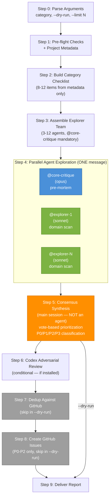

## Language Setting

Documentation language (`OMB_DOCUMENTATION_LANGUAGE`): !`echo ${OMB_DOCUMENTATION_LANGUAGE:-en}`

## Current Date

!`date +%Y-%m-%d`

## Current Branch

!`git branch --show-current 2>/dev/null`

## Repository URL

!`git remote get-url origin 2>/dev/null`

# Codebase Issue Scanner

Scans the codebase for category-specific issues using a multi-agent explorer team, synthesizes findings via vote-based consensus, and creates structured GitHub issues. This skill never writes local files — all output goes to GitHub via `gh` CLI.

Issue titles and bodies follow the documentation language (`OMB_DOCUMENTATION_LANGUAGE`) from the Language Setting section. Technical terms, file paths, commands, and code references remain in English.

## Architecture



**Legend:** Blue = mandatory agent, Green = domain explorers, Orange = main session consensus, Gray = skipped in `--dry-run`.

## When to Apply

- When the user says "scan for issues", "find problems in the codebase", "omb:issue", "/omb-issue"
- When a specific category should be audited: "security scan", "check architecture", "review API design"
- When `all` is passed: full-spectrum scan across all categories (high token cost — user confirms first)

## Write Permissions

**NONE** — this skill creates GitHub issues via `gh` CLI only. It NEVER writes local files.
`changed_files` in the output envelope MUST always be an empty list.

---

## Step 0: Parse Arguments

Arguments: `$ARGUMENTS`

1. Extract the **category** (first word, case-insensitive). Valid categories:
   - `architecture`, `security`, `api`, `database`, `ai`, `frontend`
   - `conventions`, `documentation`, `infrastructure`, `config`
   - `all`
2. Extract flags:
   - `--dry-run` → set `dry_run = true` (skip Steps 7-8, produce report only)
   - `--limit N` → set `issue_limit = N` (cap issues created in Step 8, P0 first, then P1, then P2)
3. If category is invalid or missing: list valid options and ask the user via `AskUserQuestion`.
4. If `category = all`:
   - Warn the user about token cost (~30+ agent spawns across all categories)
   - Ask for confirmation via `AskUserQuestion` before proceeding
   - Step 1 runs ONCE before the loop
   - Loop Steps 2-9 for each category in order
   - Dedup state is cumulative: issues created in earlier categories are added to the in-memory dedup set for later categories

---

## Step 1: Pre-flight Checks + Project Metadata

### Authentication Gate

```bash
gh auth status
```

If not authenticated: report BLOCKED immediately.

### Project Metadata Collection

Read the following to build project context for Step 2:

- `README.md` — project overview, tech stack
- `CLAUDE.md` — tech stack table, agent inventory
- `docs/` directory listing — documentation structure
- `.claude/agents/omb/` listing — available agents

Record metadata: repo URL (from Current Branch section), current branch (from Current Branch section), today's date (from Current Date section).

---

## Step 2: Build Category Checklist (8-12 items, target 10)

**[HARD] Build the checklist from project metadata ONLY — NO code scanning in this step.**

The main session builds the checklist using README.md, CLAUDE.md, settings, and docs/ content.

Each checklist item format:
```
{ISS-ABBREV-NN}: {description}
  Severity hint: CRITICAL | HIGH | MEDIUM | LOW
  File patterns: {glob patterns to search}
```

Target 10 items. Minimum 8, maximum 12 — adjust based on project size and domain complexity.

### Category Registry

| Category | Abbrev | Checklist Prefix | Explorer Agents | Agent Strengths |
|----------|--------|-----------------|----------------|----------------|
| `architecture` | `ARCH` | `ISS-ARCH-` | @core-critique, @general-explorer, @code-review | Pre-mortem analysis; structure discovery; convention review |
| `security` | `SEC` | `ISS-SEC-` | @core-critique, @security-audit, @ops-leak-audit | Pre-mortem; OWASP Top 10 audit; secret/credential detection |
| `api` | `API` | `ISS-API-` | @core-critique, @api-explorer, @code-review | Pre-mortem; route/handler/schema mapping; convention review |
| `database` | `DB` | `ISS-DB-` | @core-critique, @db-explorer, @code-review | Pre-mortem; schema/migration/query analysis; convention review |
| `ai` | `AI` | `ISS-AI-` | @core-critique, @ai-explorer, @code-review | Pre-mortem; workflow/agent/prompt analysis; convention review |
| `frontend` | `UI` | `ISS-UI-` | @core-critique, @ui-explorer, @code-review | Pre-mortem; component/hook/layout analysis; convention review |
| `conventions` | `CONV` | `ISS-CONV-` | @core-critique, @code-review, @general-explorer | Pre-mortem; correctness/security/performance review; structure discovery |
| `documentation` | `DOC` | `ISS-DOC-` | @core-critique, @doc-explorer, @general-explorer | Pre-mortem; docs completeness; structure discovery |
| `infrastructure` | `INFRA` | `ISS-INFRA-` | @core-critique, @infra-explorer, @infra-critique | Pre-mortem; container/CI/K8s analysis; cost/scaling critique |
| `config` | `CFG` | `ISS-CFG-` | @core-critique, @harness-explorer, @code-review | Pre-mortem; harness config discovery; convention review |

All explorer agents are read-only (`disallowedTools: Edit, Write`).

---

## Step 3: Assemble Explorer Team

1. Select agents from the Category Registry for the chosen category.
2. **@core-critique is ALWAYS included** (mandatory).
3. Minimum 3 agents, maximum 12.
4. Announce the team to the user before spawning:

```
## Explorer Team Assembled

**Category:** {category}
**Team size:** {N} agents

| # | Agent | Role | Rationale |
|---|-------|------|-----------|
| 1 | @core-critique | Architecture pre-mortem | Always included |
| 2 | @{explorer} | {domain} scan | {category} category |
| 3 | @{explorer} | {domain} scan | {category} category |

Proceeding with parallel codebase exploration.
```

---

## Step 4: Parallel Agent Exploration (ONE message)

**[HARD] Spawn ALL agents in a single message for parallel execution.**

Each agent receives: category, checklist, project metadata, and agent-specific strengths.
Each agent explores independently — no cross-agent communication.
Wait for all `<omb>DONE</omb>` responses before proceeding.

### Agent Prompt Template

```
<scan_context>
Category: {category}
Project: {repo_url}
Date: {YYYY-MM-DD}
Checklist:
{8-12 items with ID, description, file patterns}
</scan_context>

<role>You are a {domain} specialist scanning for issues in category: {category}.
Your strengths: {from "Agent Strengths" column in Category Registry}.</role>

<instructions>
For each checklist item:
1. Search the codebase for evidence using Glob, Grep, and Read tools
2. Report findings with file:line references
3. Assess severity: CRITICAL / HIGH / MEDIUM / LOW
4. If no issues found for an item, report PASS

Output a findings table for each item with evidence:
| Checklist | File:Line | Finding | Severity | Evidence |
|-----------|-----------|---------|----------|----------|

Report ALL items — both findings and PASSes.
</instructions>

End with the standard omb output envelope:
<omb>DONE</omb>
followed by a result block.
```

Spawn all agents in ONE message:

```
Agent({ subagent_type: "core-critique", prompt: "..." })
Agent({ subagent_type: "{explorer-1}", prompt: "..." })
Agent({ subagent_type: "{explorer-2}", prompt: "..." })
// ... all in the same message
```

---

## Step 5: Consensus Synthesis (main session, NOT an agent)

After all agent responses are collected, the **main session** synthesizes findings. This step MUST run in the main session, never in a sub-agent.

### Process

1. **Collect** all findings tables from all agent responses
2. **Deduplicate** by: same file (within 20 lines), same concern description
3. **Count votes** — for each unique finding, count how many agents flagged it
4. **Classify** using the standard consensus-to-priority table:

| Consensus Level | Threshold | Priority |
|----------------|-----------|----------|
| Majority | >50% of agents | P0 |
| Strong minority | 33-50% | P1 |
| Minority | <33% | P2 |
| Single voice | 1 agent | P3 (report only — NOT created as GitHub issues) |

**No small-team exceptions** — use the standard table regardless of team size.

5. **Apply veto power:**
   - @core-critique BLOCKING = minimum P1
   - @security-audit BLOCKING = minimum P1

6. **Group** related findings into distinct issue candidates with: title, priority, checklist ID, evidence rows, suggested resolution.

---

## Step 6: Codex Adversarial Review (conditional)

```bash
which codex 2>/dev/null || echo "NOT_FOUND"
```

- If `codex` is installed: Invoke `Skill("omb-codex-adv-review")` with file paths from the consensus findings as focus text. Codex reviews actual CODE, not issue text. Integrate any new Codex findings into the issue candidates from Step 5.
- If NOT installed: log `[codex] Skipped — CLI not found` and proceed to Step 7.

---

## Step 7: Dedup Against GitHub

**[HARD] Skip this step entirely in `--dry-run` mode.**

For each issue candidate (P0-P2 only — P3 is report-only):

1. Search GitHub for existing issues:
   ```bash
   gh issue list --search "{title keywords}" --state all --limit 5
   ```
2. If a match is found with high title similarity: mark as DUPLICATE, skip creation.
3. If no match: proceed to Step 8 for this candidate.

---

## Step 8: Create GitHub Issues

**[HARD] Skip this step entirely in `--dry-run` mode.**

**[HARD] If `category=security`: warn the user via `AskUserQuestion` about public exposure before creating any issues.**

### Label Setup (idempotent)

Run before creating any issues:

```bash
gh label create "priority:p0" --force --color "d73a4a" --description "Critical — must fix immediately" 2>/dev/null || true
gh label create "priority:p1" --force --color "e99d42" --description "High — fix before delivery" 2>/dev/null || true
gh label create "priority:p2" --force --color "fbca04" --description "Medium — fix if time permits" 2>/dev/null || true
gh label create "priority:p3" --force --color "0e8a16" --description "Low — cosmetic or advisory" 2>/dev/null || true
gh label create "omb-issue-scan" --force --color "5319e7" --description "Detected by omb:issue scan" 2>/dev/null || true
gh label create "domain:{scope}" --force --color "1d76db" --description "{category} domain scan" 2>/dev/null || true
```

### Issue Limit

If `--limit N` was provided: apply in priority order (P0 first, then P1, then P2). Stop after N issues are created.

### Title Format

```
{emoji}[P{N}] type(scope): description
```

Emoji: P0=🔴, P1=🟠, P2=🟡, P3=🟢

### Issue Body Template

```markdown
## Summary
- **What**: {concrete description of the issue}
- **Why**: {why this matters}
- **Category**: {category} | Checklist: {CHECKLIST_ID}

## Evidence
| # | File | Line | Finding | Flagged By |
|---|------|------|---------|-----------|
| 1 | `{file}` | {line} | {finding} | {agents} |

## Impact
{What goes wrong if unfixed — one sentence}

## Suggested Resolution
{Concrete direction for the fix}

## References
- Related files: {list}
- Checklist item: {ID} — {description}

---
> Detected by [oh-my-braincrew](https://github.com/teddynote-lab/oh-my-braincrew) `omb:issue` scan
> Category: {category} | Scan date: {YYYY-MM-DD}
> `omb-issue-scan category={category} checklist={ID}`
```

### Language-Aware Content

Read the documentation language from the Language Setting section above.
- `doc_language` = value from `OMB_DOCUMENTATION_LANGUAGE` (default: `en`)

When writing issue content:
- If `doc_language = ko`: Write Summary (요약), Impact (영향), Suggested Resolution (제안 해결 방안) sections in Korean. Title emoji prefix and `type(scope):` format stays English. Evidence table stays English (file paths, code references).
- If `doc_language = en` (default): Write everything in English.

### gh Command

```bash
gh issue create \
  --title "{emoji}[P{N}] type(scope): description" \
  --label "priority:p{N},omb-issue-scan,domain:{scope}" \
  --body "$(cat <<'OMBISSUEEOF'
{body}
OMBISSUEEOF
)"
```

**Error handling per issue:** If `gh issue create` fails for a specific issue, log the error and continue with remaining issues. Do not abort the entire scan on a single issue creation failure.

---

## Step 8.5: Language Verification

**[HARD] Skip this step entirely in `--dry-run` mode.**

Read the documentation language from the Language Setting section above.
- `doc_language` = value from `OMB_DOCUMENTATION_LANGUAGE` (default: `en`)

For each created issue (from Step 8):

1. Fetch the issue body:
   ```bash
   gh issue view {number} --json body --jq '.body' > /tmp/omb-issue-lang-check.txt
   ```

2. Verify language match:
   - If `doc_language = ko`: Check for Korean (Hangul) content in description sections.
     ```bash
     grep -cP '[\uAC00-\uD7AF]' /tmp/omb-issue-lang-check.txt
     ```
     If Hangul count is 0 or near-zero (body is English-only): rewrite Summary, Impact, Suggested Resolution sections in Korean. Evidence table and file paths stay English.
     Apply: `gh issue edit {number} --body-file /tmp/omb-issue-lang-rewrite.txt`

   - If `doc_language = en`: Check that the body is primarily English.
     If body has Korean-dominant content: rewrite description sections in English.
     Apply: `gh issue edit {number} --body-file /tmp/omb-issue-lang-rewrite.txt`

   - If language matches: no action needed.

3. Log per issue: `[language] #{number} VERIFIED — {doc_language}` or `[language] #{number} REWRITTEN — {old} → {new}`

4. Clean up: `rm -f /tmp/omb-issue-lang-check.txt /tmp/omb-issue-lang-rewrite.txt`

---

## Step 9: Deliver Report

### Report Format

```markdown
## Issue Scan Report: {category}

**Date:** {YYYY-MM-DD}
**Repository:** {repo_url}
**Category:** {category}
**Team:** {N} agents ({@agent1, @agent2, ...})
**Mode:** {live | dry-run}

### Summary

| Priority | Found | Created | Skipped (Dup) | Report Only |
|----------|-------|---------|---------------|------------|
| P0       | {N}   | {N}     | {N}           | —          |
| P1       | {N}   | {N}     | {N}           | —          |
| P2       | {N}   | {N}     | {N}           | —          |
| P3       | —     | —       | —             | {N}        |

### Created Issues

| Priority | Title | URL |
|----------|-------|-----|
| P0 | {title} | {url} |
| P1 | {title} | {url} |

### Skipped (Duplicates)

| Priority | Title | Existing Issue |
|----------|-------|---------------|
| P1 | {title} | {existing_url} |

### P3 Report Only (Not Created)

| Checklist | Finding | Flagged By |
|-----------|---------|-----------|
| {ID} | {finding} | @{agent} |

### Errors

| Issue | Error |
|-------|-------|
| {title} | {error message} |

### Checklist Coverage

| ID | Description | Status | Priority |
|----|-------------|--------|----------|
| ISS-{ABBREV}-01 | {description} | {PASS / P0 / P1 / P2 / P3} | {priority} |
```

---

## HARD Rules

1. **Parallel agent spawning** — ALL agents MUST be spawned in ONE message. Sequential spawning is not allowed.
2. **Main-session consensus** — Step 5 runs in the main session, NOT a sub-agent.
3. **No sub-agent spawning from sub-agents** — per CLAUDE.md rule #2, only the main session spawns agents.
4. **Dedup before create** — always search GitHub before `gh issue create` (Step 7 before Step 8).
5. **P3 report only** — P3 findings MUST NOT be created as GitHub issues.
6. **Visible fingerprint required** — every issue body MUST contain a searchable `omb-issue-scan category=... checklist=...` line (NOT in an HTML comment — it must be visible text).
7. **Label idempotency** — always run `gh label create --force ... 2>/dev/null || true` before creating issues.
8. **@core-critique always included** — mandatory in every scan team, every category.
9. **Codex is optional** — skip gracefully if `codex` CLI is not installed; never block on Codex availability.
10. **`--dry-run` skips Steps 7-8** — no GitHub API calls (no `gh issue list` or `gh issue create`) in dry-run mode.
11. **Security warning** — `category=security` requires user confirmation via `AskUserQuestion` before any public issue creation.
12. **Unique HEREDOC delimiter** — always use `OMBISSUEEOF`, never bare `EOF`.
13. **No file writes** — this skill creates GitHub issues via `gh` CLI only. Never write local files. `changed_files` is always `[]`.
14. **Issue language follows `OMB_DOCUMENTATION_LANGUAGE`** — issue body sections (Summary, Impact, Suggested Resolution) MUST be written in the documentation language. Technical terms, file paths, and code references remain English.

---

## Anti-Patterns

- **Sequential agent spawning** — spawn all explorers in ONE message. Sequential spawning is slow and gains nothing since agents review independently.
  Good: All `Agent()` calls in a single message.
  Bad: `Agent(...)` then wait then `Agent(...)` then wait...
- **Consensus in a sub-agent** — Step 5 must run in the main session. Delegating synthesis breaks the "no sub-agent spawning from sub-agents" rule.
- **Creating P3 issues** — P3 is advisory and report-only. Never call `gh issue create` for P3 findings.
- **Skipping dedup** — always call `gh issue list --search` before creating. Duplicate issues pollute the tracker.
- **Hard-coded dates** — use the Current Date section at the top, never hardcode dates.
- **Bare EOF in heredoc** — always use `OMBISSUEEOF` to avoid heredoc collisions with nested commands.
- **Blocking on Codex** — Codex is optional. Check with `which codex` and skip gracefully if absent.
- **Code scanning in Step 2** — the checklist is built from README.md/CLAUDE.md/docs only. Code scanning happens in Step 4 (agents).

<omb>DONE</omb>

```result
summary: "Codebase issue scanner skill — spawns parallel explorer agents, synthesizes consensus findings, and creates GitHub issues for P0-P2 findings."
artifacts:
  - ".claude/skills/omb-issue/SKILL.md"
changed_files: []
concerns: []
blockers: []
retryable: true
next_step_hint: "Invoke with: /omb-issue <category> [--dry-run] [--limit N]"
```
