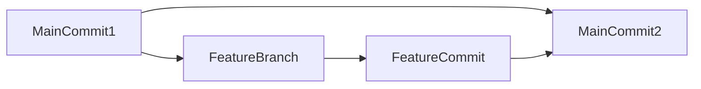
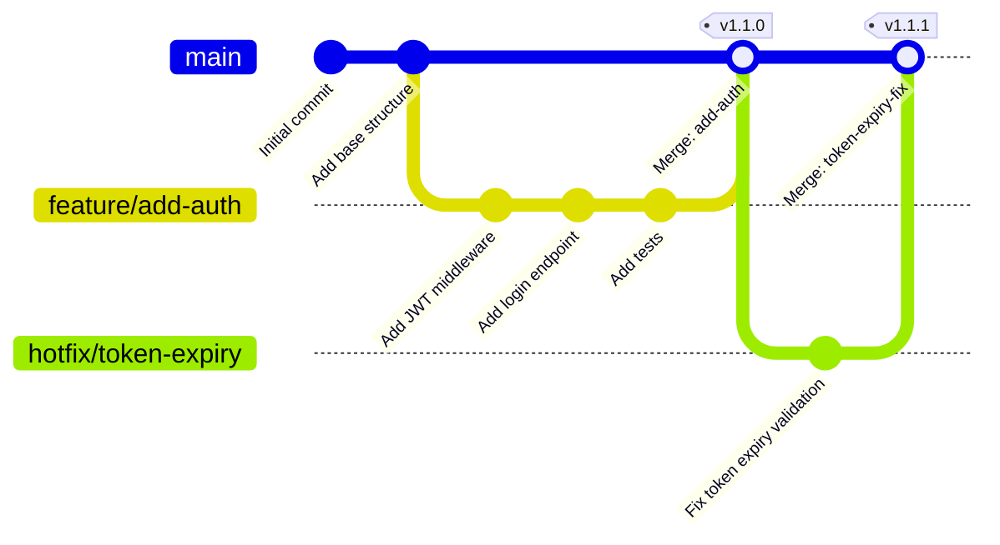

## Git Graph Diagrams (gitGraph)

Use `gitGraph` when documenting a branching strategy, release flow, or hotfix process. It renders a visual git history with named branches, commits, merges, and cherry-picks — the exact operations developers perform. A `graph` node diagram can approximate this, but it loses branch lane separation, commit ordering, and merge semantics that make gitGraph immediately legible to developers.

Include `gitGraph` diagrams in contribution guides, branching strategy ADRs, and runbooks for release or hotfix procedures. They are not appropriate for actual commit history documentation — use `git log --graph` for that.

### When to Use

- Documenting a branching strategy (GitFlow, trunk-based, release branches)
- Illustrating the expected flow for a hotfix: branch from main, fix, merge to main and release
- Showing feature branch lifecycle in a contribution guide
- Explaining a release branch workflow to new contributors
- Documenting a cherry-pick policy for backporting fixes

### When NOT to Use

- Static architecture or module relationships — use `graph TB` instead (`structure-graph.md`)
- Actual git history reconstruction — use `git log --oneline --graph` for that
- Workflows with more than ~5 branches — the diagram becomes unreadable; focus on the pattern, not every branch

**Incorrect (using a graph to visualize git branching — loses branch lanes, commit sequence, and merge semantics):**



**Correct (gitGraph with proper branch, commit, and merge operations):**



### Syntax Reference

```
gitGraph
    commit                              # commit on current branch (auto-generated ID)
    commit id: "Label"                  # commit with a readable label
    commit id: "Label" tag: "v1.0.0"   # commit with a version tag
    commit id: "Label" type: HIGHLIGHT  # highlighted commit (rendered differently)
    commit id: "Label" type: REVERSE    # reverse-styled commit (e.g., a revert)

    branch branchName                   # create a new branch from current HEAD
    checkout branchName                 # switch to an existing branch
    merge branchName                    # merge branchName into current branch
    merge branchName id: "Label"        # merge with a label
    merge branchName id: "Label" tag: "v1.1.0"   # merge with label and tag

    cherry-pick id: "commit-id"         # cherry-pick a specific commit by its id
```

**Commit types:**

| Type | Appearance | Use case |
|------|-----------|----------|
| `NORMAL` (default) | Standard circle | Regular commit |
| `HIGHLIGHT` | Filled/bold circle | Important milestone commit |
| `REVERSE` | Reverse-styled | Revert or rollback commit |

**Direction:**
```
%%{init: { 'logLevel': 'debug', 'theme': 'base', 'gitGraph': {'rotateCommitLabel': false}}}%%
gitGraph LR   # left-to-right (default)
gitGraph TB   # top-to-bottom (useful for tall branching trees)
```

### Tips

- Use `id:` labels on commits that represent meaningful milestones: feature merge points, release tags, hotfix merges. Skip IDs on intermediate work-in-progress commits.
- Always `checkout` the target branch before `merge` — the merge direction is from the named branch INTO the currently checked-out branch.
- Use `tag:` on merge commits that correspond to version releases. This communicates the release cadence alongside the branch flow.
- `cherry-pick id: "..."` requires the exact commit `id` value to match a previously defined commit. Always define a readable `id:` on commits you intend to cherry-pick.
- Keep the diagram focused on the pattern, not exhaustive commit history. 3-5 commits per branch is enough to communicate the flow.
- Name branches using the same convention as your actual project (`feature/`, `hotfix/`, `release/`) — it makes the diagram immediately applicable to the real workflow.
- For trunk-based development documentation, show a short-lived feature branch merging quickly with a linear main — that visual contrast with a long-running GitFlow branch communicates the strategy difference clearly.

Reference: [Mermaid GitGraph docs](https://mermaid.js.org/syntax/gitgraph.html)
