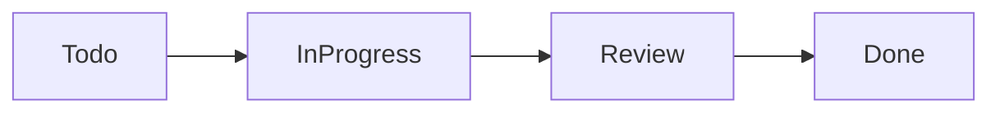
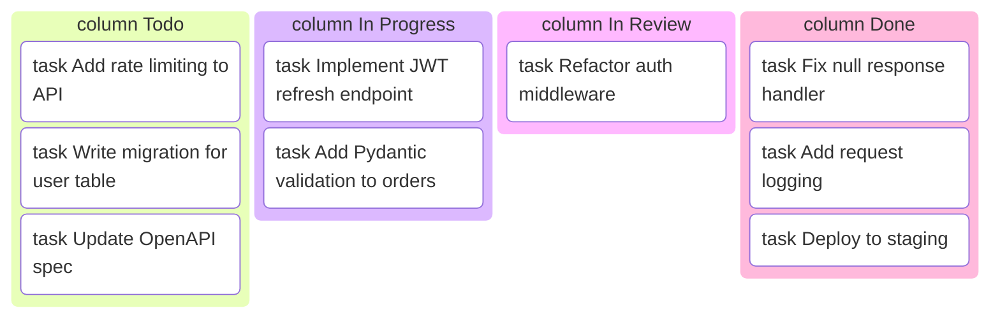

## Kanban Boards (kanban)

Use `kanban` (Mermaid v11+) when documenting a task workflow in a format that communicates status at a glance. It renders a multi-column board where each column is a workflow stage and each card is a task. A markdown table can list tasks with a status column, but it cannot communicate the WIP (work in progress) distribution across stages visually.

This is a beta feature available from Mermaid v11. Verify your rendering environment supports v11 before using.

### When to Use

- Sprint board snapshots in retrospective or status update documents
- Pipeline stage tracking in runbooks (e.g., PR stages: Draft, Review, Approved, Merged)
- Incident response workflow documentation (Detected, Investigating, Mitigated, Resolved)
- Onboarding task checklists where stage progression matters
- Release process tracking (In Progress, In QA, In Staging, Released)

### When NOT to Use

- Task dependency tracking where order matters — use `gantt` instead (`planning-gantt.md`)
- Long-lived project roadmaps — use `timeline` instead (`planning-timeline.md`)
- When Mermaid v11 is not available in your rendering environment — use a markdown table fallback
- More than 6 columns — the horizontal layout becomes too compressed to read

**Incorrect (using a markdown table for task status — loses visual stage distribution):**



**Correct (kanban with columns and task cards):**



### Syntax Reference

```
kanban
    column ColumnName
        task Task description text
        task Another task

    column AnotherColumn
        task Task with metadata @{ ticket: PROJ-123, priority: High }
        task Simple task
```

**Task metadata (optional):**
```
kanban
    column In Progress
        task Implement auth flow @{ ticket: PROJ-45, priority: High, assigned: alice }
        task Add test coverage @{ ticket: PROJ-46, priority: Medium }
```

**Metadata fields** (all optional, free-form key-value):

| Field | Example value | Purpose |
|-------|--------------|---------|
| `ticket` | `PROJ-123` | Links to issue tracker |
| `priority` | `High`, `Medium`, `Low` | Task urgency |
| `assigned` | `alice` | Assignee |

**Syntax rules:**
- Column names follow `column` keyword — no quotes needed for single-word names, use quotes for multi-word: `column "In Review"`
- Tasks are indented under their column with `task` keyword
- Metadata is appended with `@{ key: value, key: value }` after the task description
- Columns render left to right in declaration order

### Tips

- Column names should map to your actual workflow stages. Do not invent abstract labels — use the same names developers already use (Backlog, In Progress, In Review, Done).
- Keep the diagram to 3-5 tasks per column. Kanban boards in documentation serve as a snapshot, not a complete backlog dump. Link to the actual tracker for the full list.
- Use `@{ ticket: PROJ-NNN }` for any task that has a corresponding issue. It makes the diagram actionable — readers can navigate directly to the linked issue.
- Kanban diagrams in documentation get stale quickly. Treat them as point-in-time snapshots and include a "last updated" date in the surrounding markdown.
- If documenting a workflow process (not current sprint state), use abstract task names that illustrate the workflow pattern rather than real ticket descriptions.
- Verify Mermaid v11 availability in your target renderer before committing kanban diagrams to documentation. GitHub's built-in Mermaid rendering may be behind the latest release.

Reference: [Mermaid Kanban docs](https://mermaid.js.org/syntax/kanban.html)
