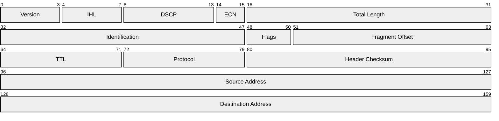

## Packet Diagrams (packet-beta)

Use `packet-beta` when documenting binary protocol headers, network frame formats, or hardware register layouts. It renders a row-based bit-field diagram where each field is labeled with its bit range — the standard representation used in RFCs, hardware datasheets, and protocol specifications. A table can list field names and sizes, but it cannot communicate bit alignment and field boundaries at a glance the way a packet diagram can.

This is a beta feature. Syntax is stable for the row-based format described below.

### When to Use

- Network protocol header documentation (TCP, UDP, custom binary protocols)
- Binary file format documentation (magic bytes, header structure, record layout)
- Hardware register map documentation (control registers, status flags, configuration bits)
- IPC message format documentation for low-level inter-process or inter-chip communication
- Firmware interface specifications where bit-level precision matters

### When NOT to Use

- JSON or structured data format documentation — use a code block with annotated JSON instead
- High-level API request/response schemas — use OpenAPI or a sequence diagram
- When the audience is non-technical and bit-level detail is not needed — use a table with field names and byte sizes

**Incorrect (using a table to document a protocol header — loses bit alignment and field boundary visualization):**


**Correct (packet-beta with bit-range fields showing the IPv4 header layout):**



### Syntax Reference

```
packet-beta
    startBit-endBit: "Field Label"
```

**Rules:**
- Bit ranges are zero-indexed and inclusive on both ends: `0-3` covers bits 0, 1, 2, and 3 (4 bits total)
- Fields must be declared in ascending bit order — gaps are not allowed; every bit must be covered
- The row width defaults to 32 bits (one 32-bit word per row). Fields that span across a 32-bit boundary wrap to the next row
- Label text must be quoted with double quotes

**Example — custom application message header:**
```
packet-beta
    0-7: "Message Type"
    8-15: "Version"
    16-31: "Payload Length"

    32-63: "Sequence Number"

    64-95: "Timestamp (Unix seconds)"

    96-103: "Flags"
    104-111: "Reserved"
    112-127: "Checksum"
```

**Example — hardware control register (8-bit):**
```
packet-beta
    0-0: "EN"
    1-1: "RST"
    2-3: "MODE"
    4-5: "SPEED"
    6-6: "IRQ"
    7-7: "RDY"
```

**Calculating bit ranges:**

| Field width | Example range | Bit count |
|-------------|--------------|-----------|
| 1 bit | `0-0` | 1 |
| 4 bits | `0-3` | 4 |
| 8 bits | `0-7` | 8 |
| 16 bits | `0-15` | 16 |
| 32 bits | `0-31` | 32 |

### Tips

- Label every field, including reserved and padding bits: `"Reserved"` or `"Padding"`. Unlabeled bits imply undefined behavior.
- Group fields by 32-bit word boundaries (rows of `0-31`, `32-63`, `64-95`) when documenting network protocol headers — this matches the RFC convention and makes byte offsets immediately calculable.
- For hardware registers, use single-bit ranges (`n-n`) for individual flag bits and wider ranges for multi-bit fields. Single-character labels (`EN`, `RST`, `RDY`) are appropriate — they match register datasheets.
- Include a `title` in the surrounding markdown (not in the diagram — `packet-beta` has no title syntax) that names the protocol, version, and reference specification (e.g., "IPv4 Header — RFC 791").
- When documenting a proprietary protocol, include a separate table below the diagram with field descriptions, valid values, and notes. The diagram shows the layout; the table explains the semantics.
- Verify field counts: if your protocol is 20 bytes, the last bit should be `159` (20 * 8 - 1 = 159). A mismatch in total bit count is a documentation error that can mislead implementers.

Reference: [Mermaid Packet Diagram docs](https://mermaid.js.org/syntax/packet.html)
