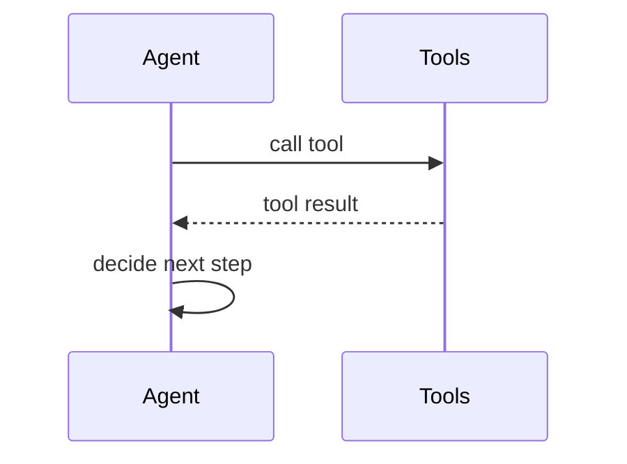
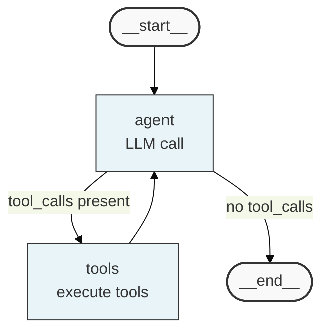
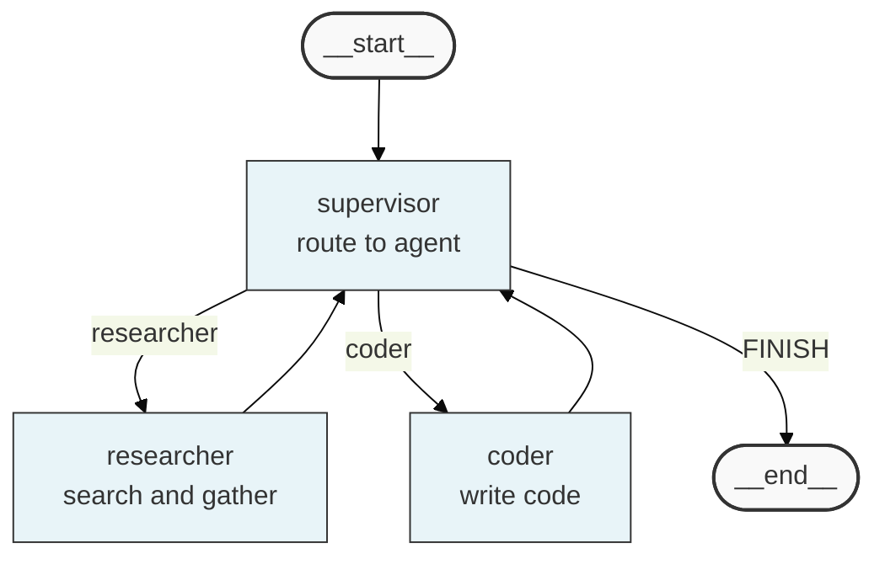
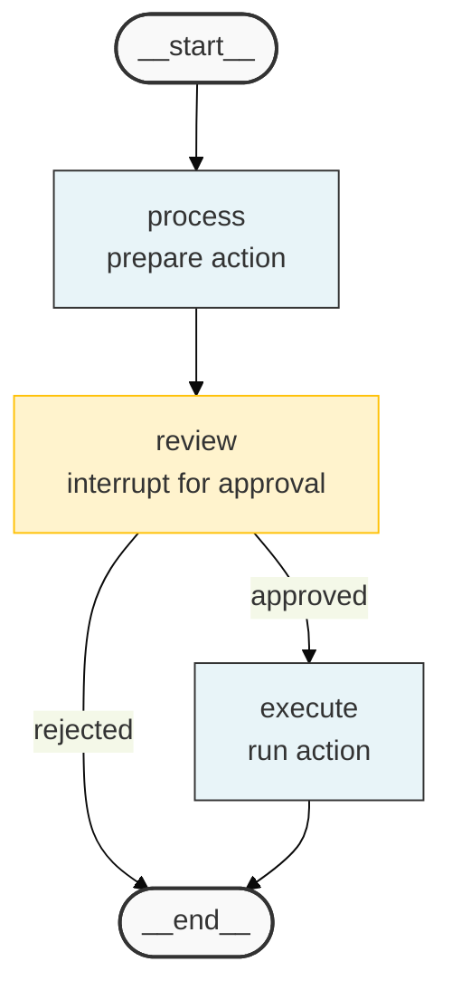
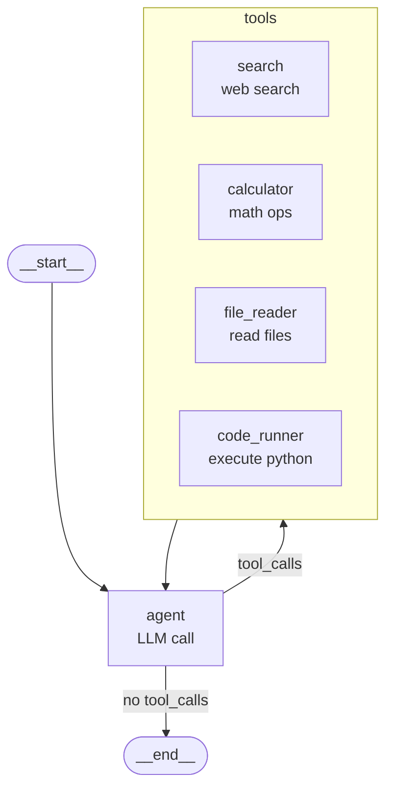
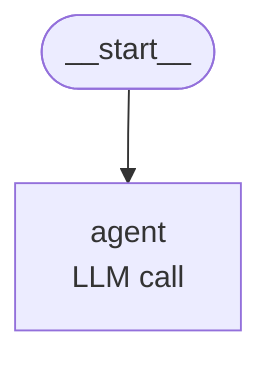

## LangGraph Agent Flow Diagrams

LangGraph state graphs have a canonical visual representation. Always prefer the native `draw_mermaid()` export over manually writing the diagram — it is guaranteed to match the actual graph structure. When manual diagrams are needed (in design docs before code exists, or for simplified explanations), follow the conventions below exactly so manual and generated diagrams look consistent.

### When to Use

- AI domain design documents: showing the agent workflow before implementation
- Architecture documentation: explaining how nodes connect and how control flows
- Debugging aids: visualizing which path was taken and where a graph got stuck
- Code reviews: confirming that the implemented graph matches the design

### When NOT to Use

- Multi-service API call flows where timing and request/response pairing matter — use `sequenceDiagram` instead (`behavior-sequence.md`)
- Simple decision trees without LangGraph node/edge concepts — use `flowchart TD` instead
- Static module architecture showing file structure — use `graph TB` instead (`structure-graph.md`)

**Incorrect (using sequenceDiagram for a LangGraph agent workflow):**



**Correct (graph TD with LangGraph conventions — START/END stadiums, feedback loop, classDef):**


---

### Section 1: Native LangGraph Export (Preferred)

Always generate from the compiled graph when code exists:

```python
from langgraph.graph import StateGraph

# After compiling the graph
app = graph.compile()

# Option A — get the Mermaid string and embed in a markdown doc
mermaid_str = app.get_graph().draw_mermaid()
with open("docs/architecture/agent-flow.md", "w") as f:
    f.write(f"```mermaid\n{mermaid_str}\n```")

# Option B — export directly to PNG
app.get_graph().draw_mermaid_png(output_file_path="docs/architecture/agent-flow.png")
```

When using the exported string, do not rewrite it. Add context as comments above the code block, not inside it.

---

### Section 2: Manual Diagram Patterns

Use these patterns when writing design docs before implementation, or when simplifying a generated diagram for a non-technical audience.

**ReAct Agent (single agent with tool loop):**



**Multi-Agent Supervisor (supervisor routes to specialist agents):**



**Human-in-the-Loop (interrupt for approval before execution):**



---

### Section 3: Conventions

**Node format:**
```
NodeName[node_function_name<br/>one-line description]
```
- First line: the Python function name as registered in the graph (`agent`, `tools`, `supervisor`)
- Second line after `<br/>`: what the node does in plain English

**START and END:**
- Always use stadium shapes: `([__start__])` and `([__end__])`
- These match LangGraph's own `draw_mermaid()` output exactly

**Conditional edges:**
- Label with the condition value that routes to that target: `-->|tool_calls present|`
- Do not label unconditional edges unless the lack of a label is ambiguous

**Tool nodes with many tools:**
- When a graph has more than 3 tools, group them in a subgraph rather than listing individually:



**Theme and classDef (always include for manual diagrams):**
```
%%{init: {'theme': 'base', 'themeVariables': {'primaryColor': '#e8f4f8'}}}%%

classDef startEnd fill:#f9f9f9,stroke:#333,stroke-width:2px
classDef node fill:#e8f4f8,stroke:#333
classDef interrupt fill:#fff3cd,stroke:#ffc107   # for human-in-the-loop interrupt nodes
```

**State annotations (via comments):**


### Tips

- If a LangGraph graph already exists in code, always use `draw_mermaid()` rather than writing manually. The generated output is always correct; manual diagrams can diverge.
- The feedback loop (tools → agent → tools) is the defining structure of a ReAct agent. Always draw it explicitly — do not collapse it into a single box.
- For supervisor patterns, show the return edge from each worker back to the supervisor. Omitting it makes the diagram look like a one-way dispatch, hiding the re-routing logic.
- Human-in-the-loop interrupt nodes should be styled differently from regular nodes (yellow `#fff3cd` fill) — this makes the approval point immediately visible to reviewers.
- When diagramming a subgraph (a graph embedded inside another graph), use a Mermaid `subgraph` block with a dashed border to show the boundary.
- State schema comments (`%% State shape: ...`) are invaluable for design reviews — they show what data flows between nodes without requiring the reader to read the TypedDict definition.

Reference: [LangGraph draw_mermaid() docs](https://langchain-ai.github.io/langgraph/how-tos/visualization/) | [Mermaid Flowchart docs](https://mermaid.js.org/syntax/flowchart.html)
