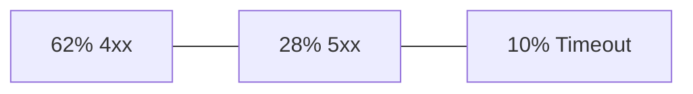
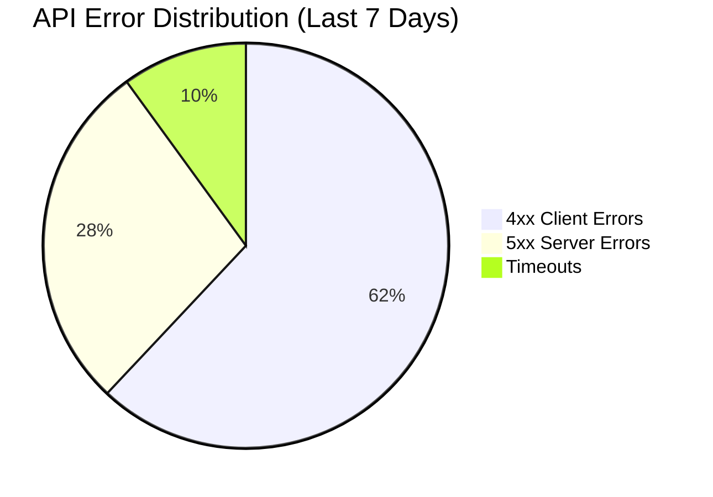

## Pie Charts (pie)

Use `pie` when the story is *what share of a fixed whole does each category represent*. The diagram renders a circular chart with proportional slices. It is the right tool for a single-point-in-time snapshot of distribution — error type breakdown, budget allocation, test coverage split, or traffic source mix. It is the wrong tool for anything with a time dimension or multi-stage flow.

### When to Use

- Error type distribution: what proportion of errors are 4xx vs 5xx vs timeout
- Budget or cost allocation: what share of spend goes to compute, storage, networking
- Test coverage breakdown: unit vs integration vs e2e test counts
- Traffic source split: web vs mobile vs API client shares
- Feature flag rollout: percentage of users in each variant

### When NOT to Use

- Time-series data showing change over time — use `xychart-beta` instead (`analytics-xychart.md`)
- Multi-stage flow where volume moves between nodes — use `sankey-beta` instead (`infra-sankey.md`)
- More than 7 slices — too many slices make labels overlap and the chart unreadable; use a table instead
- When exact values matter more than proportions — use a table or `xychart-beta` bar chart

**Incorrect (using a markdown table where proportional share is the key insight):**



**Correct (pie chart with title and labeled sections):**



### Syntax Reference

```
pie title "Chart Title"
    "Label 1" : value
    "Label 2" : value
    "Label 3" : value
```

**With showData (displays raw values alongside percentages):**
```
pie showData title "Cloud Cost Allocation — March 2026"
    "Compute (ECS)" : 4200
    "Database (RDS)" : 1800
    "Storage (S3)" : 600
    "Networking" : 400
    "Monitoring" : 200
```

**Syntax rules:**
- `title` is optional but strongly recommended — always include it
- `showData` renders the raw numeric value next to each slice label
- Values are numeric; Mermaid normalizes them to percentages automatically — you do not need to pre-calculate percentages
- Labels must be quoted with double quotes if they contain spaces or special characters
- Sections render in declaration order, clockwise from the top-right

### Tips

- Always include a `title` that names the metric and the time window: `"API Error Distribution (Last 7 Days)"` not just `"Errors"`.
- Use `showData` when the absolute values carry meaning alongside the proportions (e.g., cost allocation where $4,200 vs 57% are both informative).
- Keep slices to 5-7 maximum. If you have more categories, group the smallest into an "Other" bucket.
- Values do not need to sum to 100 — Mermaid calculates proportions automatically. Use raw counts (request counts, dollar amounts) rather than pre-computing percentages.
- Pie charts communicate proportions, not trends. If someone will ask "how did this change last week?", use `xychart-beta` instead.
- Label text appears outside the slice with a connecting line. Keep labels short (2-4 words) to avoid overlap on small renders.

Reference: [Mermaid Pie Chart docs](https://mermaid.js.org/syntax/pie.html)
