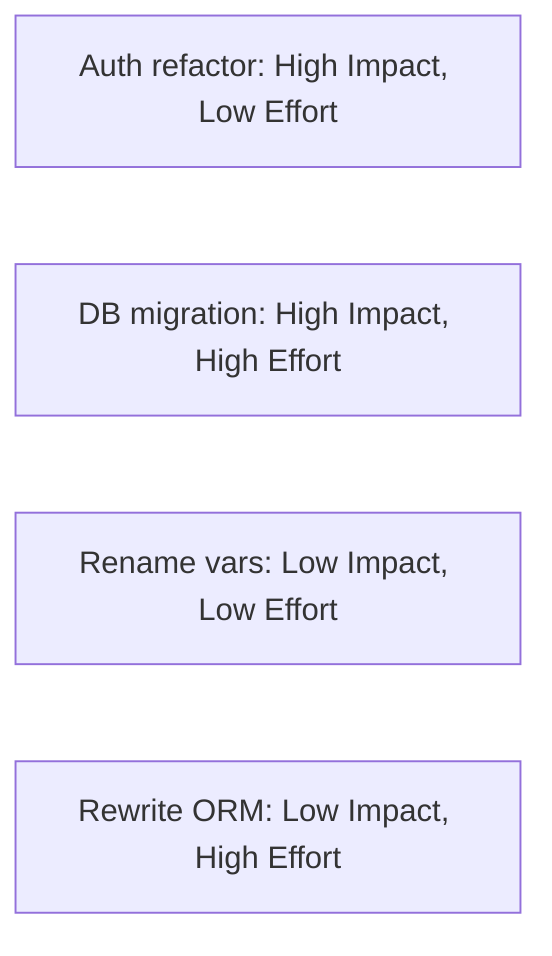
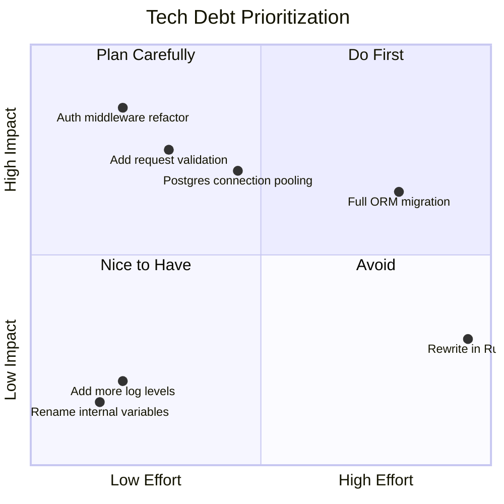

## Quadrant Charts (quadrantChart)

Use `quadrantChart` when the story is *where does each item fall on two axes* — typically effort vs impact, risk vs likelihood, or urgency vs importance. The four quadrants create a natural prioritization signal: items in the high-impact/low-effort quadrant are immediate wins; items in the low-impact/high-effort quadrant are waste. A markdown table can list the same items, but it cannot communicate their relative positioning or quadrant membership at a glance.

### When to Use

- Tech debt triage: plotting refactoring tasks by effort and impact
- Feature prioritization: placing backlog items on an impact vs effort matrix
- Framework or library evaluation: comparing candidates on two key dimensions
- Risk heat maps: plotting risks by likelihood and severity
- Incident post-mortem: categorizing contributing factors by frequency and impact

### When NOT to Use

- Ranking items in a single dimension — use a table with a sort column
- More than ~12 items — too many points create an unreadable scatter; split by category or use a table
- When one axis is time-based — use `gantt` or `xychart-beta` instead
- When the two axes have no meaningful relationship to each other

**Incorrect (using a markdown table for effort vs impact analysis — loses quadrant positioning):**



**Correct (quadrantChart with labeled axes and positioned items):**



### Syntax Reference

```
quadrantChart
    title Chart Title

    x-axis Low Label --> High Label     # x-axis label: left end --> right end
    y-axis Low Label --> High Label     # y-axis label: bottom end --> top end

    quadrant-1 Label                    # top-right quadrant label
    quadrant-2 Label                    # top-left quadrant label
    quadrant-3 Label                    # bottom-left quadrant label
    quadrant-4 Label                    # bottom-right quadrant label

    Point Name: [x, y]                  # x and y are floats from 0.0 to 1.0
```

**Quadrant numbering (counterclockwise from top-right):**

| Quadrant | Position | Default meaning |
|----------|----------|----------------|
| `quadrant-1` | Top-right | High x, High y |
| `quadrant-2` | Top-left | Low x, High y |
| `quadrant-3` | Bottom-left | Low x, Low y |
| `quadrant-4` | Bottom-right | High x, Low y |

**Axis convention for effort-impact matrices:**
- x-axis: effort (left = low, right = high) → `x-axis Low Effort --> High Effort`
- y-axis: impact (bottom = low, top = high) → `y-axis Low Impact --> High Impact`
- Result: quadrant-2 (top-left = low effort, high impact) = immediate wins

### Tips

- Always define all four quadrant labels — unlabeled quadrants leave readers guessing what the regions mean.
- Axis labels use `-->` to define the direction: the left side is the low end, the right side is the high end.
- Coordinates are floats from 0.0 to 1.0. Use the full range — items clustered near the center (0.45–0.55) lose quadrant clarity.
- Point names appear as text labels next to each dot. Keep names to 3-5 words to avoid overlap.
- If two items are very close in position, offset one slightly (0.01-0.02) rather than stacking them.
- The chart does not support categories or colors. If you need to distinguish item groups, use separate quadrant charts per category.
- Include a `title` that names both the axes implicitly: `"Tech Debt Prioritization"` conveys that x=effort and y=impact when the axis labels are set correctly.

Reference: [Mermaid Quadrant Chart docs](https://mermaid.js.org/syntax/quadrantChart.html)
