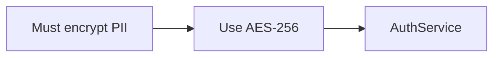

## Requirement Diagrams (requirementDiagram)

Use `requirementDiagram` when you need to document *what requirements exist, how they relate to each other, and how implementation elements satisfy or verify them*. It makes compliance traceability explicit — the diagram shows not just that a feature exists, but which requirement it satisfies and how that requirement is verified. A table can list requirements, but it cannot express the dependency graph between them or their satisfaction relationships to code elements.

### When to Use

- Compliance tracing: mapping regulatory requirements (GDPR, SOC 2, HIPAA) to system features
- Feature dependency mapping: showing which requirements derive from or refine others
- Test coverage tracing: linking test suites to the requirements they verify
- Architecture review: showing which system components satisfy which interface requirements
- Risk documentation: marking high-risk requirements explicitly with risk levels

### When NOT to Use

- General task dependency tracking — use `gantt` instead (`planning-gantt.md`)
- API endpoint documentation — use sequence diagrams or OpenAPI specs
- Simple feature lists with no relationships — a markdown table is sufficient
- When the audience is non-technical — requirement diagrams have specialized notation that requires explanation

**Incorrect (using a table for requirement traceability — loses relationship types and verification methods):**



**Correct (requirementDiagram with typed requirements, risk, and traced relationships):**

```mermaid
requirementDiagram

    requirement DataEncryption {
        id: REQ-001
        text: All PII data must be encrypted at rest and in transit
        risk: High
        verifymethod: Inspection
    }

    functionalRequirement EncryptionAlgorithm {
        id: REQ-002
        text: Encryption must use AES-256 for at-rest storage
        risk: Medium
        verifymethod: Test
    }

    performanceRequirement EncryptionLatency {
        id: REQ-003
        text: Encryption operations must add no more than 5ms per request
        risk: Low
        verifymethod: Analysis
    }

    element AuthService {
        type: component
        docref: src/auth/encryption.py
    }

    element EncryptionTestSuite {
        type: test
        docref: tests/test_encryption.py
    }

    REQ-002 - derives -> REQ-001
    AuthService - satisfies -> REQ-002
    AuthService - satisfies -> REQ-003
    EncryptionTestSuite - verifies -> REQ-002
    EncryptionTestSuite - verifies -> REQ-003
```

### Syntax Reference

**Requirement definition:**
```
requirementType RequirementName {
    id: REQ-NNN
    text: Requirement description text
    risk: Low | Medium | High
    verifymethod: Analysis | Inspection | Test | Demonstration
}
```

**Available requirement types:**

| Type | Purpose |
|------|---------|
| `requirement` | General requirement (no specific constraint type) |
| `functionalRequirement` | Describes a capability the system must provide |
| `performanceRequirement` | Defines measurable performance criteria |
| `interfaceRequirement` | Specifies an interface or integration constraint |
| `designConstraint` | Architectural or technology constraint imposed externally |
| `physicalRequirement` | Hardware or environmental constraint |

**Element definition:**
```
element ElementName {
    type: component | test | service | library    # free-form type label
    docref: path/to/file.py                       # optional reference to implementation
}
```

**Relationship types:**

| Relationship | Meaning |
|-------------|---------|
| `A - contains -> B` | A contains or owns B |
| `A - traces -> B` | A traces back to B (audit trail) |
| `A - derives -> B` | A is derived from or decomposed from B |
| `A - refines -> B` | A makes B more specific |
| `A - satisfies -> B` | Element A satisfies requirement B |
| `A - verifies -> B` | Element A (test) verifies requirement B |
| `A - copies -> B` | A copies B from another standard or source |

**Relationship syntax:**
```
RequirementOrElement - relationshipType -> RequirementOrElement
```

### Tips

- Use `id` fields with a consistent scheme (`REQ-001`, `SEC-01`, `PERF-003`) — they serve as stable references in ADRs and PRs.
- `verifymethod` should reflect how the requirement will actually be confirmed in practice: `Test` for automated test suite coverage, `Inspection` for code review, `Analysis` for design review, `Demonstration` for manual end-to-end testing.
- `risk: High` requirements should always have a corresponding `verifies` relationship to a test element — unverified high-risk requirements are a compliance gap.
- Use `derives` to link specific functional requirements back to a parent regulatory or business requirement. This creates an auditable chain from regulation to implementation.
- Keep each diagram scoped to one compliance domain (auth, data privacy, performance). Cross-domain diagrams grow unmanageable quickly.
- `element` blocks represent implementation artifacts. Use `docref` to link directly to the source file or test file — it makes the traceability actionable rather than just decorative.

Reference: [Mermaid Requirement Diagram docs](https://mermaid.js.org/syntax/requirementDiagram.html)
