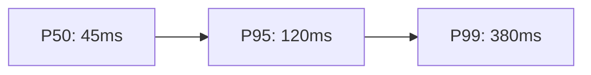
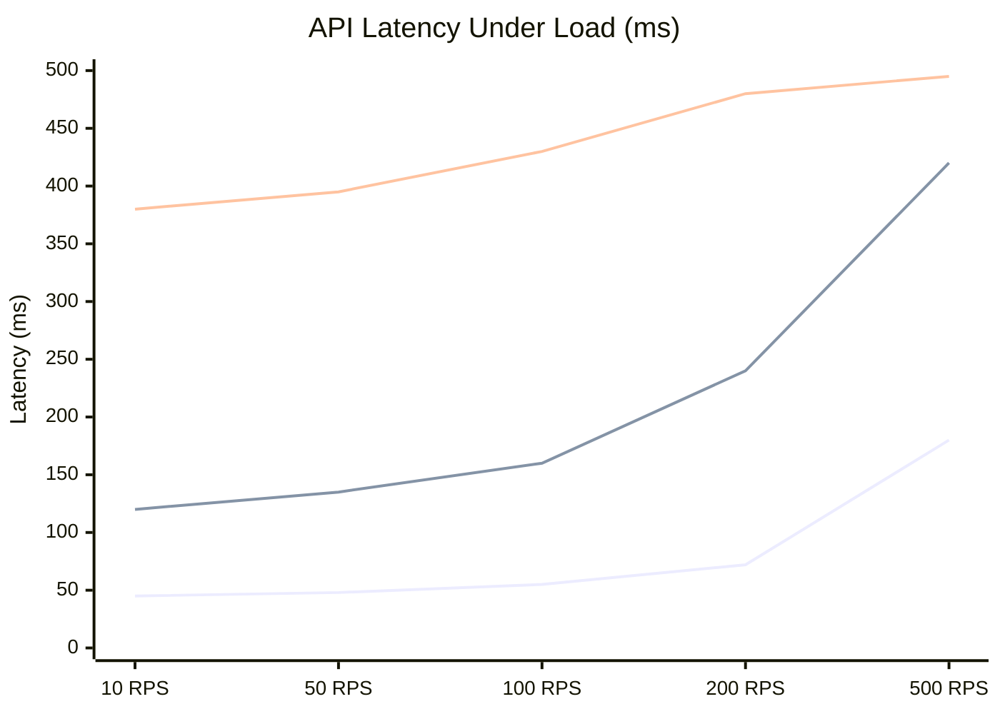

## XY Charts (xychart-beta)

Use `xychart-beta` when the story is *how a metric changes across categories or over time*. It supports `line` and `bar` series, which cover the two most common data visualization needs: trend lines for continuous metrics (latency, error rate, throughput) and bar charts for discrete category comparisons (requests per endpoint, errors per service). This is a beta feature — syntax is stable but minor additions may appear across Mermaid versions.

### When to Use

- API latency trends: P50/P95/P99 response time over deployment windows
- Load test results: requests per second and error counts at each concurrency level
- Error rate tracking: errors per minute across a time window
- Per-endpoint request volume: comparing request counts across routes
- Before/after performance comparisons: latency before and after an optimization

### When NOT to Use

- Single-point-in-time proportions — use `pie` instead (`analytics-pie.md`)
- Multi-stage flow volumes — use `sankey-beta` instead (`infra-sankey.md`)
- When you need scatter plots, histograms, or box plots — Mermaid does not support these; use an embedded image or link to an external chart tool
- When the dataset has more than ~20 x-axis points — labels overlap and the chart becomes unreadable

**Incorrect (describing performance metrics in prose or plain text when a chart would communicate trends):**



**Correct (xychart-beta with line series showing latency across load levels):**



### Syntax Reference

```
xychart-beta
    title "Chart Title"

    x-axis "X Axis Label"                           # continuous x-axis with label only
    x-axis ["Cat1", "Cat2", "Cat3"]                 # categorical x-axis with labels
    x-axis Label 0 --> 100                          # numeric x-axis with range

    y-axis "Y Axis Label"                           # y-axis with label only
    y-axis "Y Axis Label" 0 --> 1000                # y-axis with explicit range

    line "Series Name" [v1, v2, v3, v4]             # line chart series
    bar "Series Name" [v1, v2, v3, v4]              # bar chart series
```

**Combining line and bar series:**
```
xychart-beta
    title "Requests and Error Rate by Hour"
    x-axis ["00:00", "04:00", "08:00", "12:00", "16:00", "20:00"]
    y-axis "Count / Rate" 0 --> 2000
    bar "Requests" [120, 80, 450, 1800, 1650, 900]
    line "Errors" [2, 1, 8, 45, 38, 15]
```

**Syntax rules:**
- Data arrays must have the same number of elements as the x-axis category list
- Series names must be quoted if they contain spaces
- `y-axis` range is optional — Mermaid auto-scales when omitted, but explicit ranges prevent misleading zoom effects
- You can mix `line` and `bar` on the same chart — bars render as a grouped bar chart, lines overlay on top

### Tips

- Always set an explicit `y-axis` range when the auto-scale would start at a non-zero baseline — a line starting at 480ms vs 500ms looks flat when auto-scaled from 480 but alarming when scaled from 0. Choose intentionally.
- Series data arrays must have the same length as the x-axis label array. A mismatch causes a render error with no clear message.
- Keep x-axis to 12-15 categories maximum. Beyond that, rotate labels are not supported and text overlaps.
- Use `bar` for discrete comparisons (per-endpoint counts) and `line` for continuous trends (latency over time). Mixing them on one chart is valid and useful when the two series have different semantics (e.g., volume as bars, rate as a line).
- Chart title should include the unit: `"API Latency Under Load (ms)"` not `"API Latency"`.
- When documenting a before/after comparison, use two separate charts with identical axis ranges so the visual scale is directly comparable.

Reference: [Mermaid XY Chart docs](https://mermaid.js.org/syntax/xyChart.html)
