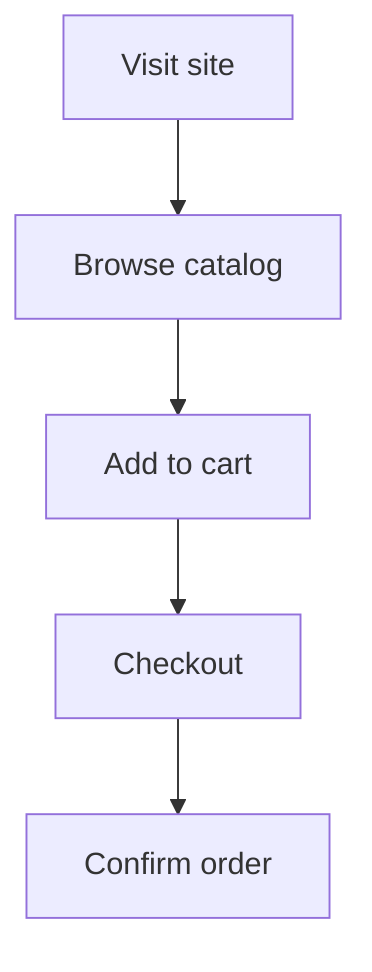
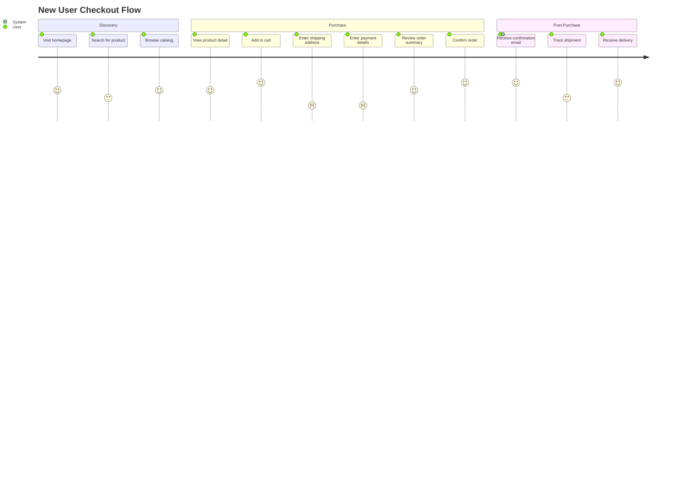

## User Journey Diagrams (journey)

Use `journey` when documenting a user experience as a sequence of tasks with satisfaction scores. The diagram makes pain points visible at a glance — any bar below 3 is a problem worth investigating. This makes it useful for feature specs, UX audits, and communicating product priorities to non-technical stakeholders.

### When to Use

- Feature specification: mapping what a user does end-to-end before writing a line of code
- UX audit: scoring the current experience to identify friction points
- Onboarding flows: showing where new users drop off or struggle
- Multi-actor flows: tasks completed by different roles (user, admin, system) across the same journey
- Release notes and product documentation where reader empathy matters

### When NOT to Use

- System-to-system call flows with request/response pairs — use `sequenceDiagram` instead (`behavior-sequence.md`)
- Conditional branching where decision logic matters — use `flowchart TD` instead
- Any flow where task order or dependencies need to be precise — `journey` is presentation-only, not executable

**Incorrect (using flowchart for a user experience flow — loses satisfaction dimension):**



**Correct (journey with sections, tasks, actors, and satisfaction scores):**



### Syntax Reference

```
journey
    title Journey Title

    section Phase Name
        Task description: score: Actor1
        Task description: score: Actor1, Actor2

    section Next Phase
        Task description: score: Actor1
```

**Score meanings (1–5):**

| Score | Meaning |
|-------|---------|
| 1 | Very dissatisfied — major pain point |
| 2 | Dissatisfied — friction or confusion |
| 3 | Neutral — works but not delightful |
| 4 | Satisfied — good experience |
| 5 | Very satisfied — delightful |

**Multiple actors:**
- Each actor listed after the score renders as a separate bar segment
- Common actors: `User`, `Admin`, `System`, `Support`
- Use consistent actor names across sections

### Tips

- The title should describe the journey being mapped, not just the product: `New User Checkout Flow` not `E-commerce Site`.
- Section names should be phase names in the user's language: `Discovery`, `Purchase`, `Post-Purchase` — not technical stage names like `Frontend Rendering`.
- Scores below 3 are actionable signals. If you are writing this diagram for a spec or audit, add a comment or linked issue for every task scored 1 or 2.
- Include `System` as an actor on tasks that happen automatically (confirmation email, tracking update) — it shows the user is not alone in the flow and helps distinguish human effort from automated steps.
- Task descriptions should read as user actions in present tense: `Enter shipping address` not `Shipping Address Form` or `address_input_rendered`.
- Journey diagrams render well in GitHub markdown and Notion. They are particularly useful in PRDs and design docs where stakeholders without technical backgrounds need to understand scope.
- Do not model more than ~6 sections or ~5 tasks per section — the diagram becomes unreadable. Split long journeys into `Pre-Purchase Journey` and `Post-Purchase Journey` if needed.

Reference: [Mermaid User Journey docs](https://mermaid.js.org/syntax/userJourney.html)
