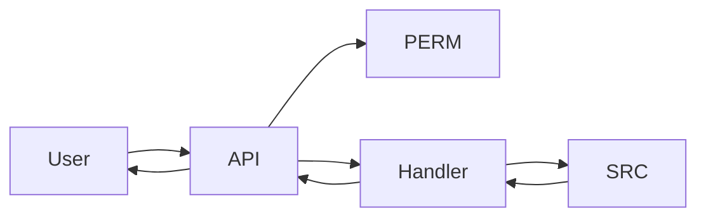
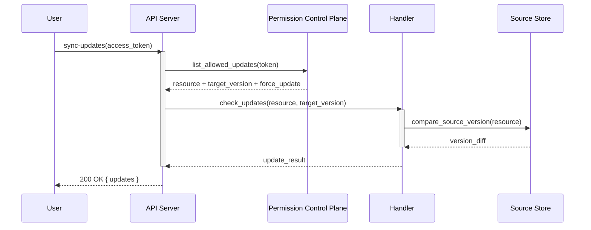

## Sequence Diagrams (sequenceDiagram)

Use `sequenceDiagram` when the story is about *who calls whom and in what order*. Temporal ordering between participants is the core value — it makes call chains, auth flows, and multi-service interactions legible in a way that a static graph never can.

### When to Use

- API call sequences between multiple services (client → API → DB → external service)
- Auth and token flows where request/response pairing matters
- Retry patterns and error handling paths that span multiple services
- Webhook and async notification flows
- Any interaction where the order of messages is load-bearing

### When NOT to Use

- Static architecture showing what exists without runtime interaction — use `graph TB` instead (`structure-graph.md`)
- State transitions within a single service — use `stateDiagram-v2` instead (`behavior-state.md`)
- More than ~8 participants or ~25 messages — split into sub-flows (see `composition-detail-levels.md`)

**Incorrect (using graph for a multi-service API call chain):**



**Correct (sequenceDiagram with participants, sync/async arrows, and activation):**



### Syntax Reference

```
sequenceDiagram
    participant A as Alias            # declare participant with display alias
    actor U as User                   # actor shape (person icon) for end users

    A->>B: label                      # synchronous request (solid arrow)
    B-->>A: label                     # async return / response (dashed arrow)
    A-xB: label                       # lost message (terminated arrow)
    A-)B: label                       # async message (open arrow, no wait)

    activate A                        # show activation bar on participant
    deactivate A

    alt condition                     # conditional branch
        A->>B: path 1
    else other condition
        A->>B: path 2
    end

    loop retry until success          # loop with label
        A->>B: attempt
    end

    opt optional step                 # optional block (may not execute)
        A->>B: if applicable
    end

    Note over A,B: text               # annotation spanning two participants
    Note right of A: text             # annotation to the right of a participant

    rect rgb(200, 220, 255)           # highlight a region with background color
        A->>B: highlighted call
    end
```

### Tips

- Always declare all participants at the top with `participant X as DisplayName` — this controls the left-to-right ordering and avoids auto-ordering surprises.
- Use `actor` instead of `participant` only for end users (humans) — it renders a person icon.
- Arrow label text should describe the actual API call or data being passed: `POST /auth/login` or `validate_token(jwt)`, not generic labels like `sends request`.
- Use `activate`/`deactivate` for operations that hold state across multiple sub-calls — it shows the service is "busy" and adds visual clarity.
- `-->>` (dashed) is for responses and async returns. `->>` (solid) is for calls and requests. Never reverse these.
- Use `rect rgb(...)` to group related steps (e.g., the auth phase, the retry window) when the sequence has distinct phases.
- Split long sequences at natural boundaries. If a sequence has >25 messages, identify a sub-flow that can be a separate diagram and link to it.
- `loop` labels should describe the termination condition, not just say "loop": `loop until ack received` not `loop`.

Reference: [Mermaid Sequence Diagram docs](https://mermaid.js.org/syntax/sequenceDiagram.html)
