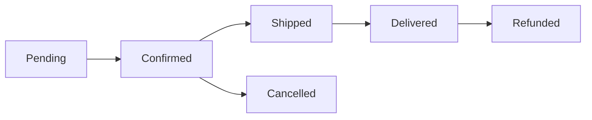
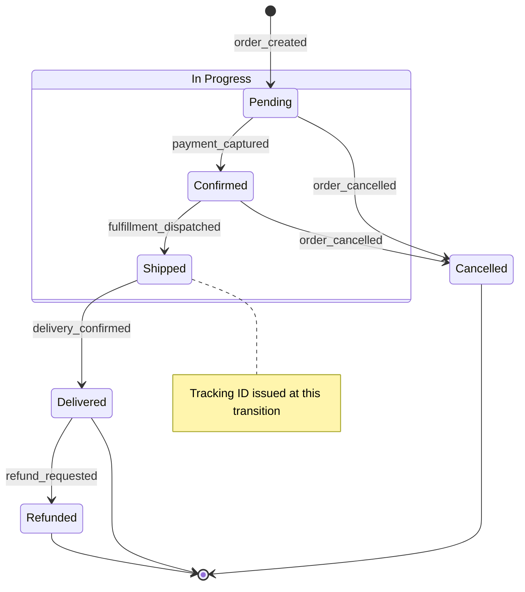

## State Diagrams (stateDiagram-v2)

Use `stateDiagram-v2` when documenting a system that can occupy a finite set of states and transitions between them based on events. The diagram makes valid transitions explicit and reveals illegal state changes by omission — any transition not drawn is not allowed.

### When to Use

- Order lifecycle: `pending → confirmed → shipped → delivered → refunded`
- Authentication session states: `unauthenticated → authenticating → active → expired`
- Task or job status machines: `queued → running → succeeded / failed / cancelled`
- Document or approval workflows with distinct review stages
- Connection or circuit-breaker states in infrastructure code

### When NOT to Use

- Multi-service call sequences with request/response timing — use `sequenceDiagram` instead (`behavior-sequence.md`)
- Simple conditional logic with no persistent state — use `flowchart TD` instead (`structure-flowchart.md`)
- More than ~15 states — split into a high-level diagram plus per-subsystem detail diagrams

**Incorrect (using graph for a state machine — loses start/end semantics and transition labels):**



**Correct (stateDiagram-v2 with start/end states, named transitions, composite states):**



### Syntax Reference

```
stateDiagram-v2
    [*] --> StateName : event          # entry from start pseudo-state
    StateName --> [*]                  # transition to end pseudo-state
    StateA --> StateB : event_name     # labeled transition

    state "Display Name" as StateName  # state with human-readable label

    state "Composite Group" as G {     # composite state — groups sub-states
        SubA --> SubB : event
    }

    state fork_state <<choice>>        # choice pseudo-state (diamond)
    StateA --> fork_state
    fork_state --> StateB : condition_true
    fork_state --> StateC : condition_false

    state join_state <<fork>>          # fork/join for concurrent regions
    StateA --> join_state
    join_state --> SubA
    join_state --> SubB

    StateA --> StateA : self_loop      # self-transition (retry, heartbeat)

    state StateA {                     # concurrent regions separated by --
        SubA1 --> SubA2
        --
        SubB1 --> SubB2
    }

    note right of StateA : annotation text
    note left of StateA : annotation text
```

### Tips

- Always include `[*]` as the explicit entry and exit points — diagrams without them leave the reader guessing where the lifecycle starts and ends.
- Name transitions with the event or trigger that causes them (`payment_captured`, `delivery_confirmed`), not with the destination state (`go_to_shipped`).
- Use `state "Display Name" as ID` when the state ID is a code constant (`ORDER_PENDING`) but the diagram should show human-readable labels.
- Use composite states to group sub-states that share a common exit: if both `Confirmed` and `Shipped` can transition to `Cancelled`, wrapping them in an `InProgress` composite state makes that single exit edge cleaner.
- `<<choice>>` pseudo-states are for guard conditions evaluated at runtime. Use them when the next state depends on a condition, not an explicit event.
- Self-transitions (`StateA --> StateA : retry`) are valid and useful for documenting retry-in-place behavior without cluttering the diagram with separate states.
- Do not model every error substate as a top-level state — use notes or group error substates inside a composite `Failed` state.

Reference: [Mermaid State Diagram docs](https://mermaid.js.org/syntax/stateDiagram.html)
