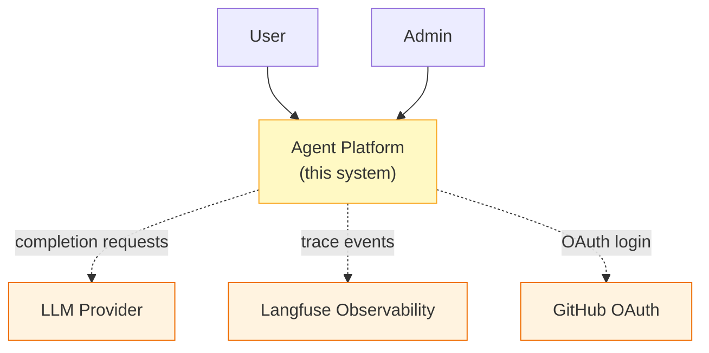
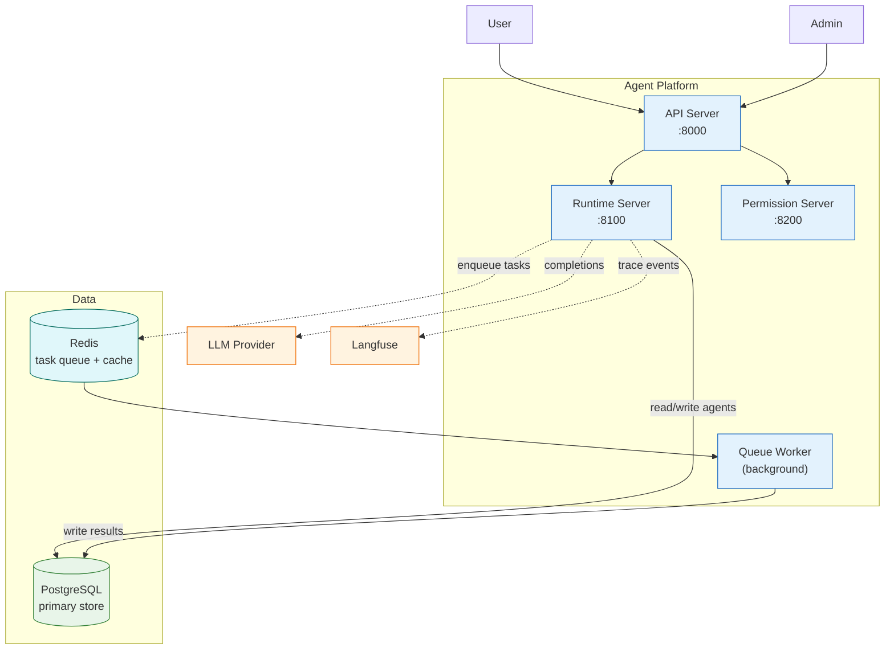
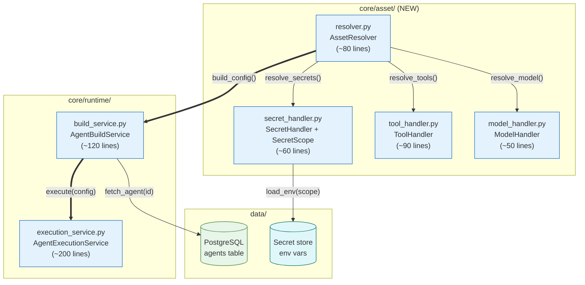
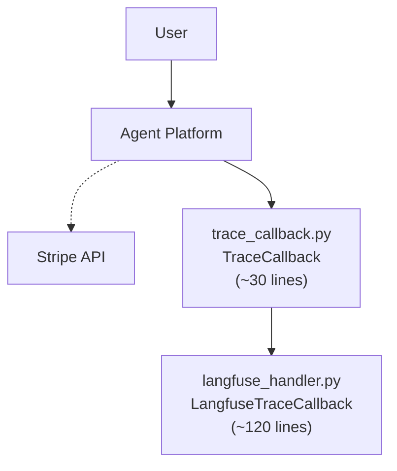
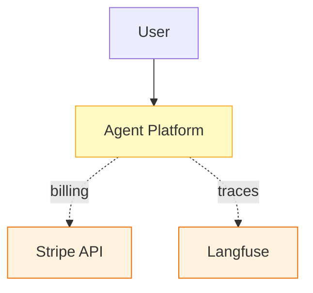
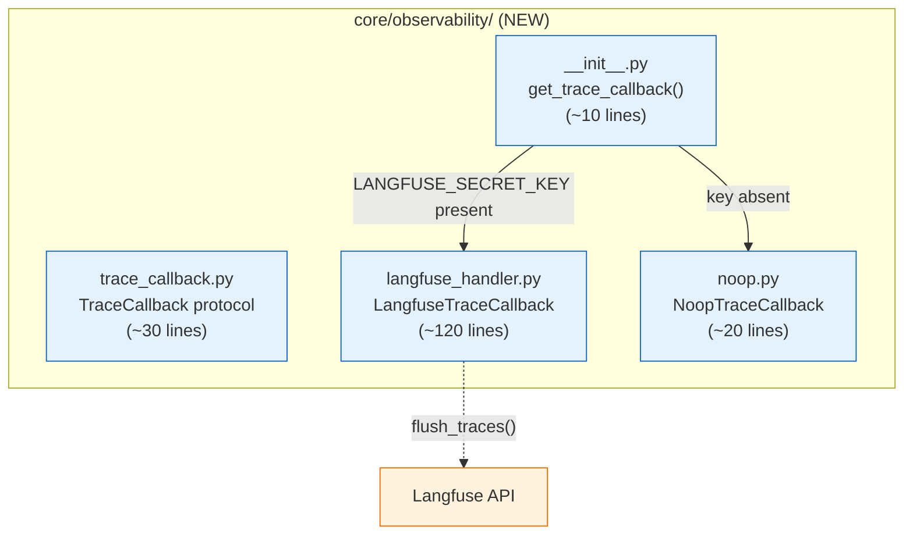

## Detail Levels (Context / Container / Component)

Architecture diagrams serve different audiences at different stages of understanding. The most common documentation failure is mixing detail levels in a single diagram — placing a user actor next to an internal module file, or a cloud service icon next to a function name. This forces every reader to mentally filter the diagram for their own level of concern.

The solution is to split architecture documentation into three discrete levels, each targeting a specific audience and containing only the elements appropriate to that level. Never mix levels in one diagram.

### When to Use

- Any time you document a system, service, or module with more than 5 components
- When onboarding documentation needs to serve both non-technical stakeholders and implementation engineers
- When a single diagram exceeds 30 nodes — it must be split by detail level
- When describing an architectural change that spans multiple abstraction layers

### When NOT to Use

- Simple utility scripts or standalone tools with 3-5 components — a single well-labeled graph is sufficient
- `sequenceDiagram`, `erDiagram`, `stateDiagram-v2` — these types are already scoped by nature and do not need C4-style splitting
- Diagrams generated by LangGraph's `draw_mermaid()` — preserve as-is (see `ai-langgraph-flow.md`)

---

### Three Detail Levels

#### Level 1 — Context (5-10 nodes)

**What it shows:** The system as a single box and its relationships to users, external services, and adjacent systems. No internal structure.

**Node types allowed:** User actors, the system itself (one box), external systems, adjacent internal systems.

**Node types NOT allowed:** Internal services, databases, files, classes, functions.

**Audience:** Stakeholders, product managers, architects getting their first look at the system.

**Node count:** 5-10 nodes. If you exceed 10, some of your "external" nodes should be collapsed or are actually internal.



#### Level 2 — Container (10-20 nodes)

**What it shows:** The internal services, data stores, caches, queues, and key external integrations that make up the system. No file-level detail.

**Node types allowed:** API servers (with port), background workers, databases, caches, queues, message brokers, external APIs used directly.

**Node types NOT allowed:** Individual files, classes, functions, or internal module details.

**Audience:** Architects, senior engineers, DevOps engineers designing deployment or integration.

**Node count:** 10-20 nodes. If you exceed 20, some containers should be grouped or extracted to their own Level 3 diagram.



#### Level 3 — Component (15-30 nodes)

**What it shows:** The internal modules, files, classes, and functions within a single service or directory. Code-level identifiers are mandatory.

**Node types allowed:** Individual source files, classes, functions, protocols, configuration files. Each node maps 1:1 to a real code artifact.

**Node types NOT allowed:** External systems (those belong at Level 1 or 2), other services as internal nodes (use an edge to a labeled boundary node instead).

**Audience:** Developers implementing or debugging a specific service.

**Node count:** 15-30 nodes. If you exceed 30, extract a subdirectory into its own Level 3 diagram and link from the parent.

**Code-level label requirement (CRITICAL):** Every node must include the file path, primary class or function name, and approximate line count. See `foundation-style-conventions.md` for label format. This makes diagrams searchable alongside source code.



---

### Choosing the Right Level

| Question | Level |
|----------|-------|
| "What does this system do and who uses it?" | 1 — Context |
| "What services exist and how do they talk?" | 2 — Container |
| "What files/classes are inside service X?" | 3 — Component |
| "How does function Y call function Z?" | 3 — Component (or sequence diagram) |

When in doubt, draw Level 2 first. It is the most useful diagram for a new engineer joining a team. Level 1 follows naturally once Level 2 exists, and Level 3 diagrams are written on demand for the services under active development.

### Linking Between Levels

Reference the adjacent level from within the diagram using a comment or from the surrounding documentation. Do not duplicate content across levels.

```
%% Title: Container View — Agent Platform
%% Context diagram: ./context-view.md
%% Component diagrams: ./components/runtime-server.md, ./components/api-server.md

graph TB
    ...
```

In Markdown documentation:

```markdown
## Architecture

- **System Context** — how the platform fits into the wider business ([context-view.md](./context-view.md))
- **Container View** — internal services and data stores ([container-view.md](./container-view.md))
- **Runtime Server (Component)** — file-level detail for the Runtime service ([runtime-component.md](./components/runtime-server.md))
```

### Node Count Enforcement

| Level | Max Nodes | Action When Exceeded |
|-------|-----------|----------------------|
| Context | 10 | Collapse adjacent systems into a single "Other Systems" node |
| Container | 20 | Extract a cluster of services into a subsystem box; link to a separate Container diagram |
| Component | 30 | Extract a subdirectory into its own Component diagram; replace with a single boundary node |

**Incorrect (single diagram mixing Level 1 context with Level 3 module files):**



**Correct (two separate diagrams, each at a single detail level):**

Level 1 — Context:



Level 3 — Component (Observability module inside Agent Platform):



### Rules

- NEVER mix detail levels in one diagram. Each diagram shows exactly one level.
- If a diagram exceeds 30 nodes, extract a subgraph into its own Level 3 diagram.
- Level 3 diagrams MUST include file path, primary class or function name, and approximate line count in every node label.
- Link between levels via cross-references in documentation — never duplicate content.
- Level 1 diagrams must represent the system as a single node. No internal service nodes at Level 1.
- Level 2 diagrams show services and data stores only. No file-level nodes at Level 2.

### Tips

- Start with Level 2. It is the most universally useful starting point and takes the least time to produce.
- Level 1 is often written last, after Level 2 clarifies the system's external interfaces.
- Level 3 diagrams are most valuable during active development of a service. Write them when the code is being changed, not months after.
- When a Level 3 diagram needs a reference to another service, represent it as a single boundary node with the service name — do not expand its internals inside the Level 3 diagram.
- Code-level labels at Level 3 (`file.py<br/>ClassName<br/>(~N lines)`) make diagrams searchable via `grep` and LSP tools, linking documentation to source code without manual maintenance.

Reference: [C4 Model](https://c4model.com/) | [Mermaid Flowchart docs](https://mermaid.js.org/syntax/flowchart.html)
