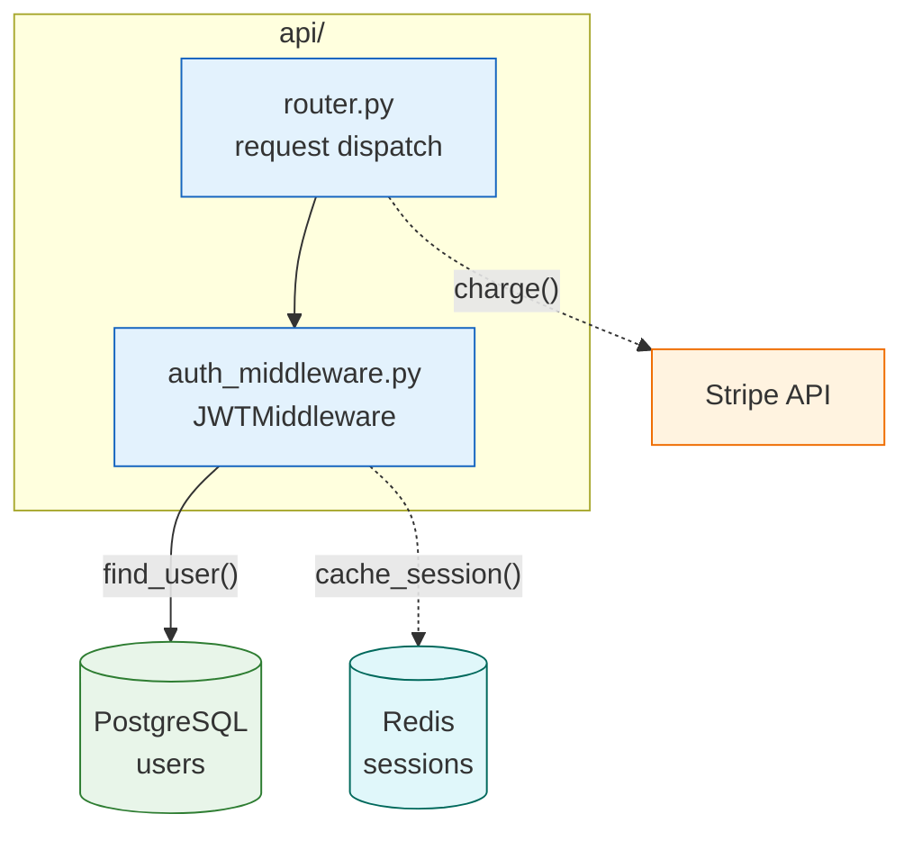
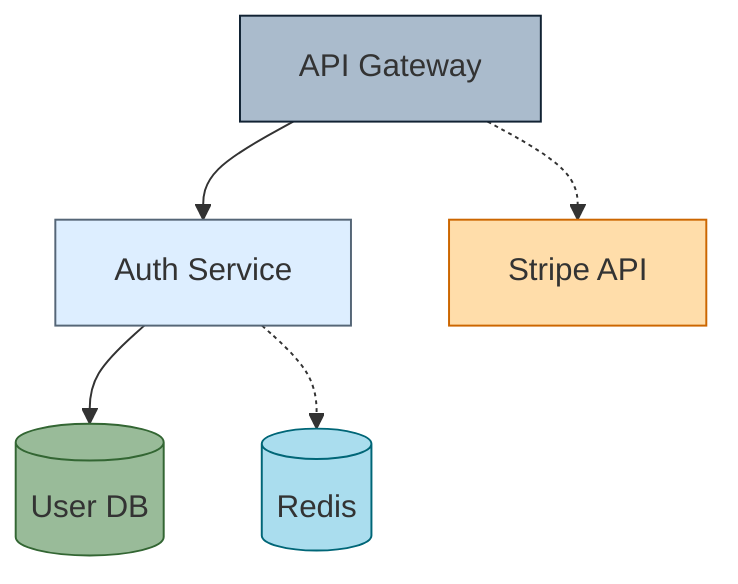
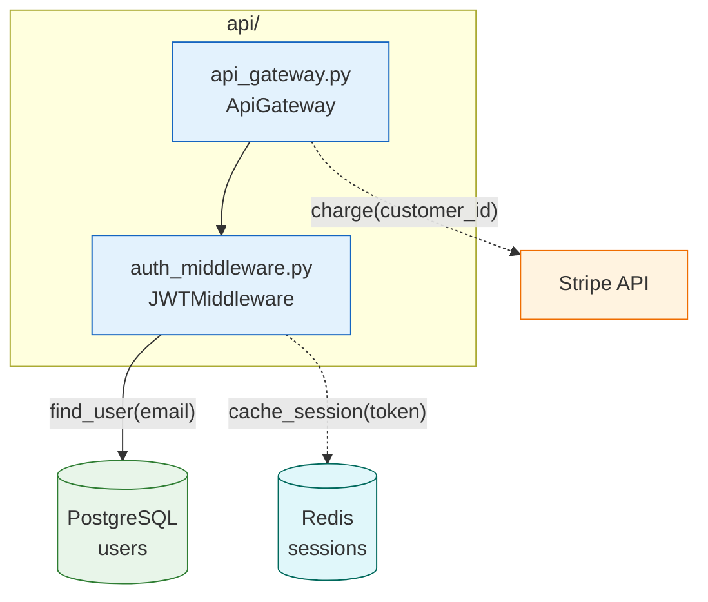

## Diagram Styling (classDef, style, theme)

Consistent styling makes a set of diagrams scannable as a documentation suite and communicates node type at a glance. This file covers the three styling mechanisms available in Mermaid — `classDef` for reusable type-based styles, `style` for one-off overrides, and `%%{init}%%` theme directives for diagram-level appearance — and defines the standard palette used across all diagrams in this harness.

### When to Use

- Any diagram that contains more than one logical node type (service, database, external system, queue, cache)
- When a diagram will appear alongside other diagrams in documentation and visual consistency matters
- When you need to draw attention to a specific node (critical path, new component, deprecated component)
- When the default Mermaid theme produces insufficient contrast for the rendering target (GitHub, VS Code, PDF)

### When NOT to Use

- `sequenceDiagram` and `erDiagram` — these types have their own styling mechanisms; `classDef` does not apply
- LangGraph `draw_mermaid()` auto-generated output — preserve as-is and annotate with comments rather than reformatting (see `ai-langgraph-flow.md`)
- Diagrams with a single node type — adding `classDef` for one class adds noise without benefit

---

### `classDef`: Reusable Type-Based Styling

`classDef` defines a named style class that can be applied to multiple nodes. This is the primary styling mechanism for any node that shares a type with other nodes in the diagram.

**Syntax:**

```
classDef className fill:#hexcolor,stroke:#hexcolor,stroke-width:Npx
```

**Apply with triple-colon syntax after the node declaration:**

```
NodeID[Label]:::className
```

**Or apply in bulk after all node declarations:**

```
class NodeA,NodeB,NodeC className
```

The triple-colon inline syntax (`:::`) is preferred — it keeps the class association visible at the point of node declaration.

### Standard Palette

Use these exact class names and colors across all diagrams in this harness. Consistent names ensure that colors are predictable when diagrams appear side-by-side in documentation.

```
classDef database  fill:#e8f5e9,stroke:#2e7d32
classDef service   fill:#e3f2fd,stroke:#1565c0
classDef external  fill:#fff3e0,stroke:#ef6c00
classDef highlight fill:#fff9c4,stroke:#f9a825
classDef startEnd  fill:#f9f9f9,stroke:#333,stroke-width:2px
classDef critical  fill:#ffebee,stroke:#c62828
classDef queue     fill:#f3e5f5,stroke:#6a1b9a
classDef cache     fill:#e0f7fa,stroke:#00695c
```

| Class | Color | Use For |
|-------|-------|---------|
| `database` | light green | PostgreSQL, SQLite, any persistent data store |
| `service` | light blue | Internal services, API handlers, application modules |
| `external` | light orange | Third-party APIs, external systems outside your boundary |
| `highlight` | light yellow | The single most important node in a diagram (use max 1-2) |
| `startEnd` | near-white, dark border | Start and end terminals in flowcharts |
| `critical` | light red | Error paths, critical failures, nodes that must not be skipped |
| `queue` | light purple | Message queues, event buses, async buffers |
| `cache` | light teal | Redis, Memcached, in-memory caches |

Never invent new color values outside this palette. If the palette lacks a class for your node type, map to the nearest semantic match. A diagram with more than 6 distinct colors is too noisy to scan.

### `classDef` Placement Rule

Define all `classDef` blocks at the bottom of the diagram, after all node declarations and edge declarations. This mirrors the pattern used in CSS (declarations first, then rules) and matches Mermaid's conventional rendering order.



Only include `classDef` entries for classes actually used in the diagram. Do not paste the entire palette as boilerplate if only two classes appear.

### `style`: Inline One-Off Overrides

Use `style` to apply a unique appearance to a single node that does not share its type with any other node in the diagram. One-off overrides should be rare. If you find yourself writing `style` for more than two nodes, switch to `classDef`.

```
style NodeID fill:#hexcolor,stroke:#hexcolor,stroke-width:Npx,stroke-dasharray:N
```

Common one-off use cases:

```
%% Mark a single node as the entry point
style EntryPoint stroke-width:3px

%% Mark a deprecated node with dashed border
style LegacyService stroke-dasharray:4,stroke:#999

%% Mark a new node under active development
style NewModule fill:#f0fff0,stroke:#2e7d32,stroke-width:2px
```

### `%%{init}%%`: Theme Directives

The `%%{init}%%` directive at the top of a diagram overrides Mermaid's default theme and sets global theme variables. Use it when the default theme produces insufficient contrast in your rendering environment or when a diagram will be embedded in a branded document.

**Syntax (must be the very first line of the diagram):**

```
%%{init: {'theme': 'base', 'themeVariables': {'primaryColor': '#e3f2fd', 'primaryBorderColor': '#1565c0', 'fontFamily': 'monospace'}}}%%
graph TB
    %% Title: Theme override example
    ...
```

**Standard initialization for architecture diagrams in this harness:**

```
%%{init: {'theme': 'base', 'themeVariables': {'primaryColor': '#ffffff', 'primaryBorderColor': '#333333', 'lineColor': '#555555', 'fontSize': '14px'}}}%%
```

Available themes: `default`, `base`, `dark`, `forest`, `neutral`. Use `base` when you need to apply `classDef` colors reliably — other themes may override your fill colors with theme-level defaults.

Notes:
- `%%{init}%%` applies to the entire diagram and cannot be scoped per subgraph.
- Use sparingly. Most architecture diagrams render acceptably with the default theme plus `classDef` classes.
- Do not use `%%{init}%%` in diagrams generated by LangGraph's `draw_mermaid()` — it conflicts with the exported structure.

### Semantic Naming Rule

Name style classes after what the node represents semantically, not after the color it renders. Future theme changes will break diagrams where class names encode color.

```
%% Correct — semantic names
classDef database fill:#e8f5e9,stroke:#2e7d32
classDef external fill:#fff3e0,stroke:#ef6c00

%% Incorrect — color names
classDef green  fill:#e8f5e9,stroke:#2e7d32
classDef orange fill:#fff3e0,stroke:#ef6c00
```

**Incorrect (inline styles scattered throughout, random colors, no semantic structure):**



**Correct (classDef at bottom, semantic names, standard palette):**



### Rules

- Define all `classDef` blocks at the bottom of the diagram, after all nodes and edges.
- Use semantic names for classes (`database`, `service`) — never color names (`green`, `blue`).
- Apply the standard 8-class palette across all diagrams. Do not invent new colors.
- Never use more than 6 distinct colors in one diagram.
- Use `classDef` for any node type appearing more than once. Use `style` only for true one-offs.
- Only include `classDef` entries for classes actually used in the diagram.
- Use `%%{init}%%` only when the default theme produces a rendering problem. Do not add it by default.

### Tips

- Apply `:::highlight` to at most 1-2 nodes per diagram. Highlighting loses meaning if overused.
- `stroke-dasharray:4` on a `style` or `classDef` renders a dashed border — useful for deprecated or unstable nodes without needing a text annotation.
- When reviewing a diagram from another agent, check that `classDef` is at the bottom and that all class names match the standard palette names.
- The `class NodeA,NodeB className` bulk syntax is convenient for retroactively applying a class to a list of nodes without editing each line.
- `stroke-width:2px` in `startEnd` makes terminal nodes stand out as entry/exit points without using color.

Reference: [Mermaid Theming](https://mermaid.js.org/config/theming.html)
