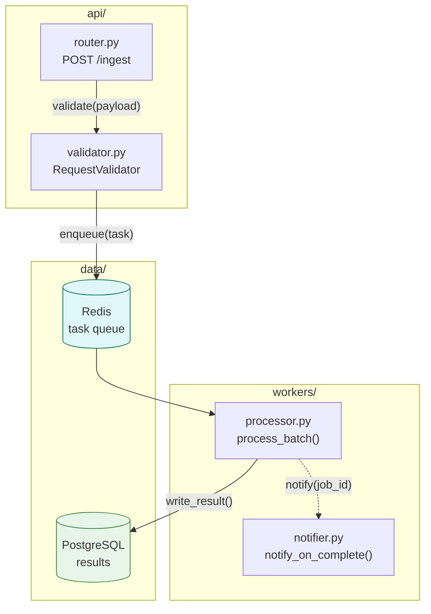
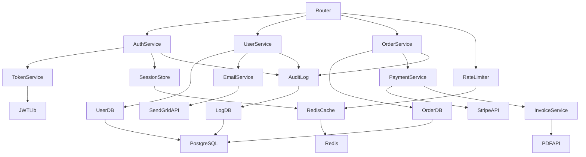
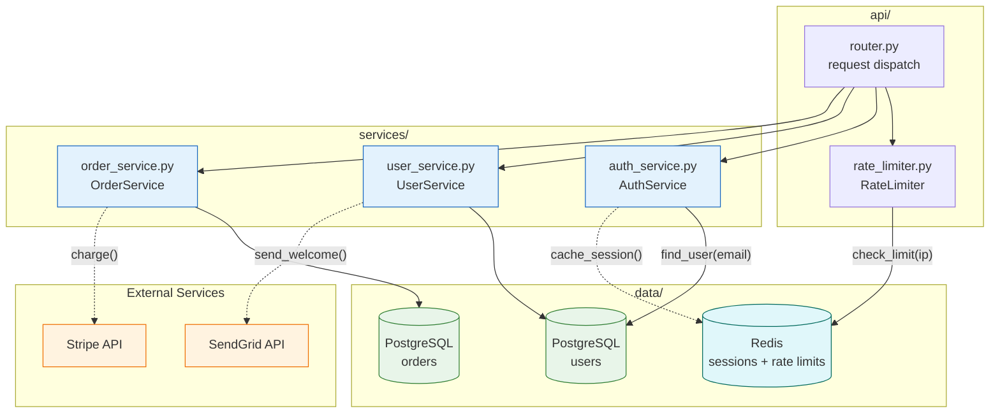

## Subgraph Composition Patterns

Subgraphs group related nodes into named regions inside a single diagram. Use them to impose structure on diagrams with more than 6-8 nodes, to communicate service or directory boundaries, and to make cross-cutting edges readable at a glance.

### When to Use

- Grouping nodes that share a directory, service boundary, or deployment unit
- Making cross-subgraph edges explicit — the reader can see which boundary a call crosses
- Communicating ownership or responsibility boundaries between teams or layers
- Reducing visual noise when a flat graph exceeds 8 nodes

### When NOT to Use

- Diagrams with fewer than 6 nodes — subgraphs add overhead without benefit
- When grouping would be arbitrary and does not reflect a real boundary in the system
- When you need more than 3 levels of nesting — split into multiple diagrams instead (see `composition-detail-levels.md`)
- When the diagram type does not support subgraphs (`erDiagram`, `sequenceDiagram`, `classDiagram`, `gantt`, `timeline`)

---

### Basic Syntax

```
subgraph "Title"
    NodeA[Label A]
    NodeB[Label B]
end
```

The title must be quoted whenever it contains spaces, slashes, parentheses, or any non-alphanumeric character. Unquoted titles parse correctly only for single-word labels.

```
%% Correct — quoted titles
subgraph "core/auth/"
    AuthService[Auth Service]
end

subgraph "External Services"
    Stripe[Stripe API]
end

%% Incorrect — unquoted title with spaces breaks parsing
subgraph External Services
    Stripe[Stripe API]
end
```

### Nesting Subgraphs (Max 3 Levels)

Subgraphs can be nested to represent hierarchical groupings. Stop at 3 levels — deeper nesting renders unpredictably and signals the diagram should be split.

```
subgraph "System"                    %% level 1 — deployment boundary
    subgraph "api-service/"          %% level 2 — service directory
        subgraph "api/routes/"       %% level 3 — subdirectory
            AuthRoutes["auth.py<br/>POST /login, POST /logout"]
            UserRoutes["users.py<br/>GET /users/:id"]
        end
        Middleware["middleware.py<br/>JWTMiddleware"]
    end
end
```

Never add a 4th level. If a 4th level seems necessary, extract the inner subgraph into its own Level 3 diagram and link to it in documentation.

### Subgraph Titles: Use Actual Directory Paths

When nodes represent files or components in a specific directory, use the directory path as the subgraph title. Include status annotations in parentheses when relevant.

```
subgraph "core/observability/ (NEW)"
    TC["trace_callback.py<br/>TraceCallback protocol<br/>(~30 lines)"]
    INIT["__init__.py<br/>get_trace_callback()<br/>(~10 lines)"]
end

subgraph "core/runtime/ (STABLE)"
    EXEC["execution_service.py<br/>AgentExecutionService<br/>(~200 lines)"]
end
```

For logical groupings that do not map to a real directory (external services, deployment zones, team boundaries), use a clear descriptive title in quotes:

```
subgraph "External Integrations"
    StripeAPI[Stripe Payment API]
    SendGrid[SendGrid Email API]
end
```

### Cross-Subgraph Edges

Define all nodes inside their subgraphs first, then declare cross-subgraph edges after all subgraph blocks have closed. This keeps the grouping and the flow concerns visually separated in the source and prevents Mermaid from misattributing nodes.



### Subgraph Direction Override

A subgraph can declare its own layout direction with `direction LR` or `direction TB` placed immediately after the subgraph title line. The outer diagram direction still applies to subgraph placement relative to each other.

```
graph TB
    %% Title: Mixed-direction layout

    subgraph "pipeline/ (left-to-right stages)"
        direction LR
        Ingest["ingest.py<br/>IngestWorker"] --> Transform["transform.py<br/>Transformer"] --> Load["load.py<br/>Loader"]
    end

    subgraph "monitoring/"
        direction TB
        AlertManager["alert_manager.py<br/>AlertManager"]
        Dashboard["dashboard.py<br/>MetricsDashboard"]
        AlertManager --> Dashboard
    end
```

Use direction overrides sparingly. Mixing directions in the same diagram increases cognitive load. Prefer a single direction across the whole diagram unless the data clearly flows in two distinct orientations.

### Styling Subgraph Borders

Apply `style` to the subgraph ID to change border color, background, or stroke width. The subgraph ID is the title text stripped of quotes.

```
subgraph NewFeatures["core/observability/ (NEW)"]
    TC["trace_callback.py<br/>TraceCallback protocol"]
end

style NewFeatures fill:#f0fff0,stroke:#2e7d32,stroke-width:2px,stroke-dasharray:4
```

Notes:
- Use a named alias (`NewFeatures`) when the subgraph title contains slashes or spaces, since `style` requires a valid identifier.
- `stroke-dasharray:4` renders a dashed border — useful for marking unstable, new, or deprecated boundaries.
- Avoid background fills on deeply nested subgraphs; they compound and produce muddy color blends.

**Incorrect (flat graph with 25+ nodes and no grouping):**



**Correct (same nodes organized into logical subgraphs with cross-subgraph edges):**



### Rules

- Max 3 levels of subgraph nesting. At level 4, extract into a separate diagram.
- Every subgraph must have a descriptive title — never leave the title blank.
- Use actual directory paths for subgraph titles when nodes represent files (`"core/auth/"`).
- Cross-subgraph edges must be declared after all subgraph definitions close.
- Keep related nodes in the same subgraph — do not scatter a service's files across multiple subgraphs.
- Every subgraph must contain at least 2 nodes. A single-node subgraph adds structure overhead without grouping benefit.

### Tips

- If two subgraphs consistently share many cross-edges, consider whether they should be merged into one subgraph or whether a Level 2 container diagram is a better fit.
- Status annotations like `(NEW)`, `(DEPRECATED)`, `(v2)` in titles communicate change context inline without requiring a legend.
- Use `direction LR` inside a subgraph to lay out a pipeline stage horizontally while keeping the overall diagram vertical.
- When the number of cross-subgraph edges exceeds the number of intra-subgraph edges, the grouping is probably wrong — reconsider the boundary.
- Subgraph borders can be styled with dashed lines to communicate instability or planned removal without adding annotation nodes.

Reference: [Mermaid Subgraphs](https://mermaid.js.org/syntax/flowchart.html#subgraphs)
