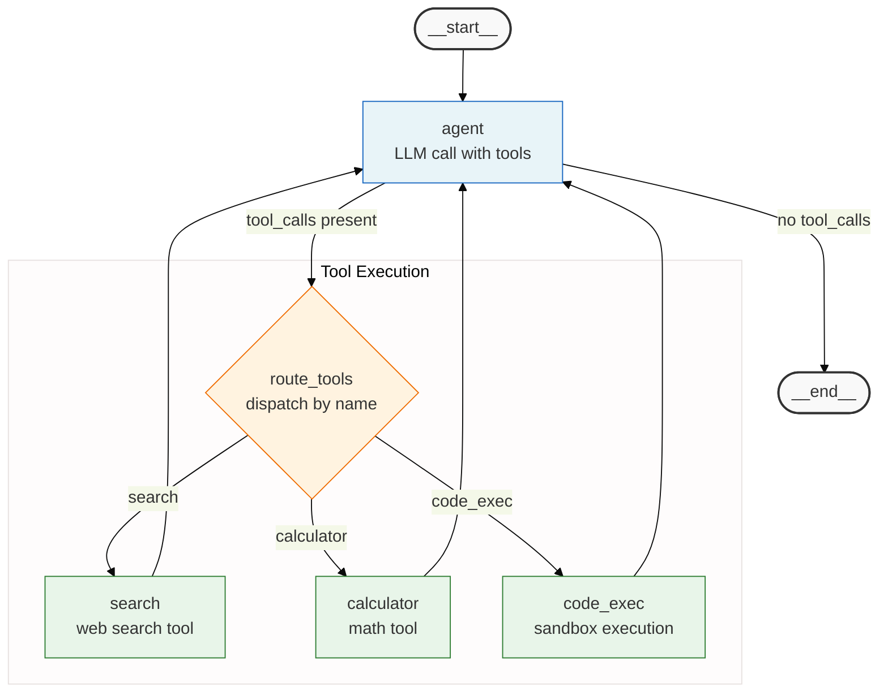

## Context

Produce this diagram when documenting a single LangGraph ReAct agent that dispatches to multiple tools. It belongs in AI domain design documents (before implementation begins), architecture documentation explaining how the agent loop works, and code reviews where the reviewer needs to confirm the implemented graph matches the design.

This pattern — agent → conditional tool router → tools → back to agent — is the defining structure of a ReAct agent. Always draw the feedback loop explicitly. Collapsing the tool dispatch into a single `tools` node (as the minimal ReAct pattern does) is appropriate when there are 3 or fewer tools, but when the graph has distinct tool types with different behaviors, showing them individually in a subgraph makes routing decisions legible.

If the LangGraph graph already exists in code, use `draw_mermaid()` rather than writing this manually. Use this example as a reference for what the manual version should look like when writing design docs before implementation.

Trigger conditions:

- AI domain design document for a new agent with 3 or more distinct tool types.
- Architecture documentation explaining tool dispatch and routing logic.
- Code review: comparing the implemented graph against the design.
- Onboarding documentation for engineers unfamiliar with the LangGraph ReAct pattern.

## Diagram

## Annotations

**Stadium shapes for START and END.** `([__start__])` and `([__end__])` use the exact names and shapes that LangGraph's `draw_mermaid()` generates. If you later replace this manual diagram with the exported version, the START/END nodes will match and diffs will be minimal. Do not substitute `[START]` or `((start))` — they diverge from the canonical export format.

**Tool router as a diamond (decision node).** The `ToolRouter` uses a hexagon shape (`{...}`) to signal that it is a conditional routing step, not a processing node. This visually distinguishes "I am deciding which tool to call" from "I am calling a tool." The node label includes the function name (`route_tools`) and a description (`dispatch by name`), matching the code-level label convention from `foundation-style-conventions.md`.

**Conditional edge labels use exact condition values.** The edges from `Agent` are labeled with the exact condition values: `tool_calls present` and `no tool_calls`. The edges from `ToolRouter` use the exact tool names: `search`, `calculator`, `code_exec`. These match the string values that the conditional edge function returns at runtime. A reader can verify the routing logic by searching for these strings in the implementation.

**Tool subgraph groups the Tool Execution phase.** Tools are grouped in a `"Tool Execution"` subgraph rather than listed flat. This subgraph title is a logical grouping (not a directory path) because these nodes represent tool functions that may live in different files. The grouping communicates that all three are peers in the dispatch tier.

**Return edges from tools go directly to Agent.** Each tool node has a return edge directly back to `Agent` (not to `ToolRouter`). This is the correct ReAct pattern: the agent sees the tool result and decides next steps, rather than the router deciding what happens after a tool call. Drawing the return edges correctly is the most common thing to get wrong in a manual LangGraph diagram.

**`%%{init}` theme directive.** The `primaryColor` in the theme directive sets the base color that propagates through default node fills. The explicit `classDef` blocks override this for each node type. Including the directive ensures the diagram renders consistently across GitHub, VS Code preview, and documentation sites that use different default themes.

**When to add more tool nodes.** If the agent has more than 5 tools, do not expand this subgraph — split it. Use one `tools` aggregation node in the main graph and a separate diagram showing the tool inventory. Beyond 5 tool nodes, the subgraph exceeds the 30-node limit when combined with the surrounding graph nodes.
