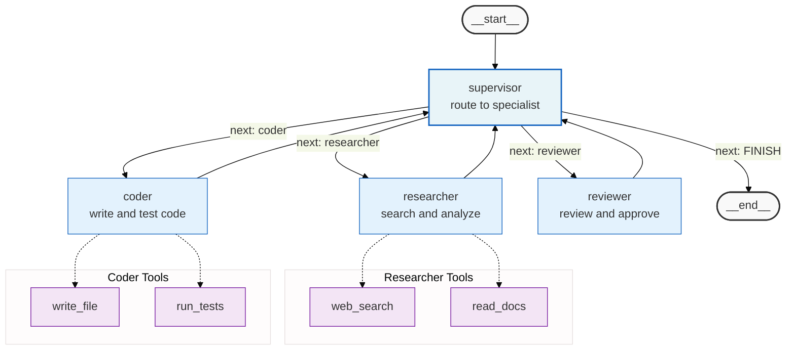

## Context

Produce this diagram when documenting a LangGraph multi-agent system that uses a supervisor to route work to specialized worker agents. It belongs in AI domain design documents for systems where a single ReAct agent is insufficient and multiple specialist agents are needed, architecture documentation for agentic pipelines, and code reviews comparing the supervisor routing logic against the design.

The supervisor pattern is architecturally distinct from a single ReAct agent in two ways: first, the supervisor itself does not execute tools directly — it routes to workers who do. Second, every worker returns to the supervisor for re-routing, not to a shared tool pool. Always show the return edges from workers back to the supervisor — omitting them makes the diagram look like a one-way dispatch system, hiding the iterative loop that is the pattern's defining characteristic.

Trigger conditions:

- AI domain design document for a system with 2 or more specialist worker agents.
- Architecture documentation for a multi-step pipeline where different agents handle different competencies.
- Code review where the reviewer needs to verify that each worker returns control to the supervisor.
- Explaining the supervisor pattern to an engineer unfamiliar with LangGraph multi-agent systems.

## Diagram

## Annotations

**Supervisor node uses thicker border.** The `supervisor` classDef adds `stroke-width:2px` to visually distinguish the routing node from the worker nodes. In a rendered diagram, the supervisor is the visual anchor — it connects to every worker and receives every return edge. The thicker border makes it immediately identifiable as the control-flow hub.

**Conditional edge labels use `"next: <value>"` format.** The labels on edges from the supervisor match the actual value of the `next` field in the supervisor's output state — `"next: researcher"`, `"next: coder"`, `"next: FINISH"`. This is the exact string the LangGraph conditional edge function inspects to select a target node. A reader can search the codebase for `"next": "researcher"` and find both the routing logic and this diagram.

**`"next: FINISH"` edge is explicit.** The edge to `END` is labeled `"next: FINISH"` rather than left unlabeled. In LangGraph multi-agent systems, `FINISH` is a sentinel value that tells the supervisor routing function to end the graph. Making it explicit documents the termination condition — without it, readers must read the routing function to know when the loop exits.

**Worker return edges are unconditional and unlabeled.** Each worker (`Researcher`, `Coder`, `Reviewer`) returns to `Supervisor` via an unconditional edge with no label. Workers in a supervisor pattern do not decide what happens next — they complete their task and hand control back. Labeling these edges would incorrectly suggest that workers make routing decisions.

**Tool subgraphs use dashed arrows.** The `-.->` dashed arrows from workers to their tool subgraphs signal that the tool calls are internal to the worker agent's execution — they are not cross-agent calls. Dashed arrows indicate optional or internal interactions, distinct from the solid routing arrows between the supervisor and workers.

**Reviewer has no tool subgraph.** The `Reviewer` worker has no associated tool subgraph because its task (reviewing and approving) does not require external tool calls — it works on the accumulated state. Omitting a tool subgraph for the reviewer communicates this distinction without requiring a comment.

**Why the tool subgraphs are not nested inside the worker nodes.** Mermaid does not support declaring a subgraph as a child of a single node. The tool subgraphs are siblings of the worker nodes, connected by dashed arrows. If nesting were available, the tool subgraphs would sit inside the worker nodes — but the dashed arrow achieves the same communication: "these tools belong to this worker."

**Node count.** This diagram has 14 nodes. If additional workers or tool sets are added and the count approaches 30, split the diagram: one high-level supervisor diagram (workers only, no tool subgraphs) and separate per-worker tool inventory diagrams.
