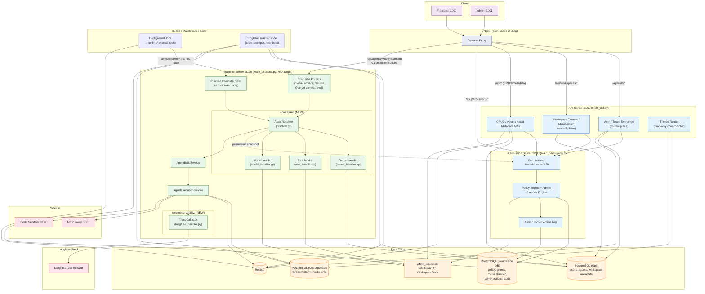

## Context

Produce this diagram when you need a single authoritative view of every service, database, and traffic path in a deployed system. It belongs in the top-level architecture document (e.g., `docs/architecture/README.md` or an ADR) and is the first diagram a new engineer should read. Because it contains every major subsystem in one view, it deliberately trades implementation detail for breadth — individual services get their own diagrams at lower levels of the composition hierarchy (see `composition-detail-levels.md`).

Trigger conditions:

- A new engineer asks "how does the whole system fit together?"
- You are writing the architecture section of a design document.
- You need to show traffic paths across all service boundaries simultaneously.
- You are documenting an existing system before a refactor so reviewers can see the before state.

## Diagram

## Annotations

**Subgraph nesting strategy.** The Runtime Server subgraph nests two inner subgraphs (`core/asset/` and `core/observability/`) to show that these are implementation modules inside a single process, not separate deployments. The nesting depth is 2 (system → server → module), which stays within the 3-level limit. The `(NEW)` annotation on those subgraphs communicates change status without a separate legend — reviewers immediately know these are additions to the existing runtime.

**Port numbers and entry-point files in subgraph titles.** Each server subgraph includes its bind port (`:8000`, `:8100`, `:8200`) and the entry-point filename in its title. This makes the diagram useful for operations work — a reader can correlate a log line's port number directly to the subgraph without reading source code. The `(HPA target)` annotation on the runtime server flags it as the autoscaling boundary, which is architecturally significant.

**Route-based arrow labels on Nginx edges.** The edges from Nginx include the actual URL path prefixes (`/api/auth/*`, `/v1/chat/completions`). This is the single most useful thing a routing diagram can show — it tells the reader exactly which requests go where without requiring them to read nginx.conf.

**Dashed arrow for optional/snapshot flow.** The `RESOLVER -.->|"permission snapshot"| PERM_API` edge uses a dashed arrow because this call is conditional — the resolver checks permissions only when evaluating an execution request, not on every resolution. Dashed arrows (`-.->`) consistently mean "asynchronous or conditional" throughout the harness style conventions.

**Node count.** This diagram has 28 nodes, approaching the 30-node limit. The `core/asset/` module shows only 4 of the 6 handlers (SkillHandler and MiddlewareHandler are omitted) to stay under the limit. For full handler detail, see `module-code-level.md`.

**`classDef` color assignment.** Colors follow semantic roles: purple for clients (origin of traffic), indigo for the proxy, blue for API/permission servers, green for runtime, orange for data plane, red for external services. This scheme is consistent with the harness-wide `foundation-style-conventions.md` palette extended with domain-specific roles.
