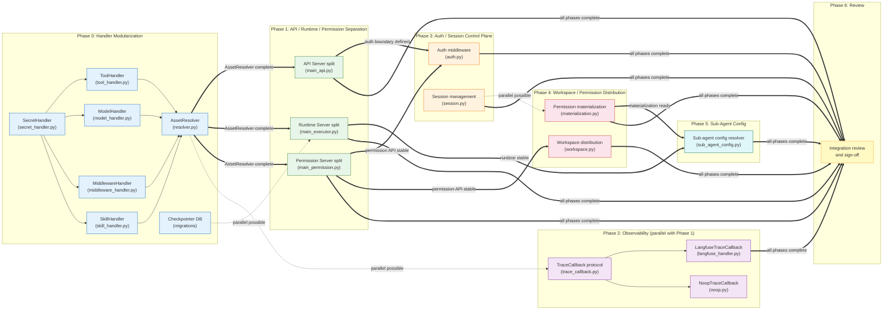

## Context

Produce this diagram when a plan has multiple phases and you need to show not just ordering within a phase but the dependencies *between* phases. A Gantt chart is the right tool for within-phase ordering, but it does not communicate inter-phase relationships well — a `graph LR` with subgraphs makes inter-phase edges explicit and shows which phases can run in parallel.

This diagram sits at a higher level of abstraction than a per-phase Gantt. Each node represents an entire phase or a major deliverable within a phase, not an individual task. Readers use it to understand the project's critical path and to identify where parallel tracks are possible before drilling into per-phase Gantt charts.

Trigger conditions:

- A multi-phase implementation plan where some later phases depend on specific earlier phases but others can run in parallel.
- A design document that needs to show the total ordering of work across a large refactor.
- A project kickoff where engineers need to see the full dependency graph before phase assignments are made.
- Identifying which phases share no dependencies and can be assigned to separate teams.

## Diagram

## Annotations

**`graph LR` for a dependency chain that flows left to right.** Left-to-right layout is the natural reading direction for a dependency chain: foundations on the left, integration on the right, review at the far right. `graph TB` would stack the phases vertically, which makes the parallel tracks (Phase 1 + Phase 2) harder to see at a glance.

**Solid `==>` for strict dependencies, dashed `-.->` for parallel-possible edges.** The thick arrows (`==>`) mean "this phase cannot start until the source phase is complete." The dashed arrows (`-.->`) mean "this phase can start before the source completes, but they share a dependency — coordinate to avoid conflicts." The distinction is load-bearing: misreading a dashed arrow as a strict dependency would serialize work that can be done in parallel.

**Arrow labels name the specific deliverable that unlocks the next phase.** Each cross-phase edge label states exactly what artifact or condition gates the dependency: `"AssetResolver complete"`, `"permission API stable"`, `"auth boundary defined"`. Vague labels like `"depends on"` or `"after"` require the reader to infer the gating condition from context.

**Per-phase color coding.** Each subgraph's nodes share a distinct fill color. This makes subgraph membership legible even when cross-phase edges visually cross subgraph boundaries — a reader can trace a cross-phase edge to its source phase by color without reading node labels.

**Intra-phase edges inside subgraphs.** Phase 0 and Phase 2 show intra-phase dependencies (`P0_SECRET --> P0_TOOLS`, `P2_TRACE --> P2_LF & P2_NOOP`) directly inside their subgraph blocks. These are not duplicating the per-phase Gantt charts — they are showing only the within-phase dependencies that are relevant to understanding cross-phase blocking. A reader who needs full within-phase detail should consult the corresponding Gantt chart.

**Fan-in edge to Phase 6.** The final review node receives edges from every preceding phase using a single compound fan-in declaration (`P1_API & P1_RUNTIME & ... & P5_CFG ==>|"all phases complete"| P6_REV`). This communicates that review is gated on the entire system being complete, not just one phase.
