## Context

Produce this diagram when a design document or ADR needs to show the order in which implementation tasks must be done and which tasks can run in parallel. The Gantt format makes the dependency chain explicit — readers immediately see what must complete before something else can start, and which tasks can be assigned to different engineers simultaneously.

Use this at the start of an implementation plan, not after. The diagram is a planning artifact that helps engineers and reviewers agree on task ordering before any code is written. It is also useful for retrospectives to compare planned vs. actual completion order.

Trigger conditions:

- Writing an implementation plan with more than 3 tasks that have dependencies between them.
- A design document that needs to show which subsystems must be built first.
- Identifying parallelization opportunities: which tasks can start on day 0 vs. which are blocked.
- Communicating a phased rollout to stakeholders who need to see sequence but not calendar dates.

## Diagram

```mermaid
gantt
    title Phase 0 Implementation Order
    dateFormat X
    axisFormat %s

    section Foundation
    01 SecretHandler (no deps)                    :a1, 0, 2
    07 Checkpointer DB (independent, parallel)    :a7, 0, 1

    section Handlers (depend on SecretHandler)
    02 ToolHandler                                :a2, after a1, 3
    03 ModelHandler                               :a3, after a1, 2
    04 MiddlewareHandler                          :a4, after a1, 2
    05 SkillHandler                               :a5, after a1, 2

    section Integration
    06 AssetResolver (all Handlers)               :crit, a6, after a2 a3 a4 a5, 3
```

## Annotations

**`dateFormat X` with integer durations.** The plan uses `dateFormat X` (relative units) rather than ISO calendar dates. At design time, exact start dates are rarely known — the goal is to show ordering and relative effort. Integer durations (1 unit, 2 units, 3 units) represent relative effort, not calendar days. Switch to `dateFormat YYYY-MM-DD` only when the plan has been committed to a real sprint calendar.

**Section names reflect grouping reason, not arbitrary phases.** The sections are named `Foundation`, `Handlers (depend on SecretHandler)`, and `Integration` — each name explains why those tasks are grouped together. A reader immediately understands that the Handlers section depends on Foundation being complete. Avoid generic section names like `Phase 1`, `Phase 2` that require the reader to infer the reason for grouping.

**Parallel tasks at position 0.** Both `SecretHandler` and `Checkpointer DB` start at position 0 — they have no dependencies on each other and can be assigned to different engineers simultaneously. The parenthetical `(no deps)` and `(independent, parallel)` in the task labels make this explicit without requiring the reader to compare start positions.

**Multiple `after` dependencies on the critical path.** The `AssetResolver` task uses `after a2 a3 a4 a5` to declare that it cannot start until all four Handlers are complete. This is the integration point — a single task that depends on four parallel predecessors. The `crit` modifier marks it as the critical path task, making it visually distinct in the rendered output.

**Numbered task labels.** All task labels are prefixed with a two-digit number (`01`, `02`, ... `07`). This gives each task an unambiguous short name for verbal communication ("we are blocked on task 06") and preserves visual ordering even when tasks from different sections are rendered on the same horizontal band.

**When to split this diagram.** This chart covers a single phase (Phase 0) with 7 tasks — well within the 20-task limit from `planning-gantt.md`. For a multi-phase plan, produce one Gantt per phase and link them from a summary document. Putting all phases in a single Gantt quickly exceeds 20 tasks and makes the dependency graph hard to read.
