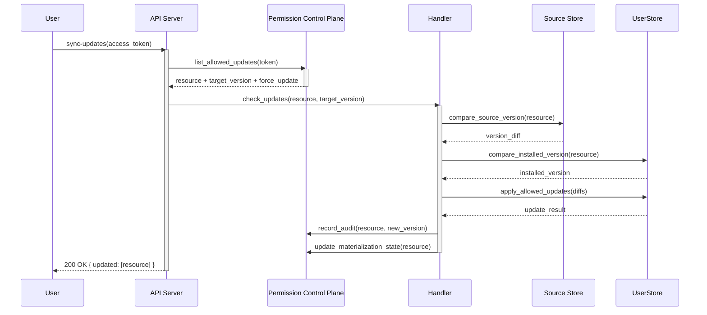

## Context

Produce this diagram when you need to document the exact order of calls, request/response pairing, and data passed between services during a specific API operation. It belongs in endpoint documentation, ADRs that explain multi-service call chains, and design documents for new API flows.

A sequence diagram is the right choice here — not a `graph` — because the story is temporal: *which service calls which other service, in what order, and what data crosses each boundary*. A graph would show the same participants but lose the ordering and the data shapes on each edge.

Trigger conditions:

- Documenting an existing API endpoint's internal call chain for a new engineer.
- Designing a new API flow and checking that service dependencies are correct before implementation.
- Debugging a latency issue where the sequence of calls is the key variable.
- Writing an ADR that requires showing a before/after call sequence.

## Diagram

## Annotations

**Participant aliases.** Every participant uses a short alias (`as API`, `as PERM`) paired with a descriptive display name. The alias keeps edge declarations concise; the display name keeps the rendered diagram readable. Short aliases are especially important here because the participants appear on every message line.

**Activation blocks.** The `activate`/`deactivate` blocks on `API` and `H` show which service is holding a request open while it waits for downstream responses. This makes the blocking structure visible: `API` is blocked waiting for `H`, which is blocked waiting for `SRC` and `U`. Readers can immediately see the latency dependency chain.

**Synchronous vs. response arrows.** All calls from a service to another use `->>` (solid arrow, synchronous request). All responses use `-->>` (dashed arrow, response). This matches Mermaid's sequence diagram convention and visually distinguishes "I am calling you" from "I am returning to you."

**Message labels carry real method names.** Every arrow label names the actual function or endpoint being called — `list_allowed_updates(token)`, `compare_source_version(resource)` — rather than vague descriptions like "check permissions." This makes the diagram cross-referenceable with the codebase: a developer can search for `compare_source_version` and find both the code and this diagram.

**Why PERM appears twice.** The Handler calls Permission twice at the end — once to record an audit log and once to update materialization state. These are two distinct operations on the same service and are shown as separate messages rather than collapsed into one. Collapsing them would hide the fact that both calls must succeed for the update to be considered complete.

**Node count note.** Sequence diagrams count participants, not individual messages. This diagram has 6 participants (well under the 8-participant guideline in `behavior-sequence.md`) and 12 message arrows (well under the 25-message limit). If the real flow has more participants, split it: one diagram for the permission check sub-flow and a separate one for the storage mutation sub-flow.
