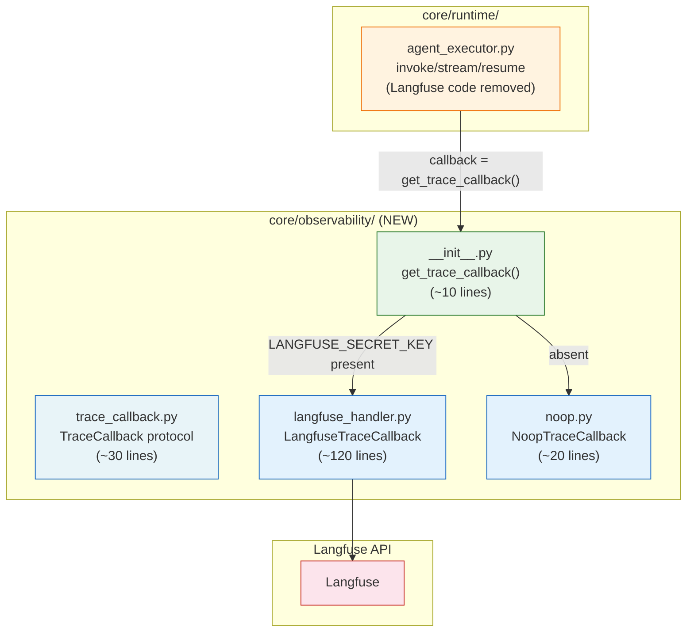

## Context

Produce this diagram when you need to document the internal structure of a specific directory or module at the file-and-class level. It belongs in implementation design documents (before writing the code), inline in the module's `README.md` or `ARCHITECTURE.md`, and code reviews where the reviewer needs to understand what was added without reading every file.

This is a Level 3 (Component) diagram in the C4 model hierarchy — see `composition-detail-levels.md`. Unlike the full system architecture diagram (`arch-full-system.md`), this diagram focuses on a single module and includes file names, class names, protocol names, and approximate line counts in every node label. That level of detail would be noise in a high-level system diagram but is essential here: the reader is an implementer who needs to know where to find specific code.

The code-level label convention (`filename.py ClassName (~N lines)`) is the single most important style rule for developer-facing module diagrams. It makes the diagram searchable alongside the codebase: grepping for `get_trace_callback` or `TraceCallback` finds both the source file and this diagram.

Trigger conditions:

- Writing an implementation plan for a new module: show the file structure before writing any code.
- Documenting an existing module for a new engineer joining the team.
- Code review for a new module or significant refactor: the reviewer can see intent alongside the diff.
- Post-implementation documentation: verify the built structure matches the design.

## Diagram

## Annotations

**Every node includes file name, primary class or function, and approximate line count.** The three-line label format (`filename.py ClassName (~N lines)`) is mandatory for module-level diagrams. The file name tells the reader where to find the code. The class or function name tells them what to look for inside the file. The line count gives a quick sense of complexity — `~10 lines` signals a thin factory; `~120 lines` signals the main implementation. Approximate counts are acceptable and preferred over false precision.

**Subgraph titles match actual directory paths.** `"core/observability/ (NEW)"` and `"core/runtime/"` are the exact paths relative to the project root. A reader can `cd core/observability/` and find the files listed in the subgraph. The `(NEW)` annotation communicates change status without a separate legend — it signals to reviewers that this entire directory is being added, not modified.

**Arrow labels show the actual function call that crosses boundaries.** The edge from `EXEC` to `INIT` carries the label `"callback = get_trace_callback()"` — the exact Python expression at the call site. This is searchable: `grep -r "get_trace_callback"` finds both the call site in `agent_executor.py` and this diagram. The condition labels on INIT's outgoing edges (`"LANGFUSE_SECRET_KEY present"` / `"absent"`) show the branch condition in the factory function, making the initialization logic legible without reading the source.

**`classDef` colors distinguish protocol, implementation, factory, and external roles.** The color coding follows semantic roles within the module:
- Blue (`#e8f4f8`) for the protocol definition (`TraceCallback`)
- Light blue (`#e3f2fd`) for concrete implementations (`LangfuseTraceCallback`, `NoopTraceCallback`)
- Green (`#e8f5e9`) for the factory/entry-point (`get_trace_callback`)
- Orange (`#fff3e0`) for the runtime caller (`AgentExecutionService`)
- Red (`#fce4ec`) for external services (`Langfuse`)

This color scheme communicates the dependency direction visually: the runtime (orange) depends on the factory (green), which returns either a real implementation or a noop (both light blue). The external service (red) is only reached through the real implementation.

**Why `core/runtime/` shows only one file.** The runtime module has many files, but only `agent_executor.py` is relevant to this diagram — it is the caller that consumes the observability module. Showing the entire runtime directory would add irrelevant nodes and dilute the diagram's focus. Include only the nodes that participate in the relationships being documented.

**The `(Langfuse code removed)` annotation in the runtime node label.** This communicates the refactoring intent: the Langfuse-specific code that previously lived in `agent_executor.py` is being extracted to `core/observability/`. A reviewer can immediately see that the runtime file is a sender (before: it had Langfuse code; after: it delegates through the factory). This kind of change annotation in labels is appropriate for design and review diagrams — strip it from long-lived documentation once the refactor is complete.
