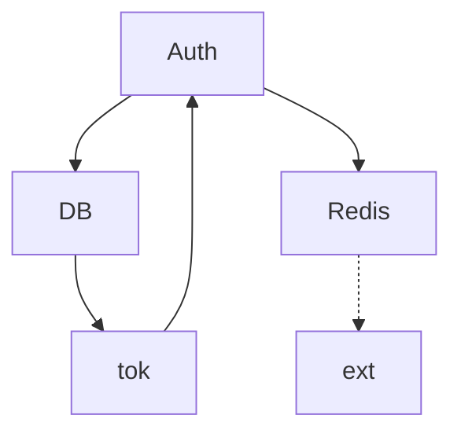
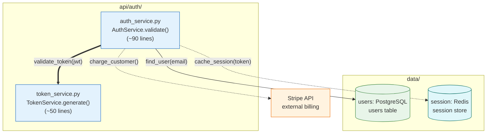

## Style Conventions

Consistent style across all diagrams makes documentation scannable, searchable, and maintainable. These conventions are mandatory for every diagram produced by any agent in this harness. They are not suggestions — deviating from them produces diagrams that look inconsistent when combined in documentation and that lose code-level discoverability.

### When to Use

- Every diagram in the harness — architecture, flow, sequence, ER, class, AI workflow.
- When reviewing an existing diagram from another agent.
- When extending or updating a diagram written by a human.

### When NOT to Use

- LangGraph's `draw_mermaid()` exports should be preserved as-is and annotated with comments rather than reformatted. Reformatting auto-generated output introduces drift. See `ai-langgraph-flow.md`.

---

### Node IDs: PascalCase, 2-3 Words Max

Node IDs are the internal identifiers used in edge declarations. Keep them short, PascalCase, and meaningful.

```
%% Correct
AuthService
UserDB
RedisCache
ApiGateway
TraceCallback

%% Incorrect
auth_service          %% snake_case — inconsistent
AUTHSERVICE           %% all caps — hard to read
A                     %% single letter — not meaningful
TheAuthenticationAndSessionManagementService  %% too long
```

### Node Labels: Full Descriptive Name in Brackets

Every node ID must be paired with a human-readable label in brackets. The label is what appears in the rendered diagram. The ID is only used internally for edges.

```
AuthService[Authentication Service]
UserDB[(User Database)]
RedisCache[(Redis Cache)]
ApiGateway["API Gateway (v2)"]
```

### Code-Level Detail in Labels (CRITICAL)

Architecture and module diagrams MUST include file paths, function or class names, and approximate line counts inside labels using `<br/>`. This is the single most important style rule for developer-facing documentation.

**Why this rule exists:** Developers searching the codebase with `grep` or LSP tools look for identifiers like `TraceCallback`, `get_trace_callback`, or `trace_callback.py`. When those identifiers appear in diagram labels, the diagram shows up in search results alongside the source code. This creates a direct link between documentation and code that is otherwise impossible to maintain.

Format:
```
NodeID["filename.py<br/>ClassName or function_name()<br/>(~N lines)"]
```

Examples:
```
TC["trace_callback.py<br/>TraceCallback protocol<br/>(~30 lines)"]
INIT["__init__.py<br/>get_trace_callback()<br/>(~10 lines)"]
Router["router.py<br/>AgentRouter.route()<br/>(~85 lines)"]
UserModel["models/user.py<br/>User(Base)<br/>(~60 lines)"]
```

Apply this rule to:
- `graph` and `flowchart` diagrams showing module or file structure
- `classDiagram` nodes representing actual source files
- Any diagram where a node maps 1:1 to a file or function

Do NOT apply to:
- `sequenceDiagram` participants (they represent services, not files)
- `erDiagram` entities (they represent database tables)
- High-level context diagrams where file names are not the focus

### Arrow Types: Match Semantic Meaning

| Relationship | Arrow | Example |
|---|---|---|
| Synchronous call / direct data flow | `-->` | `Client --> AuthService` |
| Asynchronous call / optional / event | `-.->` | `Worker -.-> Queue` |
| Critical path / primary flow | `==>` | `AuthService ==> UserDB` |
| Association (no data transfer) | `---` | `ConfigA --- ConfigB` |

Do not use `-->` for everything. The arrow type communicates intent. Async flows shown with `-->` mislead readers about blocking vs non-blocking behavior.

### Arrow Labels: Include Function Calls or Data

Labels on arrows should name the function call, event, or data being passed — not just generic descriptions.

```
%% Correct
AuthService -->|"validate_token(jwt)"| TokenService
TokenService -.->|"token_validated event"| EventBus
ApiGateway ==>|"callback = get_trace_callback()"| TraceCallback

%% Incorrect — too vague
AuthService -->|"calls"| TokenService
TokenService -.->|"sends"| EventBus
```

### Subgraph Titles: Use Actual Directory Paths

When a subgraph groups files or components that live in a specific directory, use the directory path as the title. Include status annotations when relevant.

```
subgraph "core/observability/ (NEW)"
    TC["trace_callback.py<br/>TraceCallback protocol<br/>(~30 lines)"]
    INIT["__init__.py<br/>get_trace_callback()<br/>(~10 lines)"]
end

subgraph "api/routes/"
    AuthRoutes[auth.py]
    UserRoutes[users.py]
end
```

For logical groupings that do not map to a directory, use a clear descriptive title in quotes:

```
subgraph "External Services"
    Stripe[Stripe Payment API]
    SendGrid[SendGrid Email API]
end
```

### Title Comment: Required on Every Diagram

The first non-blank line after the diagram type declaration must be a title comment. No exceptions.

```
graph LR
    %% Title: Authentication Service Architecture
    AuthService[Authentication Service]
    ...
```

Format: `%% Title: [Diagram Name]`

The title should be descriptive enough to identify the diagram in a documentation search.

### Node Limit: Max 30 Nodes Per Diagram

A diagram with more than 30 nodes becomes unreadable in most rendering contexts (GitHub, VS Code preview, documentation sites). If the natural scope of the diagram exceeds 30 nodes, split it into multiple diagrams with clear linking between them. See `composition-detail-levels.md` for splitting strategies.

### Subgraph Nesting: Max 3 Levels

```
subgraph "System"              %% level 1
    subgraph "Service"         %% level 2
        subgraph "Module"      %% level 3
            NodeA
        end
    end
end
```

Four or more levels of nesting exceeds what Mermaid renders predictably and what readers can parse visually.

### classDef: Define Consistent Colors for Node Types

Every diagram that mixes node types must define `classDef` blocks and apply them with `:::`. Use these standard class names and colors across all diagrams in the harness:

```
classDef database fill:#e8f5e9,stroke:#2e7d32
classDef service fill:#e3f2fd,stroke:#1565c0
classDef external fill:#fff3e0,stroke:#ef6c00
classDef highlight fill:#fff9c4,stroke:#f9a825
classDef queue fill:#f3e5f5,stroke:#6a1b9a
classDef cache fill:#e0f7fa,stroke:#00695c
```

Apply with triple-colon syntax after the node declaration:

```
UserDB[(User Database)]:::database
AuthService[Authentication Service]:::service
StripeAPI[Stripe API]:::external
CriticalNode[Critical Path Node]:::highlight
```

Use the same class names across all diagrams so colors are consistent when diagrams appear side-by-side in documentation.

**Incorrect (flat graph with abbreviations, no title, generic labels, inconsistent arrows):**



**Correct (structured graph with code-level labels, title, subgraph paths, classDef, typed arrows):**



### Syntax Reference

```
%% Title: [Diagram Name]                    %% required title comment

NodeID[Label]:::className                   %% node with class applied
NodeID[(Label)]:::database                  %% cylinder + database class

A -->|"function_call(arg)"| B               %% synchronous with label
A -.->|"async_event"| B                     %% async with label
A ==>|"critical path"| B                    %% emphasized with label

subgraph "directory/path/ (annotation)"
    NodeA
end

classDef database fill:#e8f5e9,stroke:#2e7d32
classDef service fill:#e3f2fd,stroke:#1565c0
classDef external fill:#fff3e0,stroke:#ef6c00
classDef highlight fill:#fff9c4,stroke:#f9a825
classDef queue fill:#f3e5f5,stroke:#6a1b9a
classDef cache fill:#e0f7fa,stroke:#00695c
```

### Tips

- Define all `classDef` blocks at the bottom of the diagram, after all nodes and edges. This matches Mermaid's conventional order.
- When in doubt about whether to add code-level detail to a label, add it. It is easier to strip detail from a label than to recover it when the diagram is the only reference.
- Use the `highlight` class sparingly — one or two nodes maximum — to draw attention to the most important element without making the diagram noisy.
- Subgraph titles that include status annotations like `(NEW)`, `(DEPRECATED)`, or `(v2)` communicate change context without requiring a separate legend.
- Keep arrow labels concise: a function signature is ideal; a sentence is too long.

Reference: [Mermaid documentation](https://mermaid.js.org/intro/)
