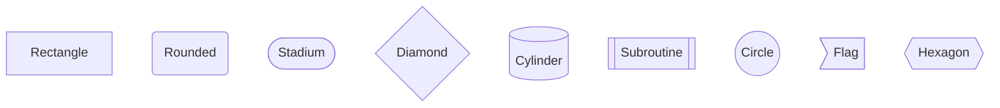
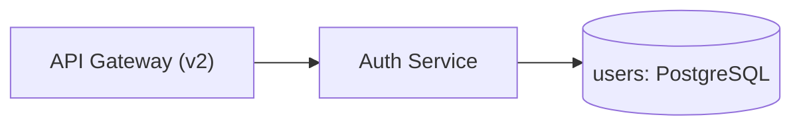

## Common Mermaid Syntax Basics

These syntax rules apply across all diagram types that use node-and-edge notation (`graph`, `flowchart`, `sequenceDiagram`, `stateDiagram-v2`, etc.). Mastering these basics prevents the majority of rendering errors.

### When to Use

- Every time you write a Mermaid diagram — this is foundational syntax, not a diagram-type-specific rule.
- When reviewing an existing diagram for correctness.
- When debugging a diagram that fails to render.

### When NOT to Use

- `erDiagram`, `gantt`, `timeline`, `mindmap`, `pie`, `xychart-beta`, `sankey-beta`, and `quadrantChart` each have their own unique syntax. Refer to their respective rule files for type-specific syntax.

---

### Node Shapes

| Shape | Syntax | Use For |
|-------|--------|---------|
| Rectangle | `NodeID[Label]` | Default nodes, services, components |
| Rounded rectangle | `NodeID(Label)` | Processes, steps |
| Stadium | `NodeID([Label])` | Start/end terminals |
| Diamond | `NodeID{Label}` | Decision points (flowchart only) |
| Cylinder | `NodeID[(Label)]` | Databases, storage |
| Subroutine | `NodeID[[Label]]` | Subroutines, reusable blocks |
| Circle | `NodeID((Label))` | Events, connectors |
| Flag / asymmetric | `NodeID>Label]` | Annotations, notes |
| Hexagon | `NodeID{{Label}}` | Preparation steps, configuration |



### Edge Types

| Edge | Syntax | Use For |
|------|--------|---------|
| Solid arrow | `A --> B` | Synchronous call, data flow |
| Solid line (no arrow) | `A --- B` | Association, link |
| Dashed arrow | `A -.-> B` | Async call, optional dependency |
| Dashed line (no arrow) | `A -.- B` | Weak association |
| Thick arrow | `A ==> B` | Critical path, emphasized flow |
| Invisible link | `A ~~~ B` | Layout spacing (no visible edge) |

### Edge Labels

Place labels on edges using pipes or inline text:

```
A -->|"label text"| B        %% preferred — quotes handle special chars
A -- label text --> B        %% alternative for simple labels
A -.->|"async call"| B       %% dashed arrow with label
```

Always use double quotes around labels that contain spaces, colons, parentheses, slashes, or any non-alphanumeric character.

### Diagram Direction

Applies to `graph` and `flowchart`. Declare direction immediately after the diagram type keyword:

| Keyword | Direction | Use For |
|---------|-----------|---------|
| `TB` | Top to Bottom | Hierarchies, layer diagrams |
| `BT` | Bottom to Top | Reverse hierarchies |
| `LR` | Left to Right | Pipelines, data flows, timelines |
| `RL` | Right to Left | Less common; reverse pipelines |

```
graph LR
flowchart TD
```

### Subgraphs

Group related nodes with `subgraph ... end`. Use actual directory paths or logical group names as titles.

```
subgraph "core/auth/ (service boundary)"
    AuthService[Authentication Service]
    TokenService[Token Service]
end
```

Rules:
- Title must be quoted if it contains spaces or special characters.
- Max 3 levels of nesting. See `composition-subgraphs.md` for nesting patterns.
- Edges can cross subgraph boundaries freely.

### Comments

Use `%%` for single-line comments. Required for the diagram title on every diagram.

```
%% Title: System Architecture Overview
%% This node handles external traffic
```

### Special Characters in Labels

Labels containing `:`, `/`, `(`, `)`, `[`, `]`, `<`, `>`, `-`, or `&` MUST be enclosed in double quotes inside the brackets:

```
%% Correct
ApiGateway["API Gateway (v2)"]
UserDB["users: PostgreSQL DB"]

%% Incorrect — will break parsing
ApiGateway[API Gateway (v2)]
UserDB[users: PostgreSQL DB]
```

### Newlines in Labels

Use `<br/>` to insert a line break inside a node label:

```
TraceCallback["trace_callback.py<br/>TraceCallback protocol<br/>(~30 lines)"]
```

### Node ID Rules

Node IDs are internal identifiers. They must be:
- Alphanumeric characters and underscores only
- No spaces — use underscore or PascalCase instead
- No hyphens — hyphens break edge parsing
- No leading digits

```
%% Correct node IDs
AuthService
UserDB
RedisCache
Api_Gateway

%% Incorrect node IDs
auth-service     %% hyphen breaks parsing
user db          %% space not allowed
2faModule        %% leading digit not allowed
```

**Incorrect (hyphens in node IDs, missing quotes around special chars):**

```mermaid
graph LR
    %% Title: Bad Syntax Example
    api-gateway[API Gateway (v2)] --> auth-service[Auth Service]
    auth-service --> user-db[(users: PostgreSQL)]
```

**Correct (PascalCase IDs, quoted labels with special chars):**



### Syntax Reference

```
graph LR / TB / BT / RL          %% graph direction
flowchart TD / LR                 %% flowchart direction

NodeID[Label]                     %% rectangle node
NodeID(Label)                     %% rounded node
NodeID([Label])                   %% stadium node
NodeID{Label}                     %% diamond (decision)
NodeID[(Label)]                   %% cylinder (database)
NodeID[[Label]]                   %% subroutine
NodeID((Label))                   %% circle
NodeID>Label]                     %% flag/asymmetric
NodeID{{Label}}                   %% hexagon

A --> B                           %% solid arrow
A --- B                           %% solid line
A -.-> B                          %% dashed arrow
A ==> B                           %% thick arrow
A ~~~ B                           %% invisible link
A -->|"label"| B                  %% labeled edge

subgraph "Group Title"
    NodeA
    NodeB
end

%% comment text
```

### Tips

- Always quote node labels that contain any punctuation or special characters. When in doubt, add quotes.
- Use `<br/>` to break long labels across two lines rather than creating very wide nodes.
- Prefer PascalCase node IDs (`AuthService`) over snake_case (`auth_service`) for readability.
- Invisible links (`~~~`) are useful for nudging layout when auto-placement puts nodes in confusing positions.
- Test each subgraph independently before combining — syntax errors inside subgraphs can produce cryptic error messages.
- Mermaid is whitespace-sensitive: always use spaces, never tab characters. See `foundation-validation.md`.

Reference: [Mermaid documentation](https://mermaid.js.org/intro/)
