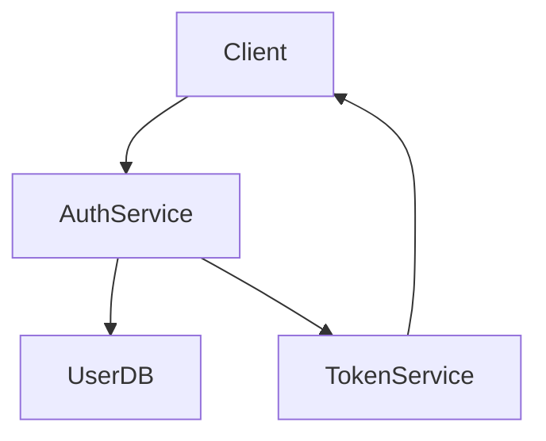
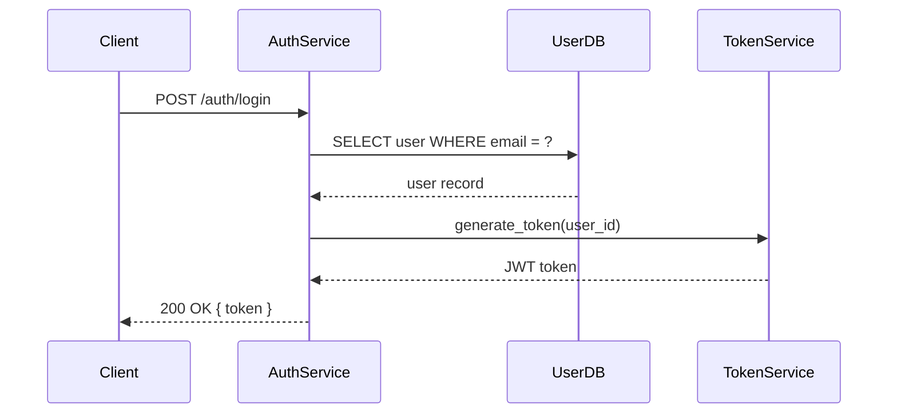

## Diagram Type Selection

Choosing the wrong diagram type is the most common mistake when authoring Mermaid diagrams. A sequence diagram used for static architecture produces a confusing message-passing view of a system that has no runtime interactions. A graph used for API call flows loses the temporal ordering that makes call chains understandable. This decision matrix narrows the choice to a single correct type before you write a single node.

### When to Use

Match the intent of your diagram to the left column. Use the corresponding diagram type.

| I need to show... | Use | Syntax |
|---|---|---|
| N participants communicating over time | Sequence Diagram | `sequenceDiagram` |
| States with named transitions | State Diagram | `stateDiagram-v2` |
| Database entities with relationships | ER Diagram | `erDiagram` |
| Implementation phases with dependencies | Gantt Chart | `gantt` |
| Components with data flow / system architecture | Graph | `graph TB` or `graph LR` |
| Decision trees, conditional user flows | Flowchart | `flowchart TD` |
| Class or module hierarchy, interfaces | Class Diagram | `classDiagram` |
| Topic breakdown, brainstorming | Mindmap | `mindmap` |
| Project milestones, incident timelines | Timeline | `timeline` |
| LangGraph agent workflow | Graph (LangGraph) | `graph TD` + `draw_mermaid()` or manual |
| System context view (C4 model) | C4 Diagram | `C4Context` / `C4Container` |
| Cloud infrastructure topology | Architecture Diagram | `architecture-beta` |
| Data flow volumes, cost distribution | Sankey Diagram | `sankey-beta` |
| Priority matrix (effort vs impact) | Quadrant Chart | `quadrantChart` |
| Performance metrics, latency graphs | XY Chart | `xychart-beta` |
| Proportions, distributions (snapshot) | Pie Chart | `pie` |
| Git branching strategy | GitGraph | `gitGraph` |
| User journey with satisfaction scores | User Journey | `journey` |
| Layered architecture, network topology | Block Diagram | `block-beta` |
| Requirement tracing, compliance | Requirement Diagram | `requirementDiagram` |
| Task workflow, sprint boards | Kanban | `kanban` |
| Protocol headers, binary format | Packet Diagram | `packet-beta` |

### When NOT to Use

- Do NOT use `graph` for sequential API calls between services — it hides temporal ordering. Use `sequenceDiagram`.
- Do NOT use `sequenceDiagram` for static architecture where nothing is calling anything at runtime — it implies dynamic interaction. Use `graph`.
- Do NOT use `flowchart` when there are no decision branches or conditions — it implies conditional logic. Use `graph`.
- Do NOT use `pie` for time-series data — it shows a static snapshot, not change over time. Use `xychart-beta`.
- Do NOT use `gantt` for static module relationships — it implies time and dependency ordering. Use `graph` or `classDiagram`.
- Do NOT use `mindmap` for data flow — it implies parent-child hierarchy with no directionality. Use `graph`.
- Do NOT use `erDiagram` for service topology — it implies database entity relationships. Use `graph` or `C4Container`.

**Incorrect (using graph TB for an API call flow between services):**

**Correct (using sequenceDiagram for the same API call flow):**

### Key Rules

1. **Graph vs Flowchart:** Use `graph` for architecture/structure with no decision branches. Use `flowchart` only when diamond-shaped decision nodes are required.
2. **Graph vs Sequence:** Ask "does order of interaction matter?" If yes, use `sequenceDiagram`. If you are showing what exists (not what happens), use `graph`.
3. **LangGraph workflows:** Use `graph TD` (top-down). LangGraph's native `.get_graph().draw_mermaid()` outputs this format — match it for consistency with generated diagrams.
4. **Beta types:** `architecture-beta`, `sankey-beta`, `xychart-beta`, `kanban`, `packet-beta`, `block-beta` are production-usable but their syntax may have minor changes across Mermaid versions. Prefer stable types when a stable equivalent exists.
5. **C4 vs graph:** Use `C4Context` when you need formal C4 notation with person/system/boundary labels. Use `graph` when you need more control over layout or are mixing code-level detail with architecture.

### Tips

- When the content fits two types equally well, prefer the simpler one. `graph` is almost always simpler to maintain than `C4Context`.
- For LangGraph: if the graph was exported via `draw_mermaid()`, preserve the output exactly and annotate with comments rather than rewriting it manually.
- If a diagram exceeds 30 nodes, split it into multiple diagrams with links rather than forcing everything into one. See `composition-detail-levels.md`.
- When unsure between `graph TB` and `graph LR`: use `TB` for hierarchies (parent-child, layer-by-layer), use `LR` for pipelines and left-to-right data flows.

Reference: [Mermaid documentation](https://mermaid.js.org/intro/)
