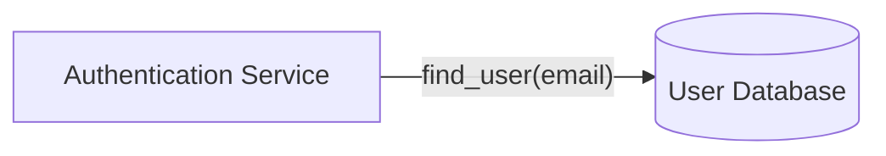

## Diagram Syntax Validation

A Mermaid diagram that fails to render produces a broken block in documentation rather than a visible error message — the reader simply sees nothing, or a raw code block. Validation before committing prevents silent failures. This rule defines three validation approaches in order of reliability.

### When to Use

- Before including any Mermaid diagram in a documentation file.
- After editing an existing diagram.
- When debugging a diagram that renders blank or shows an error.

### When NOT to Use

- LangGraph auto-generated output from `draw_mermaid()` has already been validated by the library. Preserve it as-is. See `ai-langgraph-flow.md`.

---

### Approach 1: mmdc CLI (Preferred When Node.js Is Available)

The `mmdc` CLI from `@mermaid-js/mermaid-cli` is the authoritative validator. It uses the same parser as the Mermaid library itself. A diagram that passes `mmdc` will render correctly in GitHub, VS Code, and documentation sites.

**Validate a standalone `.mmd` file:**

```bash
npx -y @mermaid-js/mermaid-cli mmdc -i input.mmd -o /dev/null 2>&1
```

Exit code `0` = valid. Any non-zero exit code or stderr output indicates a syntax error.

**Extract and validate a diagram embedded in a Markdown file:**

```bash
# Extract the first mermaid block from a markdown file and validate it
grep -Pzo '```mermaid\n([\s\S]*?)```' file.md | head -c -4 | tail -c +12 > /tmp/check.mmd
npx -y @mermaid-js/mermaid-cli mmdc -i /tmp/check.mmd -o /dev/null 2>&1
```

**When mmdc is not available:**

If Node.js or `npx` is not installed in the environment, fall back to Approach 2 (regex pre-checks) combined with Approach 3 (self-check checklist). These two approaches together catch the majority of syntax errors without requiring any tooling.

---

### Approach 2: Regex Pre-Checks (Always Available — Catches 80% of Errors)

These five checks can be run without any installed tooling using standard shell commands. Run them on any `.mmd` file or extracted diagram text.

#### Check 1: Missing diagram type on the first non-comment line

The first non-blank, non-comment line of every Mermaid diagram must be a valid diagram type keyword. A file that starts with a node definition or edge will fail to parse.

Valid first-line keywords:
`graph`, `flowchart`, `sequenceDiagram`, `erDiagram`, `stateDiagram-v2`, `classDiagram`, `gantt`, `pie`, `gitGraph`, `mindmap`, `timeline`, `journey`, `quadrantChart`, `xychart-beta`, `sankey-beta`, `requirementDiagram`, `C4Context`, `C4Container`, `C4Component`, `C4Deployment`, `architecture-beta`, `block-beta`, `kanban`, `packet-beta`

```bash
# Check that first non-comment, non-blank line is a known diagram type
head -5 input.mmd | grep -v '^\s*%%' | grep -v '^\s*$' | head -1 | \
  grep -E '^(graph|flowchart|sequenceDiagram|erDiagram|stateDiagram-v2|classDiagram|gantt|pie|gitGraph|mindmap|timeline|journey|quadrantChart|xychart-beta|sankey-beta|requirementDiagram|C4Context|C4Container|C4Component|C4Deployment|architecture-beta|block-beta|kanban|packet-beta)'
```

#### Check 2: Unclosed brackets

Count opening and closing characters. They must match.

```bash
# Count brackets — each pair should be balanced
python3 -c "
import sys
text = open('input.mmd').read()
for open_char, close_char in [('[',']'), ('(',')'), ('{','}')]:
    opens = text.count(open_char)
    closes = text.count(close_char)
    if opens != closes:
        print(f'UNBALANCED {open_char}{close_char}: {opens} open, {closes} close')
    else:
        print(f'OK {open_char}{close_char}: {opens} pairs')
"
```

Note: This check is approximate. String content inside quoted labels can contain brackets without requiring a matching pair. Use it as a signal, not a definitive verdict.

#### Check 3: Tab characters

Mermaid's parser is sensitive to tab vs space indentation. Diagrams with tab characters inside node definitions or subgraph bodies produce inconsistent parsing behavior across renderers. Always use spaces.

```bash
# Detect tab characters in the diagram
grep -Pn '\t' input.mmd && echo "FAIL: tab characters found" || echo "OK: no tabs"
```

To convert tabs to spaces in-place:

```bash
expand -t 4 input.mmd > /tmp/fixed.mmd && mv /tmp/fixed.mmd input.mmd
```

#### Check 4: Unmatched quotes in labels

Every opening `"` inside a node label must have a closing `"` on the same line. A label like `NodeID["unclosed label]` will break parsing for the rest of the diagram.

```bash
# Count quotes per line — each line with an odd count has an unmatched quote
awk '{ count = gsub(/"/, "\""); if (count % 2 != 0) print NR": "$0 }' input.mmd
```

#### Check 5: Duplicate node IDs with conflicting labels

A node ID defined twice with different label text produces silent rendering inconsistencies — the second definition may override the first or be ignored depending on the Mermaid version.

```bash
# Find duplicate node ID declarations
grep -oE '^[[:space:]]*[A-Za-z0-9_]+[\[\(\{]' input.mmd | \
  sed 's/^[[:space:]]*//' | sed 's/[\[\(\{]//' | sort | uniq -d
```

---

### Approach 3: Agent Self-Check Checklist

Before writing any diagram to a file or documentation, verify each item:

- [ ] First line (ignoring blank lines and `%%` comments) is a valid diagram type keyword
- [ ] All node IDs are alphanumeric + underscore only — no hyphens, no spaces
- [ ] All brackets are balanced: `[` matches `]`, `(` matches `)`, `{` matches `}`
- [ ] No tab characters — spaces only for indentation
- [ ] `%% Title:` comment is present immediately after the diagram type line
- [ ] Node count is 30 or fewer
- [ ] All quoted strings inside labels are properly closed on the same line
- [ ] No node ID is declared with two different labels
- [ ] All `subgraph` blocks are closed with `end`
- [ ] `classDef` classes referenced with `:::` are actually defined

**Incorrect (diagram with tabs, unclosed bracket, missing type declaration):**

```mermaid
	%% Title: Missing diagram type, has tabs, unclosed bracket
	AuthService[Authentication Service
	UserDB[(User Database)]
	AuthService --> UserDB
```

**Correct (clean diagram passing all checks):**



### Syntax Reference

```bash
# Full validation pipeline (when Node.js available)
npx -y @mermaid-js/mermaid-cli mmdc -i diagram.mmd -o /dev/null 2>&1

# Tab check
grep -Pn '\t' diagram.mmd && echo "FAIL" || echo "OK"

# Bracket balance check
python3 -c "
text = open('diagram.mmd').read()
for o, c in [('[',']'), ('(',')'), ('{','}')]:
    print(f'{o}{c}: {text.count(o)} open / {text.count(c)} close')
"

# Unmatched quotes per line
awk '{ count = gsub(/\"/, "\""); if (count % 2 != 0) print NR\": \"$0 }' diagram.mmd

# Duplicate node IDs
grep -oE '^[[:space:]]*[A-Za-z0-9_]+[\[\(\{]' diagram.mmd | \
  sed 's/^[[:space:]]*//' | sed 's/[\[\(\{]//' | sort | uniq -d
```

### Tips

- Run mmdc validation as a final step before adding a diagram to any documentation file. A 2-second check prevents a broken diagram from reaching a PR.
- The bracket balance check generates false positives when labels contain brackets inside quotes (e.g., `NodeID["function(arg)"]`). If the count is off by an even number, it is likely a false positive from quoted content.
- When a diagram renders blank in GitHub but the code looks correct, the most common cause is a tab character or an unclosed subgraph `end`. Check those first.
- For long diagrams, validate incrementally — add 5-10 nodes at a time and validate before adding more. This makes it easy to identify which addition broke parsing.
- If `npx` is not available and you cannot install Node.js, paste the diagram into the [Mermaid Live Editor](https://mermaid.live) to get real-time validation with error highlighting.

Reference: [Mermaid documentation](https://mermaid.js.org/intro/)
