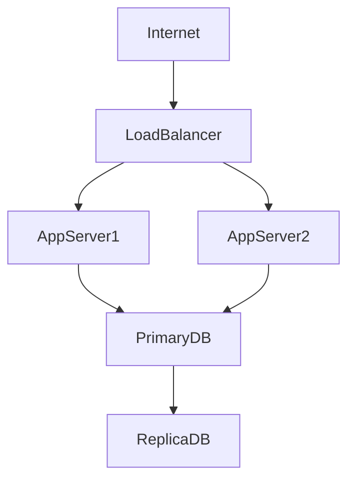

## Architecture Diagrams (architecture-beta)

Use `architecture-beta` (Mermaid v11+) when documenting cloud infrastructure topology with first-class service icons. It renders named service boxes with icon glyphs — `cloud`, `database`, `server`, `disk`, `internet` — and supports grouping into logical boundaries. The icon-aware layout communicates infrastructure at a glance in ways that plain `graph` nodes with text labels cannot.

This is a beta feature. The syntax is stable for the icon set listed below, but expect minor additions across Mermaid versions. Use `graph TB` as a fallback when you need layout features (`subgraph`, complex routing) that `architecture-beta` does not yet support.

### When to Use

- Cloud infrastructure topology where component type (database, server, disk) needs visual distinction
- Illustrating AWS/GCP/Azure resource groups and their connections
- Network architecture documentation where zone boundaries (VPC, subnet) group services
- Side-by-side comparison of two infrastructure topologies (dev vs prod)

### When NOT to Use

- Call flows or API interactions between services — use `sequenceDiagram` instead (`behavior-sequence.md`)
- Abstract system context with persons and external systems — use `C4Context` instead (`infra-c4.md`)
- When Mermaid v11 is not available in the rendering environment — check before using; fall back to `graph TB`

**Incorrect (using graph TB with text-only labels for cloud topology):**



**Correct (architecture-beta with service icons and group boundaries):**


### Syntax Reference

```
architecture-beta

    # Group (logical boundary / zone)
    group groupId(icon)[Display Label]
    group groupId(icon)[Display Label] in parentGroupId   # nested group

    # Service (individual resource)
    service serviceId(icon)[Display Label]
    service serviceId(icon)[Display Label] in groupId     # service inside a group

    # Junction (invisible routing point for clean edge paths)
    junction junctionId
    junction junctionId in groupId

    # Edges: direction syntax — A:side --> side:B
    # Valid sides: L (left), R (right), T (top), B (bottom)
    serviceA:R --> L:serviceB         # serviceA right to serviceB left
    serviceA:B --> T:serviceB         # serviceA bottom to serviceB top
    serviceA:R --> L:junction1        # route through a junction
    junction1:B --> T:serviceB
```

**Available icons:**

| Keyword | Renders as |
|---------|-----------|
| `cloud` | Cloud shape |
| `database` | Cylinder (database) |
| `server` | Server rack |
| `disk` | Disk/storage |
| `internet` | Globe/internet |

### Tips

- Always use directional edges (`serviceA:R --> L:serviceB`) rather than undirected edges — `architecture-beta` requires explicit port sides to route cleanly.
- Use `junction` to avoid diagonal crossing edges when multiple services fan out from a single point. A junction acts as an invisible waypoint.
- Nest groups to reflect real network topology: VPC contains subnets; subnets contain instances. Nesting uses `in parentGroupId`.
- Keep icon choice consistent with the resource type: `database` for any data store (PostgreSQL, Redis, S3), `server` for compute, `disk` for block/object storage, `internet` for edge/CDN/gateway.
- If you need a resource type without a matching icon (e.g., a queue or a function), use `server` as the closest approximation and be explicit in the label.
- Group labels should reflect the actual zone or account boundary, not just abstract categories: `VPC - 10.0.0.0/16` not `Infrastructure`.
- Verify Mermaid version before using — `architecture-beta` requires v11+. Check your renderer (GitHub renders v10.x as of early 2025; GitLab and local tools may differ).

Reference: [Mermaid Architecture Diagram docs](https://mermaid.js.org/syntax/architecture.html)
