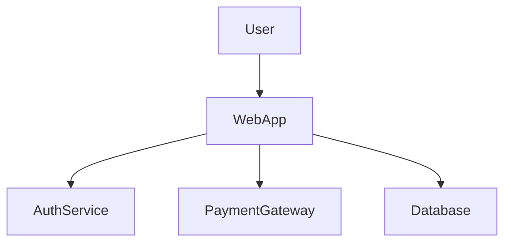
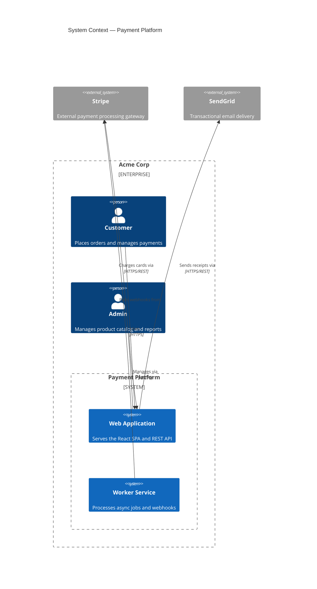

## C4 Model Diagrams (C4Context, C4Container, C4Component, C4Deployment)

The C4 model provides four levels of architectural zoom. Each level answers a different audience's question. Use C4 diagrams when formal notation is required — stakeholder reviews, architecture decision records, or onboarding documentation where the distinction between person, system, and container must be unambiguous. Do not use `graph TB` for the same purpose unless you need layout control that C4 does not offer.

### When to Use

- **C4Context**: explaining the system to non-technical stakeholders — who uses it and what external systems it depends on
- **C4Container**: explaining the high-level technology choices to architects — what containers (apps, databases, queues) make up the system
- **C4Component**: explaining the internal structure of one container to developers — what components live inside it and how they communicate
- **C4Deployment**: explaining how containers map to infrastructure to DevOps — which deployment nodes host which containers

### When NOT to Use

- When you need fine-grained layout control — use `graph TB` instead (`structure-graph.md`)
- When the diagram is purely a data flow with no person or system boundary context — use `graph` or `sequenceDiagram`
- When mixing code-level detail with architecture — C4 does not express function calls or data schemas

**Incorrect (using graph TB for a system context view — loses person/system/boundary semantics):**



**Correct (C4Context with Person, System, System_Ext, and Rel elements):**



### Syntax Reference

**C4Context:**
```
C4Context
    title Diagram Title

    Enterprise_Boundary(id, "Label") {
        Person(id, "Name", "Description")
        System(id, "Name", "Description")
        System_Boundary(id, "Label") {
            System(id, "Name", "Description")
        }
    }

    System_Ext(id, "Name", "Description")   # external system (outside your control)

    Rel(from, to, "Label")
    Rel(from, to, "Label", "Technology")
    BiRel(a, b, "Label")                    # bidirectional relationship
```

**C4Container:**
```
C4Container
    title Container View — System Name

    Person(user, "User", "Description")

    System_Boundary(sys, "System Name") {
        Container(webApp, "Web App", "React", "Serves the SPA")
        Container(api, "API Server", "FastAPI", "Handles REST requests")
        ContainerDb(db, "Database", "PostgreSQL", "Stores application data")
        ContainerQueue(queue, "Job Queue", "Redis", "Background job queue")
    }

    System_Ext(ext, "External System", "Description")

    Rel(user, webApp, "Uses", "HTTPS")
    Rel(webApp, api, "Calls", "HTTPS/REST")
    Rel(api, db, "Reads/writes", "TCP/5432")
    Rel(api, queue, "Enqueues jobs", "TCP/6379")
```

**C4Component:**
```
C4Component
    title Component View — API Server

    Container(webApp, "Web App", "React", "Calls API")

    Container_Boundary(api, "API Server") {
        Component(authHandler, "Auth Handler", "FastAPI Router", "Handles login and token refresh")
        Component(orderHandler, "Order Handler", "FastAPI Router", "Manages order lifecycle")
        Component(jwtService, "JWT Service", "Python", "Signs and validates JWT tokens")
        ComponentDb(cache, "Session Cache", "Redis Client", "Token blacklist and session store")
    }

    ContainerDb(db, "Database", "PostgreSQL", "Application data")

    Rel(webApp, authHandler, "POST /auth/login", "HTTPS")
    Rel(authHandler, jwtService, "sign_token()")
    Rel(authHandler, cache, "blacklist_token()")
    Rel(orderHandler, db, "SELECT/INSERT", "SQLAlchemy")
```

**C4Deployment:**
```
C4Deployment
    title Deployment View — Production

    Deployment_Node(aws, "AWS", "Amazon Web Services") {
        Deployment_Node(vpc, "VPC", "10.0.0.0/16") {
            Deployment_Node(ecs, "ECS Cluster", "Fargate") {
                Node(apiTask, "API Task", "Docker container running API server")
            }
            Deployment_Node(rds, "RDS", "Multi-AZ") {
                Node(postgres, "PostgreSQL 15", "Primary + read replica")
            }
        }
    }
```

### Tips

- Always include `title` — it is required for C4 diagrams to render correctly and is the primary label in architecture documentation.
- Every element must have a description (third positional argument) — a blank description produces a floating label that looks broken.
- Use `System_Ext` for anything outside your deployment boundary — third-party APIs, external SaaS, partner services.
- Use `Enterprise_Boundary` to wrap everything owned by your organization. Use `System_Boundary` to scope a single deployable system inside it.
- Relationship labels should describe the interaction, not just say "calls": `"Charges cards via"` not `"uses"`.
- Technology labels on `Container` and `Rel` elements are optional but strongly recommended — they are the main reason architects use C4Container over C4Context.
- Keep C4Context diagrams to fewer than 10 elements. If you need more, split into multiple context views scoped to different user types.
- C4Component diagrams get stale quickly as code evolves. Only create them for stable, well-defined containers with long-lived architecture.

Reference: [Mermaid C4 Diagram docs](https://mermaid.js.org/syntax/c4.html)
