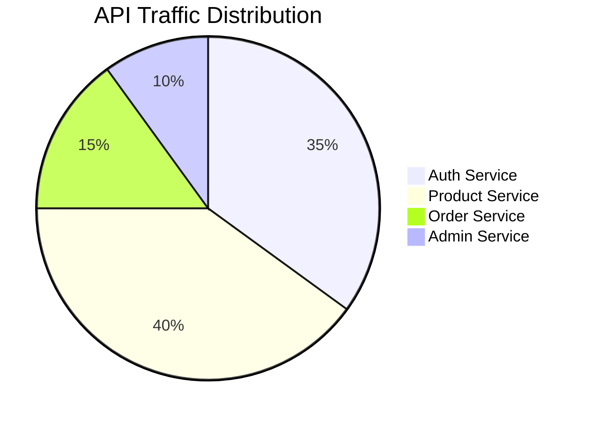
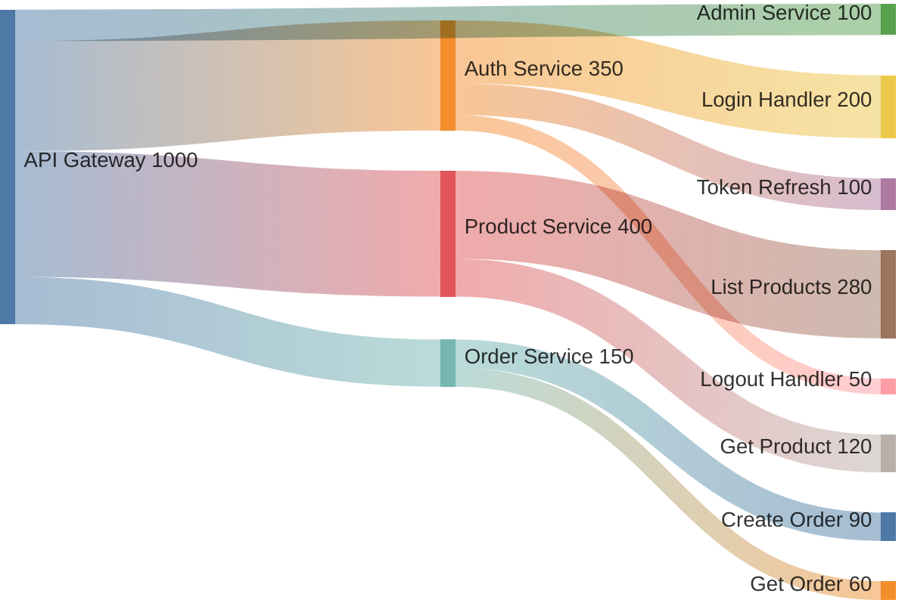

## Sankey Diagrams (sankey-beta)

Use `sankey-beta` when the story is about *volume flowing from sources to destinations*. The band width encodes quantity, making it immediately clear which paths carry the most traffic, cost, or data. A pie chart shows shares of a whole; a sankey shows how that whole is split across a multi-stage routing or distribution.

This is a beta feature. The CSV-like syntax is stable but the diagram does not support node styling or labels beyond the source/target names.

### When to Use

- API request routing: showing how total traffic distributes across endpoints or services
- Cost allocation: breaking down cloud spend from accounts into services into resources
- Data pipeline throughput: how records flow from ingestion through processing stages to outputs
- Traffic split testing: visualizing A/B traffic percentages at each split point
- Error funnel: showing how requests drop off at each stage (ingested → processed → succeeded → returned to user)

### When NOT to Use

- Showing proportions of a single whole with no multi-stage flow — use `pie` instead (`analytics-pie.md`)
- Time-series data — sankey has no time axis; use `xychart-beta` instead (`analytics-xychart.md`)
- Flows where direction or sequence matters — use `sequenceDiagram` instead (`behavior-sequence.md`)
- When the value is 0 for a path — zero-width bands are invisible and confuse readers

**Incorrect (using pie chart to show request routing from one source to multiple destinations):**



**Correct (sankey-beta showing request volume flowing from API gateway to downstream services):**



### Syntax Reference

```
sankey-beta

%% Comments use standard Mermaid %% syntax
%% Each line: Source,Target,Value
SourceNode,TargetNode,NumericValue

%% A node can appear as both source and target across multiple lines
%% First mention of a node name determines its left-to-right position
%% Nodes on the left column are sources; nodes on the right are sinks
%% Intermediate nodes appear in the middle when they are both target and source
```

**Node ordering rules:**
- Left column (sources): nodes that appear only as a source across all rows
- Right column (sinks): nodes that appear only as a target
- Middle columns: nodes that appear as both — their left-to-right position is determined by the order they first appear as a target

**Value units:**
- Values are dimensionless; the diagram scales band widths proportionally
- Use consistent units across all rows (requests/sec, dollars, bytes, record counts)
- Include a title or surrounding documentation note to state the unit

### Tips

- Node names are case-sensitive and must match exactly across rows. `Auth Service` and `auth service` are different nodes.
- Use `%% Title: Description` comments at the top to document the unit and time window being visualized — sankey syntax has no built-in title field.
- Group source nodes logically before target nodes. The order of rows in the CSV controls the visual stacking of bands at each node.
- Avoid more than 3 levels of fan-out in a single diagram — readability degrades quickly. Split into separate sankeys scoped to one level each.
- Sankey diagrams are best for rounded, approximate values. Exact precision is not the goal — relative magnitude is.
- When values differ by orders of magnitude (e.g., 10,000 requests vs 3 errors), consider normalizing to percentages so the thin bands remain visible.

Reference: [Mermaid Sankey Diagram docs](https://mermaid.js.org/syntax/sankey.html)
