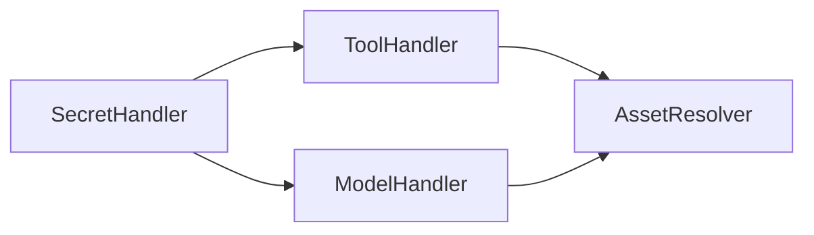

## Gantt Charts (gantt)

Use `gantt` when documenting implementation phases, sprint plans, or task dependency ordering. The primary value is showing what must happen before something else can start — the `after` keyword makes dependencies explicit and reveals the critical path. This makes it useful in design documents, ADRs, and implementation plans.

### When to Use

- Implementation phase ordering: which tasks depend on others before they can begin
- Sprint planning documentation where task durations and dependencies need to be visible
- Release planning: feature gates, milestone dependencies
- Parallelization analysis: which tasks can run concurrently vs. which are serialized
- Onboarding documentation showing the order of setup steps

### When NOT to Use

- Simple milestone lists with no dependencies — use `timeline` instead (`planning-timeline.md`)
- Static module or service relationships — use `graph TB` instead (`structure-graph.md`)
- When no duration or ordering information is available — a gantt without real durations misleads

**Incorrect (using graph to show task dependencies — loses duration and parallelism):**



**Correct (gantt with sections, durations, and after-dependencies):**

```mermaid
gantt
    title Phase 0 Implementation Order
    dateFormat X
    axisFormat %s

    section Foundation
    01 SecretHandler (no deps)           :a1, 0, 2
    07 Checkpointer DB (independent)     :a7, 0, 1

    section Handlers (depend on SecretHandler)
    02 ToolHandler                        :a2, after a1, 3
    03 ModelHandler                       :a3, after a1, 2

    section Integration
    06 AssetResolver (all handlers)      :a6, after a2 a3, 3
    08 SessionManager                    :a8, after a6, 2

    section Critical Path
    09 End-to-end smoke test             :crit, a9, after a8, 1
```



### Syntax Reference

```
gantt
    title Chart Title
    dateFormat  X                       # X = relative units (days, sprints)
    dateFormat  YYYY-MM-DD              # ISO dates for calendar-based plans
    axisFormat  %s                      # display format for axis labels
    axisFormat  %Y-%m-%d                # ISO date axis format

    section Section Name
    Task label         :id, start, duration     # basic task
    Task label         :id, after otherId, dur  # dependency — starts after otherId
    Task label         :crit, id, start, dur    # critical path task
    Task label         :done, id, start, dur    # completed task
    Task label         :active, id, start, dur  # currently in progress

    Milestone name     :milestone, id, date, 0  # zero-duration milestone marker

    excludes weekends                   # skip weekends in calendar mode
```

**Duration units:**
- With `dateFormat X`: integers represent relative units (1 = one sprint, 2 = two days, etc.)
- With `dateFormat YYYY-MM-DD`: use `1d`, `2w`, `1M` for days/weeks/months

**Multiple dependencies:**
```
Task C   :c, after a b, 3    # starts only after both task a AND task b complete
```

### Tips

- Use `dateFormat X` with integer durations for implementation plans where exact calendar dates are not known yet — it keeps the diagram useful without committing to dates that will change.
- Switch to `dateFormat YYYY-MM-DD` only when the plan is committed to a real calendar with actual dates.
- Task IDs (`a1`, `a2`) are for dependency references only and do not appear in the rendered chart. Keep them short.
- Prefix task labels with a number (`01 SecretHandler`) to preserve visual ordering and make the diagram scannable.
- Use `crit` to mark the critical path — the longest chain of dependencies that determines the minimum project duration.
- Use `done` and `active` states when the gantt is used as a living document tracking in-progress work.
- Section names should reflect the reason for grouping, not just arbitrary phases: `Foundation`, `Handlers (depend on SecretHandler)`, `Integration`.
- Keep gantt charts to 20 tasks or fewer. Beyond that, split into per-phase diagrams linked from a summary.
- Gantt charts are planning artifacts, not commitments. Include a note in the surrounding documentation if dates are estimates.

Reference: [Mermaid Gantt Chart docs](https://mermaid.js.org/syntax/gantt.html)
