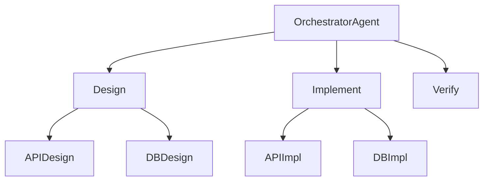
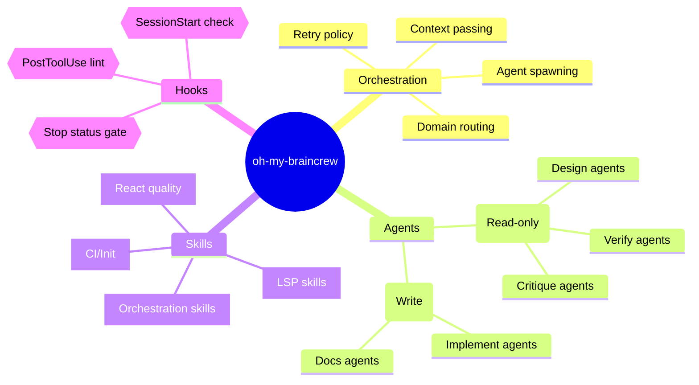

## Mindmap Diagrams (mindmap)

Use `mindmap` when the content is a topic hierarchy without directionality or dependency — brainstorming, feature decomposition, domain concept breakdowns, and documentation structure planning. The indentation-based syntax makes it fast to write and easy to reorganize.

### When to Use

- Feature decomposition: breaking an epic into areas, then into tasks
- Domain concept maps: showing how concepts in a domain relate hierarchically
- Documentation structure planning: outlining what sections a doc will cover
- Brainstorming output: capturing a hierarchy of ideas explored during design
- Codebase orientation: high-level map of modules and their sub-concerns

### When NOT to Use

- Data flows where directionality matters — use `graph LR` instead (`structure-graph.md`)
- Task dependencies with ordering — use `gantt` instead (`planning-gantt.md`)
- Decision trees with conditions — use `flowchart TD` instead
- Hierarchies with more than 3–4 levels — deep nesting renders poorly; split into multiple mindmaps

**Incorrect (using graph for a simple topic breakdown — implies directional data flow):**



**Correct (mindmap with proper indentation hierarchy and node shapes):**



### Syntax Reference

```
mindmap
    root((Root Node))               # root with circle shape

        Branch Node                 # child indented by 4 spaces
            Leaf Node               # grandchild indented by 8 spaces

        (Rounded Node)              # rounded rectangle
        [Square Node]               # square / rectangle
        ((Circle Node))             # circle
        ))Bang Node((               # bang / explosion shape
        {{Hexagon Node}}            # hexagon

        Node with icon::icon(fa fa-book)    # Font Awesome icon prefix
```

**Indentation rules:**
- Root node is the first non-blank line after `mindmap`
- Each level of hierarchy is one additional indentation level (4 spaces recommended)
- Node shape is determined by the wrapping characters, not by keywords
- All nodes at the same indentation level are siblings

**Shape reference:**

| Syntax | Shape | Best for |
|--------|-------|----------|
| `Node text` | Default rectangle | Generic |
| `(Node text)` | Rounded rectangle | Groups, categories |
| `((Node text))` | Circle | Root nodes, key concepts |
| `[Node text]` | Square | Technical items, modules |
| `))Node text((` | Bang | Warnings, highlights |
| `{{Node text}}` | Hexagon | Processing steps, actions |

### Tips

- The root node should be a circle `((name))` — it visually anchors the diagram and matches the mental model of a central topic radiating outward.
- Use rounded rectangles `(name)` for category nodes (second level) and default rectangles for leaf nodes — this creates a visual hierarchy that matches the structural hierarchy.
- Keep node text short (2–5 words). Mindmaps are orientation tools, not documentation — details belong in linked docs.
- Do not go deeper than 4 levels. The diagram renders the deeper levels very small. If you need depth, split the leaf branches into their own mindmaps.
- Icons (`::icon(fa fa-database)`) add quick semantic signals for readers familiar with Font Awesome. Use them on second-level category nodes to aid scanning.
- Mindmaps are ideal for the "Prior Art" section of a plan — a brainstorm of what was considered before the design was finalized.
- When writing feature specs, start with a mindmap to agree on scope, then move to a gantt or task table for ordering.

Reference: [Mermaid Mindmap docs](https://mermaid.js.org/syntax/mindmap.html)
