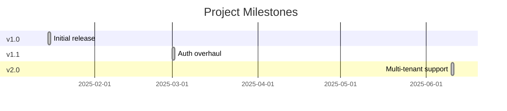
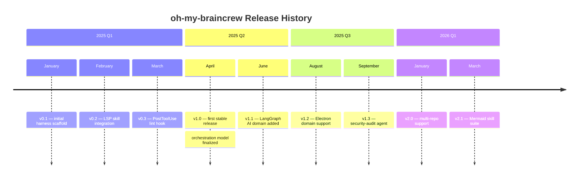

## Timeline Diagrams (timeline)

Use `timeline` when the story is a chronological sequence of events grouped by time period, without dependency ordering or duration. The diagram is optimized for readability — a reader can scan left-to-right and understand what happened when, without needing to follow edges or activation bars.

### When to Use

- Project milestone history: what shipped in each quarter or release
- Incident timelines: what happened at each point during an outage or investigation
- Release history documentation: feature arrivals per version
- Roadmap communication: what is planned per quarter (Q1/Q2/Q3)
- Onboarding guides: what the project looked like at each major phase

### When NOT to Use

- Tasks with dependencies and durations — use `gantt` instead (`planning-gantt.md`)
- Events with parallel tracks (multiple actors doing things simultaneously) — use `sequenceDiagram` instead
- More than ~4 events per time section — the diagram becomes vertically cluttered; consider splitting by year or phase

**Incorrect (using gantt for simple milestones without dependencies — adds false precision):**



**Correct (timeline with sections and events):**



### Syntax Reference

```
timeline
    title Chart Title

    section Time Period Label
        Label : Event description
        Label : Event 1
               : Event 2        # multiple events under same label (same time point)

    section Next Period
        Label : Event description
```

**Key syntax rules:**
- `section` groups events by time period (quarter, month, release, phase)
- Each event is `Label : Description`
- Multiple events at the same time point share a label with additional `: Description` lines indented under it
- No edges, no durations, no dependency syntax — timeline is purely chronological

### Tips

- Section labels should be natural time references that readers recognize: `2025 Q1`, `v1.0 → v2.0`, `Week 1`, `Pre-Launch`.
- Event descriptions should be short (under 60 characters) — the diagram is wide and text wraps poorly at length.
- When documenting an incident timeline, use `section` for phases of the incident: `Detection`, `Investigation`, `Mitigation`, `Post-mortem`.
- Multiple events under the same label (same time point) are common for release notes: use them when two things shipped simultaneously.
- Timeline diagrams render well alongside changelogs and ADRs in documentation. They give historical context without requiring the reader to parse a gantt.
- Do not use timeline for future planning if task dependencies matter — readers will assume chronological order implies dependency order, which misleads. Use `gantt` for dependency-aware planning.
- Avoid mixing past and future events in the same timeline without a clear visual separator — use a section label like `Planned` or `Upcoming` to distinguish.

Reference: [Mermaid Timeline docs](https://mermaid.js.org/syntax/timeline.html)
