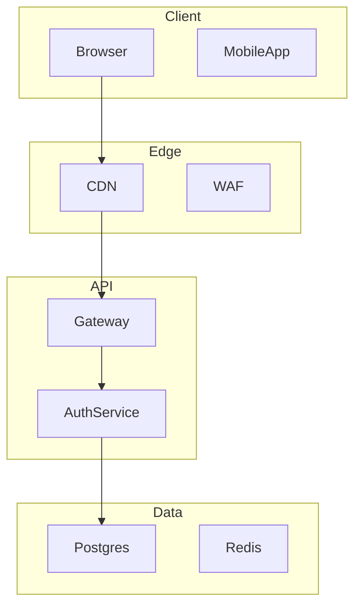
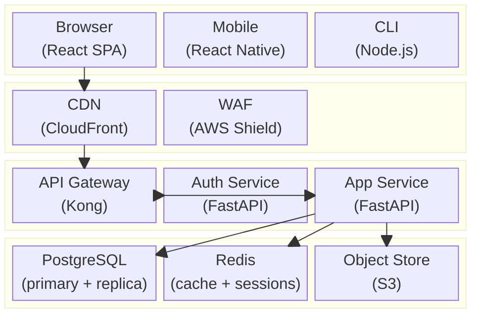

## Block Diagrams (block-beta)

Use `block-beta` for layered architectures where physical stacking and size convey meaning — network topology layers (client / edge / API / data), OS stack diagrams, or any diagram where relative block size signals relative scope or importance. The `columns` directive gives you a grid-based layout that subgraphs in `graph TB` cannot produce cleanly.

Note: `block-beta` is a Beta feature. The `block-beta` keyword is required — there is no stable alias. Syntax is stable enough for production documentation but may see minor changes in future Mermaid releases.

### When to Use

- Layered architectures: client → CDN → API Gateway → services → data layer
- Network topology: zones, subnets, and the components inside each
- System block diagrams: hardware or OS stack with size-proportional blocks
- Side-by-side comparison layouts: two deployment modes shown as columns
- Any diagram where grid position (row/column) carries architectural meaning

### When NOT to Use

- Diagrams where edges and data flow are the primary story — use `graph LR` (`structure-graph.md`) instead
- Diagrams that need decision branches — use `flowchart TD` (`structure-flowchart.md`)
- Class or module relationships — use `classDiagram` (`structure-class.md`)
- When the diagram has fewer than 4 blocks and no layering — prose or a simple `graph TB` is clearer
- Cloud-specific diagrams with service icons — use `architecture-beta` (`infra-architecture.md`) instead

**Incorrect (attempting a layered view with graph TB subgraphs — produces a flow diagram, not a block layout):**



**Correct (block-beta with column layout, sized blocks, and labeled zones):**



### Syntax Reference

```
block-beta
    columns N                   # set the grid column count

    block:blockId["Label"]:W    # block spanning W columns
        ChildA["Child label"]   # child block (occupies 1 column by default)
        ChildB["Child label"]:2 # child block spanning 2 columns
        space                   # empty cell placeholder
    end

    A --> B                     # edge between blocks (same syntax as graph)
    A -->|"label"| B            # labeled edge
```

**Width control:**
- `:N` after a block ID sets its column span (e.g., `:3` spans all 3 columns)
- `space` fills an empty grid cell to maintain alignment
- Child blocks inside a parent inherit the parent's column grid

**Block vs node distinction:**
- `block:id["Label"]:W ... end` — a container block (like a subgraph)
- `NodeId["Label"]` — a leaf block (like a node)

**Edges** use the same arrow syntax as `graph`:
```
A --> B
A -->|"HTTP/2"| B
A -.-> B
```

### Tips

- Always add a `%% Title:` comment as the first line.
- Set `columns` to match the widest layer in your diagram — typically the layer with the most side-by-side components.
- Use `space` to keep layers visually aligned when one layer has fewer blocks than the column count.
- Block labels support `\n` for line breaks inside the block title.
- Use consistent column spans across layers: if your API layer spans 3 columns, span all layers to 3 for visual alignment.
- Edges connect to block IDs, not to child node IDs — keep this in mind when wiring cross-layer connections.
- Because `block-beta` is a beta feature, always validate with `npx -y @mermaid-js/mermaid-cli mmdc -i input.mmd -o /dev/null` before publishing (see `foundation-validation.md`).
- If the diagram needs detailed edge routing or conditional paths, `block-beta` is not the right choice — switch to `graph LR` with subgraphs.

Reference: [Mermaid Block Diagram docs](https://mermaid.js.org/syntax/block.html)
