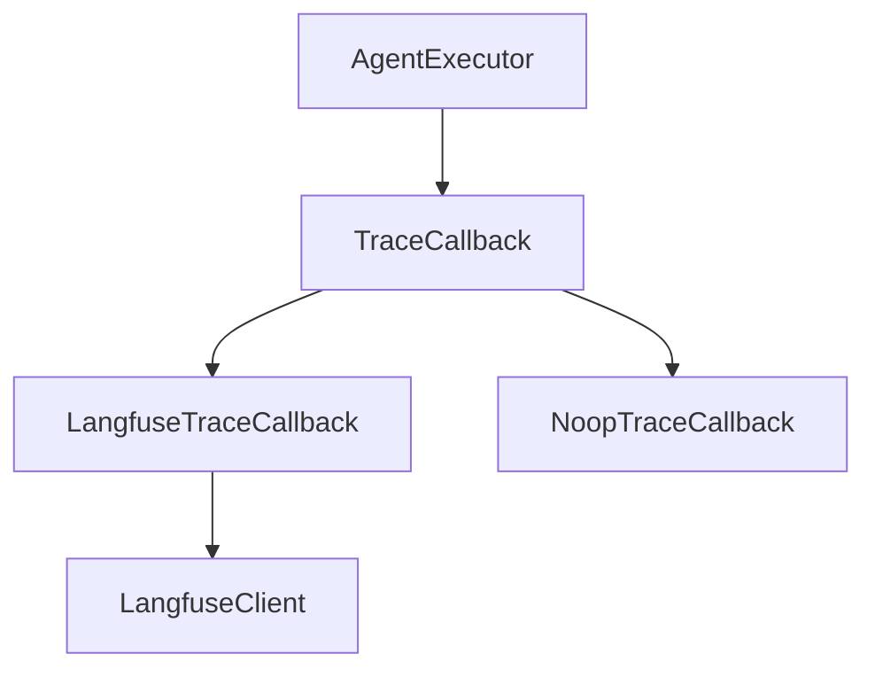
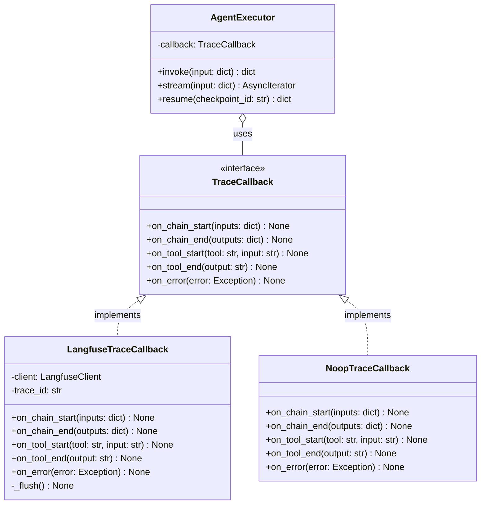

## Class Diagrams (classDiagram)

Use `classDiagram` when the subject is a module's type system: class hierarchies, interface contracts, domain models, or SDK structure. The diagram type natively expresses inheritance, composition, aggregation, and associations with correct cardinality — relationships that `graph TB` can only approximate with custom labels.

Show method signatures with return types and property types with visibility markers. Readers should be able to implement a class from the diagram alone.

### When to Use

- Domain model: entities and their relationships (User, Order, Product)
- Protocol or interface contracts: abstract base classes, Python ABCs, TypeScript interfaces
- SDK or library public API: what classes exist, what methods they expose
- Inheritance hierarchies: base classes and their specializations
- Plugin or strategy patterns: base class with multiple concrete implementations

### When NOT to Use

- Showing data flow or communication between instances — use `sequenceDiagram` (`behavior-sequence.md`)
- Showing database tables and foreign keys — use `erDiagram` (`structure-er.md`), which has native cardinality notation for relational data
- Showing how modules/files depend on each other — use `graph TB` (`structure-graph.md`)
- When there are no relationships to show and a simple list of classes suffices — document in prose instead

**Incorrect (using graph TB to show class relationships — loses type information and relationship semantics):**



**Correct (classDiagram with visibility markers, method signatures, and typed relationships):**



### Syntax Reference

```
classDiagram
    class ClassName {
        <<stereotype>>          # <<interface>>, <<abstract>>, <<enum>>, <<service>>
        +publicField: Type      # + public
        -privateField: Type     # - private
        #protectedField: Type   # # protected
        +publicMethod(arg: Type) ReturnType
        -privateMethod() void
    }
```

**Relationship types:**

| Relationship | Syntax | Meaning |
|---|---|---|
| Inheritance | `Parent <|-- Child` | Child extends Parent |
| Implementation | `Interface <|.. Class` | Class implements Interface |
| Composition | `Whole *-- Part` | Part cannot exist without Whole |
| Aggregation | `Container o-- Item` | Item can exist independently |
| Association | `ClassA --> ClassB` | ClassA uses ClassB |
| Dependency | `ClassA ..> ClassB` | ClassA depends on ClassB (weaker) |

**Cardinality on associations:**
```
Customer "1" --> "0..*" Order : places
Order "1" *-- "1..*" LineItem : contains
```

**Stereotypes for special classes:**
```
class PaymentGateway {
    <<interface>>
}
class UserRole {
    <<enum>>
    ADMIN
    EDITOR
    VIEWER
}
class BaseService {
    <<abstract>>
}
```

**Generics notation:**
```
class Repository~T~ {
    +findById(id: str) T
    +save(entity: T) T
    +delete(id: str) None
}
```

### Tips

- Always add a `%% Title:` comment as the first line — it identifies the diagram in search.
- Use `<<interface>>` for Python ABCs and TypeScript interfaces, not just Java-style classes.
- Show only the public API in interface definitions; show private members only for concrete classes where they clarify the design.
- Keep method signatures realistic — copy them from the actual source code when documenting existing code.
- Add relationship labels (`: implements`, `: uses`, `: contains`) to make cardinality arrows self-explanatory.
- Limit to ~15 classes per diagram. If a domain model has more, split by aggregate root (see `composition-detail-levels.md`).
- Generics notation (`~T~`) renders in Mermaid — use it when the type parameter matters for understanding the design.
- Prefer `o--` (aggregation) over `-->` (association) when the lifecycle distinction is meaningful.

Reference: [Mermaid Class Diagram docs](https://mermaid.js.org/syntax/classDiagram.html)
