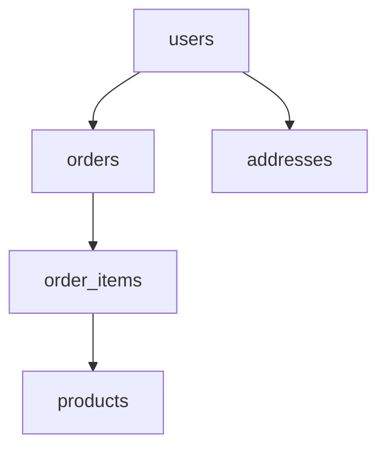
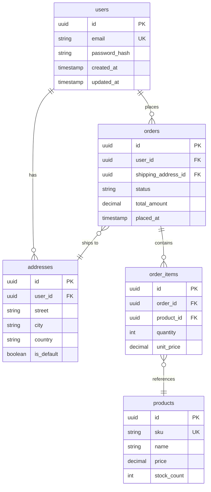

## ER Diagrams (erDiagram)

Use `erDiagram` when documenting database schemas, entity relationships, and cardinality constraints. The diagram type has native notation for one-to-one, one-to-many, and many-to-many relationships — notation that `graph TB` cannot replicate without losing precision.

Always include PK and FK markers on attributes. Readers should be able to derive the migration file from the diagram alone.

### When to Use

- Database schema documentation: tables, columns, primary keys, foreign keys
- Data model design review: entity boundaries, normalization decisions
- Onboarding new engineers to the persistence layer
- API response shape documentation when the shape mirrors a DB entity
- Migration planning: showing which tables a migration will touch and how

### When NOT to Use

- Class hierarchies with methods and inheritance — use `classDiagram` (`structure-class.md`)
- Service communication or API call flows — use `sequenceDiagram` (`behavior-sequence.md`)
- Module/file dependencies — use `graph TB` (`structure-graph.md`)
- When the data shape is a nested document (e.g., MongoDB) — ER notation implies relational semantics; use `classDiagram` or `graph TB` for document models

**Incorrect (using graph TB for table relationships — loses cardinality, PK/FK semantics):**



**Correct (erDiagram with cardinality, attribute types, and PK/FK markers):**



### Syntax Reference

**Entity definition:**
```
erDiagram
    entity_name {
        type  attribute_name  PK        # primary key
        type  attribute_name  FK        # foreign key
        type  attribute_name  UK        # unique key
        type  attribute_name            # regular column
    }
```

**Cardinality notation:**

| Symbol | Meaning |
|--------|---------|
| `\|\|` | exactly one |
| `o\|` | zero or one |
| `\|{` | one or more |
| `o{` | zero or more |

**Relationship patterns:**

| Pattern | Syntax | Example meaning |
|---------|--------|-----------------|
| One-to-many | `A \|\|--o{ B` | One A has zero or more B |
| One-to-one | `A \|\|--\|\| B` | One A has exactly one B |
| Many-to-many | `A }o--o{ B` | via junction table |
| Optional one-to-many | `A o\|--o{ B` | Zero or one A has zero or more B |

**Full relationship line:**
```
entity_a cardinality--cardinality entity_b : "relationship label"
```

**Common attribute types:**
```
uuid, int, bigint, string, text, boolean, decimal, float, timestamp, date, json, jsonb
```

### Tips

- Always add a `%% Title:` comment as the first line identifying the schema or subsystem being documented.
- Mark every PK, FK, and UK explicitly — do not leave readers to infer keys from attribute names.
- Use `uuid` rather than `id: int` when the actual column type is UUID — type accuracy matters for onboarding.
- Include `created_at` and `updated_at` on auditable entities — it signals the audit pattern is in use.
- For many-to-many relationships, model the junction table explicitly as its own entity rather than using `}o--o{` directly — the junction table almost always carries attributes (e.g., `role`, `joined_at`).
- Keep diagrams scoped to one bounded context or aggregate. A 30-table diagram is not readable — split by domain (users, orders, catalog).
- Relationship labels should be verb phrases from the entity's perspective: `"places"`, `"contains"`, `"ships to"`.
- Use `UK` for unique constraints that are not the primary key — they are frequently overlooked in schema reviews.

Reference: [Mermaid ER Diagram docs](https://mermaid.js.org/syntax/entityRelationshipDiagram.html)
