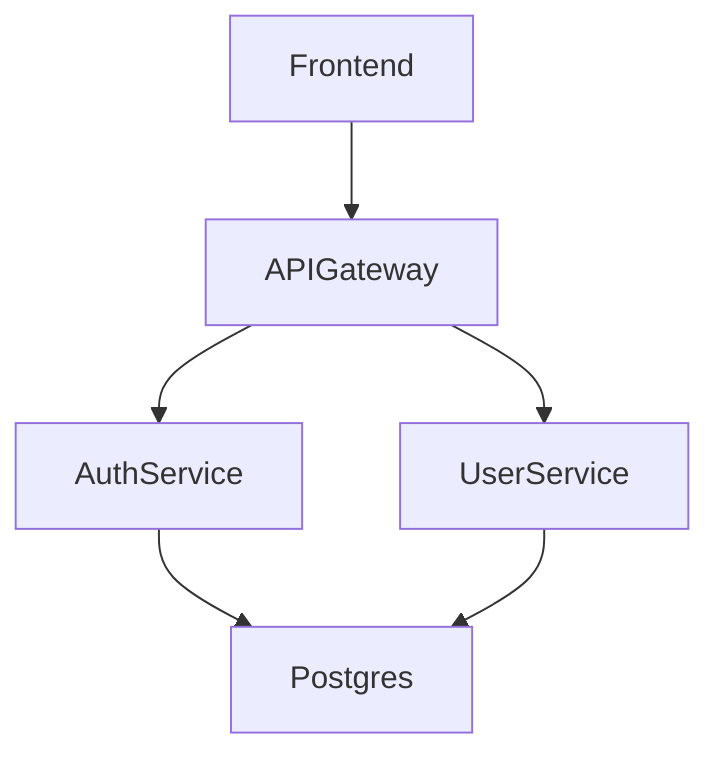
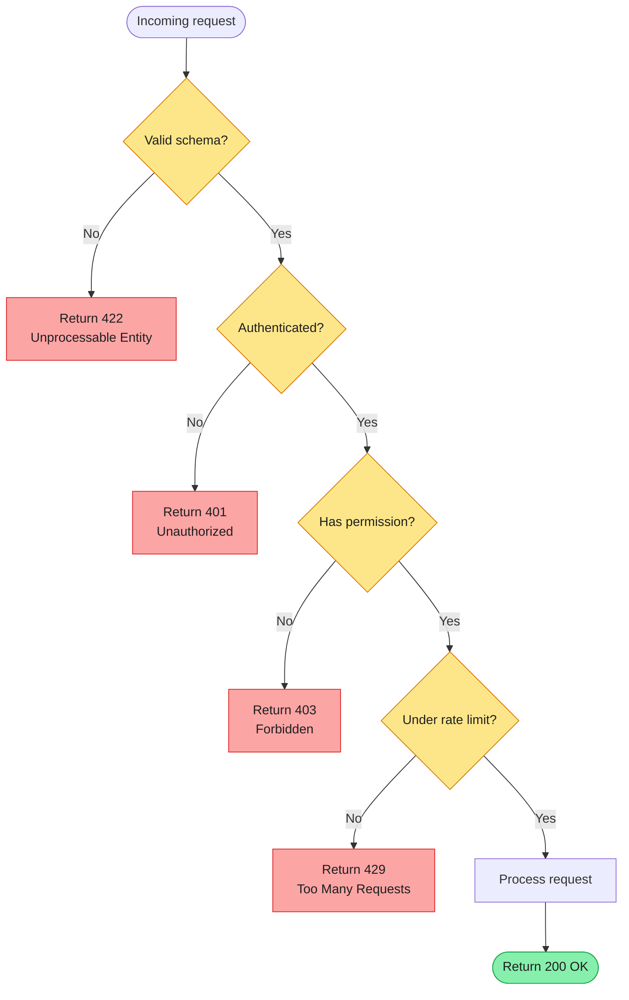

## Flowchart Diagrams (flowchart TD)

Use `flowchart TD` for decision trees, user flows, and any diagram where conditional branching is the primary story. The key distinction from `graph`: flowcharts model logic with explicit yes/no (or true/false) decision points using diamond shapes. If your diagram has no decisions, you probably want `graph TB` instead.

Color-code success and failure paths so readers can trace the happy path and error paths at a glance without reading every label.

### When to Use

- Request validation logic: is input valid? → proceed or reject
- Authentication and authorization flows: is user logged in? → continue or redirect
- User onboarding flows: has user completed step N? → show step N+1 or prompt
- Error handling decision trees: is error retryable? → retry or surface to user
- Feature flag branching: is flag enabled? → new path or legacy path
- Any flow with at least one yes/no branch

### When NOT to Use

- Static architecture with no decisions — use `graph TB` instead (`structure-graph.md`)
- Diagrams showing relationships between components without branching — use `graph TB`
- API call sequences with time ordering — use `sequenceDiagram` (`behavior-sequence.md`)
- State machines where states are persistent — use `stateDiagram-v2` (`behavior-state.md`)

**Incorrect (flowchart used for static architecture with no decisions — graph TB is correct here):**



**Correct (decision tree with clear yes/no branches, color-coded success/failure paths):**



### Syntax Reference

```
flowchart TD                    # top-down layout (most common for decision trees)
flowchart LR                    # left-to-right (works well for sequential pipelines)

Start([Label])                  # stadium shape — use for Start/End nodes
Step[Label]                     # rectangle — process step
Decision{Is condition?}         # diamond — decision point (always a question)
SubStep(Label)                  # rounded rectangle — subprocess

A -->|Yes| B                    # labeled edge for decision branch
A -->|No| C                     # labeled edge for the other branch
A --> B                         # unlabeled edge for sequential steps
```

**Node shape conventions:**

| Shape | Syntax | Use for |
|-------|--------|---------|
| Stadium | `([...])` | Start and End nodes |
| Rectangle | `[...]` | Process / action steps |
| Diamond | `{...}` | Decisions (frame as a question) |
| Rounded rect | `(...)` | Subprocess or sub-flow |
| Hexagon | `{{...}}` | Preparation or setup step |

**Styling paths with classDef:**
```
classDef error fill:#fca5a5,stroke:#dc2626,color:#1f1f1f
classDef success fill:#86efac,stroke:#16a34a,color:#1f1f1f
class NodeA,NodeB error
```

### Tips

- Frame every diamond as a question ending in `?` — it forces clarity on the condition being tested.
- Label every edge out of a diamond — even if the answer is obvious, explicit `Yes`/`No` labels prevent misreads.
- Always include explicit Start and End nodes using stadium shape `([...])` — readers need to know where the flow begins and terminates.
- Color error paths red and success paths green so the happy path is visible at a glance.
- If a decision has more than 2 outcomes, it is still valid — label each edge with its specific outcome value.
- Keep the happy path as the vertical spine of the diagram; branch error paths to the sides.
- If a flowchart grows beyond 20 decision nodes, split it: extract sub-flows into separate diagrams and reference them by name.
- Avoid mixing flowchart with graph syntax — pick one per diagram.

Reference: [Mermaid Flowchart docs](https://mermaid.js.org/syntax/flowchart.html)
