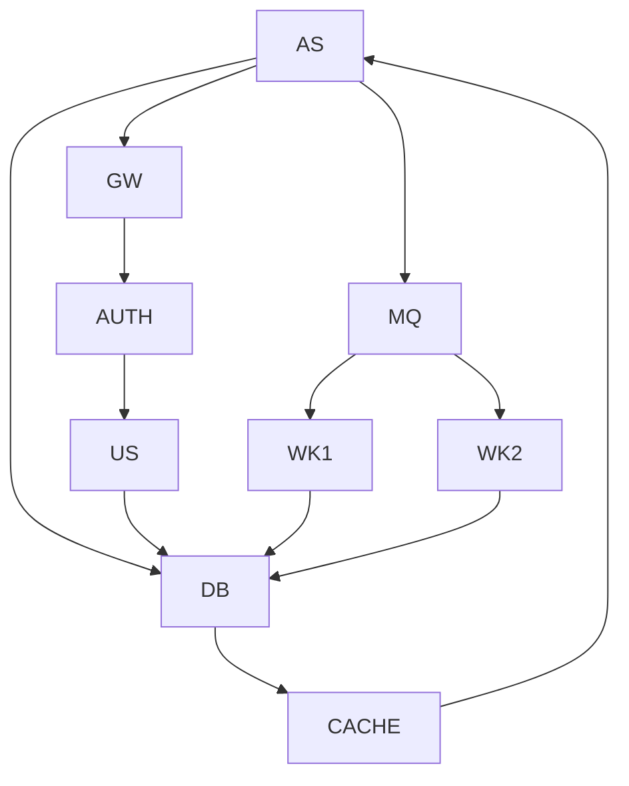
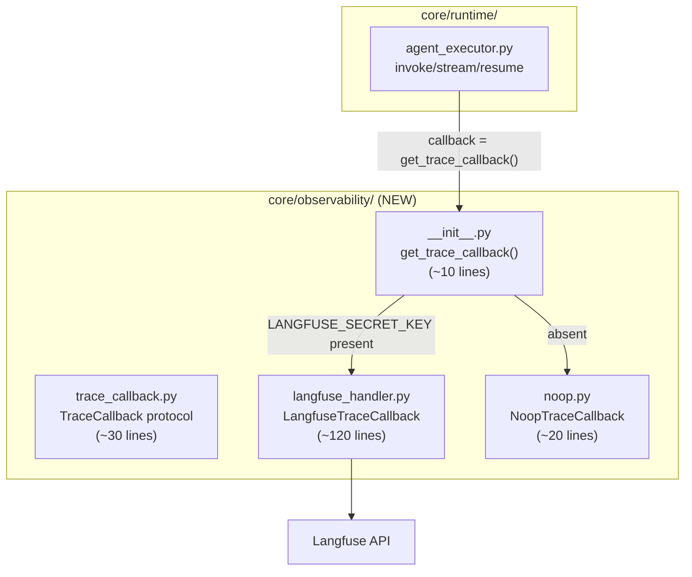
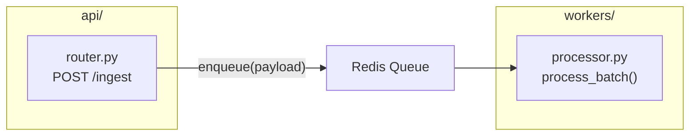

## Graph Diagrams (graph TB / graph LR)

The workhorse diagram type for architecture and dependency documentation. Use `graph TB` (top-to-bottom) for vertical system architecture where hierarchy matters, and `graph LR` (left-to-right) for horizontal dependency chains and data pipelines where flow direction is the story.

Group related nodes into subgraphs using actual directory paths or service boundaries as titles. Add code-level labels (file names, class names, line counts) to make diagrams useful for implementation work, not just high-level orientation.

### When to Use

- System architecture: services, modules, and their relationships
- Dependency graphs: package imports, module coupling
- Data pipelines: end-to-end flow through processing stages
- Module structure: files within a directory with their responsibilities
- Infrastructure topology: load balancers, services, databases, queues

### When NOT to Use

- Decision trees with yes/no branches — use `flowchart TD` instead (`structure-flowchart.md`)
- API call sequences with request/response timing — use `sequenceDiagram` instead (`behavior-sequence.md`)
- Class hierarchies with inheritance and method signatures — use `classDiagram` instead (`structure-class.md`)
- When you have more than 30 nodes — split into multiple diagrams (see `composition-detail-levels.md`)

**Incorrect (flat node soup: 40+ nodes, cryptic abbreviations, no subgraphs, no title comment):**



**Correct (grouped with subgraphs, descriptive labels, code-level detail, ≤30 nodes, title comment):**



### Syntax Reference

```
graph TB                        # top-to-bottom layout
graph LR                        # left-to-right layout

subgraph "title"                # group nodes — use actual directory/service names
    NodeID["Label text"]        # rectangle (default)
    NodeID(["Label text"])      # stadium / pill shape
    NodeID{{"Label text"}}      # hexagon (processing step)
end

A --> B                         # directed edge (data flow)
A -.-> B                        # dashed edge (async / optional)
A ==> B                         # thick edge (critical path)
A -->|"label text"| B           # edge with label
A -->|"fn_call()"| B            # edge label with function call
```

**Node ID conventions:**
- PascalCase for node IDs: `AuthService`, `UserDB`
- Short but meaningful: avoid single letters or pure abbreviations
- Unique across the entire diagram, including across subgraphs

**Code-level label pattern:**
```
NodeID["filename.py<br/>ClassName<br/>(~N lines)"]
```

**Cross-subgraph edges** — declare nodes inside their subgraph, then define cross-subgraph edges after all subgraph blocks close:


### Tips

- Always open with a `%% Title: ...` comment — it identifies the diagram in documentation search.
- Use `graph TB` when depth/hierarchy is the main story; use `graph LR` when left-to-right flow matters.
- Subgraph titles should be real paths (`"core/auth/"`) not invented labels (`"Authentication Layer"`).
- Limit subgraph nesting to 3 levels — deeper nesting renders poorly and signals the diagram needs splitting.
- Arrow labels with function names (`-->|"get_trace_callback()"|`) make diagrams navigable alongside the code.
- When a module has a clearly dominant entry point, place it at the top (TB) or left (LR) of its subgraph.
- Use `<br/>` for multi-line labels, not `\n` — Mermaid renders `<br/>` in node labels.
- If a diagram exceeds 30 nodes, split by concern: one diagram per subgraph group (see `composition-detail-levels.md`).

Reference: [Mermaid Flowchart / Graph docs](https://mermaid.js.org/syntax/flowchart.html)
