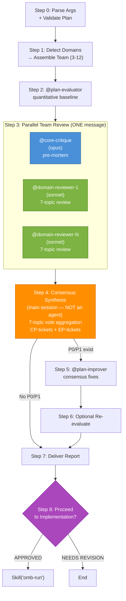

## Language Setting

Documentation language (`OMB_DOCUMENTATION_LANGUAGE`): !`echo ${OMB_DOCUMENTATION_LANGUAGE:-en}`

# Plan Review (Multi-Agent Team Discussion)

Orchestrates a multi-agent review team to critique an existing implementation plan through quantitative evaluation followed by structured team discussion. Unlike `omb-plan` (which creates plans via write→evaluate→improve), this skill reviews an already-written plan from multiple specialist perspectives and synthesizes consensus findings.

Output language follows the documentation language (`OMB_DOCUMENTATION_LANGUAGE`) from the Language Setting section.

## Architecture



**Legend:** Blue = mandatory reviewer, Green = domain reviewers, Orange = main session consensus, Purple = implementation decision.

## When to Apply

- After `omb-plan` has produced a plan and the user wants deeper review
- When the user says "review plan", "계획 리뷰", "review the implementation plan"
- When a plan scored CONDITIONAL PASS and the user wants expert opinions before proceeding
- When multiple domain experts should weigh in before execution begins

## Write Permissions

**WRITE:** `.omb/plans/*.md` files ONLY (via @plan-improver in Step 5)
**READ:** Entire codebase, `docs/`, `.claude/agents/`, `.claude/skills/`, existing plans

## Step 0: Parse Arguments + Validate Plan

### Argument Parsing

```
omb-plan-review <plan-file-path>
```

1. If no argument provided: list files in `.omb/plans/` and ask user to select one via AskUserQuestion
2. If argument provided: verify the file exists at `.omb/plans/{argument}` (or as an absolute path)
3. If file does not exist: report error and list available plans

### Validation

- Read the plan file and confirm it has the 8-section structure
- If the plan is incomplete (fewer than 3 sections), recommend running `omb-plan` first and stop

## Step 1: Assemble Review Team

### Domain Detection

Read the plan document and detect which technical domains it touches. Scan Sections 2, 3, and 4 for domain signals:

<reviewer_delegation>

| Domain Signal (plan keywords) | Reviewer | Review Strengths | Key Review Focus |
|------|---------|-----------|-------------|
| API, endpoints, REST, middleware, FastAPI, Express | @api-design (sonnet) | API contract design, REST/GraphQL architecture | Endpoint paths/methods/status codes, request/response schemas, auth/authz, error handling, rate limiting |
| Database, models, migrations, SQLAlchemy, Alembic, queries | @db-design (sonnet) | PostgreSQL schema and ORM design | Table definitions, index strategy (B-tree/GIN/GiST), migration safety, query optimization, JSONB patterns |
| React, components, hooks, frontend, Tailwind, UI | @ui-design (sonnet) | Component architecture, accessibility | Component tree, hook API, composition patterns, ARIA/keyboard accessibility, responsive layout, design tokens |
| LangGraph, LangChain, agents, prompts, RAG, AI | @ai-design (sonnet) | LLM workflow and agent architecture | Framework selection (LangChain/LangGraph/Deep Agents), state schema, node/tool design, prompt templates, RAG pipeline |
| Electron, IPC, preload, BrowserWindow, desktop | @electron-design (sonnet) | Electron IPC and security boundaries | IPC channel types, preload API surface, security config (contextIsolation/sandbox), window management |
| Docker, CI/CD, K8s, Terraform, deploy, infra | @infra-design (sonnet) | Infrastructure design | Container config, CI/CD pipelines, K8s manifests, Terraform modules, deployment strategy |
| Infrastructure cost, scaling, resilience | @infra-critique (sonnet) | Infra cost/scalability/resilience critique | Over-provisioning, single points of failure, monitoring coverage, compliance |
| Auth, OWASP, secrets, security | @security-audit (sonnet) | OWASP Top 10 audit | Injection, broken auth, sensitive data exposure, XSS, access control, dependency vulnerabilities |
| Code quality, testing, linting, refactoring | @code-review (sonnet) | Code correctness/security/performance review | Logic errors, N+1 queries, naming conventions, type correctness, edge cases, regressions |
| settings.json, CLAUDE.md, hooks, skills, agents, rules, harness | @harness-design (sonnet) | Claude Code harness config design | Agent frontmatter, skill structure, hook setup, permission design, MCP config, memory architecture |
| Any plan with code changes (conditional: `which codex` must succeed) | Codex adversarial reviewer (via Bash) | Adversarial code analysis via OpenAI Codex CLI | Failure modes, race conditions, auth bypass, data loss, rollback safety, observability gaps. Runs `codex review` with adversarial prompt instructions on the plan's target code changes. Only included when Codex CLI is installed. |

</reviewer_delegation>

### Team Composition Rules

1. **@core-critique is ALWAYS included** — mandatory architectural critic
2. **Add domain reviewers** based on detected signals from the plan
3. **Minimum team size: 3** — @core-critique + at least 2 domain reviewers. If fewer than 2 domains detected, add @code-review and @security-audit as defaults
4. **Maximum team size: 12** — all available reviewers. Do not exceed this.
7. **All reviewers run in parallel** — spawn all in a single message for maximum speed
5. **Never include implement agents** — review team is read-only agents only
6. **Match reviewers to tech stack** — only include reviewers for domains the plan actually touches. Do not over-staff.

### Team Announcement

Before spawning reviewers, announce the assembled team to the user:

```
## Review Team Assembled

**Plan:** .omb/plans/{file}.md
**Team size:** {N} reviewers

| # | Reviewer | Role | Rationale |
|---|---------|------|-----------|
| 1 | @core-critique | Architecture critique | Always included |
| 2 | @api-design | API contract review | Plan touches API endpoints |
| 3 | @db-design | Schema review | Plan includes database tasks |
| ... | ... | ... | ... |

Proceeding with quantitative evaluation followed by team discussion.
```

## Step 2: Quantitative Evaluation

Spawn the `plan-evaluator` agent:

```
Agent({
  subagent_type: "plan-evaluator",
  prompt: "Evaluate the plan at: .omb/plans/{file}.md\n\nUse the omb-evaluation-plan rubric (44 items, 9 dimensions).\nVerify @agent references exist in .claude/agents/omb/.\nVerify Skill() references exist in .claude/skills/.\nSpot-check file:line references."
})
```

**Wait for:** `<omb>DONE</omb>` with score sheet and P0-P3 tickets.

Record the full evaluation output — it will be passed to each reviewer as context.

## Step 3: Parallel Team Review

Spawn ALL reviewer agents **in parallel** using multiple Agent() calls in a single message. Each reviewer receives the same context independently:
1. The plan file path
2. The evaluation score sheet and tickets from Step 2
3. A structured review prompt targeting the 7 discussion topics

### Review Prompt Template

Spawn all reviewers in ONE message:

```
// All Agent() calls in a SINGLE message — parallel execution
Agent({
  subagent_type: "core-critique",
  prompt: "<review_context>
Plan: .omb/plans/{file}.md
Evaluation: Score {score}% (Grade {grade}), P0: {count}, P1: {count}
{Full evaluation ticket list}
</review_context>

<role>You are an architecture critic specializing in pre-mortem analysis. Your strength is identifying design contradictions, unverified assumptions, missing risk mitigation, and edge case gaps. Verify every claim against actual codebase files.</role>

<review_topics>
[7-topic review — see template below]
</review_topics>

<output_format>
For each topic, use: | # | Finding | Severity | Evidence |
End with the standard omb output envelope.
</output_format>"
})

Agent({
  subagent_type: "{domain-reviewer}",  // e.g., "api-design"
  prompt: "<review_context>
Plan: .omb/plans/{file}.md
Evaluation: Score {score}% (Grade {grade}), P0: {count}, P1: {count}
{Full evaluation ticket list}
</review_context>

<role>You are a {domain} specialist. Your review strengths: {strengths from delegation table}. Focus on: {key review focus from delegation table}. Stay within your domain.</role>

<review_topics>
Provide assessment on ALL 7 topics. For each finding, quote evidence and assign severity (BLOCKING / NON-BLOCKING).
If a topic is not relevant to your domain, state 'No findings from my perspective.'

### 1. KEEP — What should be preserved (strengths)
### 2. REMOVE — What can be eliminated
### 3. MISSING — What needs to be added
### 4. AMBIGUOUS — What is unclear in intent
### 5. VIOLATIONS — What breaks rules or conventions
### 6. RISKS — Potential problems
### 7. TDD — Test case opinions
</review_topics>

<output_format>
For each topic, use: | # | Finding | Severity | Evidence |
End with the standard omb output envelope.
</output_format>"
})

// ... additional domain reviewers, all in the same message
```

**Wait for:** `<omb>DONE</omb>` from **all** reviewers. All run simultaneously.

### Independence Constraint

**[HARD] Each reviewer assesses independently.** Parallel execution naturally guarantees this — no reviewer can see another's output since they all run simultaneously. This eliminates anchoring bias and groupthink by design.

## Step 4: Synthesize Consensus

After all individual reviews are collected, the **main session** (NOT a sub-agent) synthesizes findings. This is the core differentiator of this skill.

### Consensus Building Process

For each of the 7 discussion topics:

1. **Collect** — Gather all findings from all reviewers for this topic
2. **Deduplicate** — Merge findings that reference the same plan element or concern
3. **Count votes** — For each unique finding, count how many reviewers flagged it
4. **Classify by consensus level:**

| Consensus Level | Criterion | Priority |
|----------------|-----------|----------|
| **Unanimous** | All reviewers agree | P0 (critical) |
| **Supermajority** | ≥75% of reviewers agree | P0 (critical) |
| **Majority** | >50% of reviewers agree | P0 (critical) |
| **Strong minority** | 33-50% of reviewers agree | P1 (high) |
| **Minority** | <33% of reviewers agree | P2 (medium) |
| **Single voice** | Only 1 reviewer flags | P3 (low) |

### Veto Power

Even without majority agreement, certain agents can escalate findings:

- **@core-critique BLOCKING** → minimum P1 (architectural integrity)
- **@security-audit BLOCKING** → minimum P1 (security posture)

### Conflict Resolution

When reviewers disagree on the same plan element:
- Document both perspectives with evidence
- The majority position becomes the recommendation
- The minority position is recorded as a **dissenting view** with rationale
- If the split is exactly 50/50: escalate to the user via the report (do NOT auto-resolve)

### Merging with Evaluation Tickets

- Evaluation P0/P1 tickets from Step 2 are carried forward
- If a consensus finding overlaps with an evaluation ticket, merge them (use the consensus priority if higher)
- Use ticket ID prefixes to distinguish source:
  - **`CP-P{N}-{NNN}`** — consensus-derived tickets
  - **`EP-P{N}-{NNN}`** — evaluation-derived tickets
  - See `.claude/rules/workflow/09-ticket-schema.md` for canonical ticket format

### Synthesis Output Structure

For each topic:

```
### Topic N: {TOPIC NAME}

**Consensus findings ({count} items):**

| # | Finding | Flagged By | Consensus | Priority | Evidence |
|---|---------|-----------|-----------|----------|----------|
| 1 | {finding} | @agent1, @agent2, @agent3 | Majority (3/5) | P0 | "{quoted text}" |
| 2 | {finding} | @agent1 | Single voice | P3 | "{quoted text}" |

**Dissenting views (if any):**
- @agent2 disagrees with finding #1 because: {rationale}
```

## Step 5: Improvement

If consensus findings include P0 or P1 items, spawn the `plan-improver` agent:

```
Agent({
  subagent_type: "plan-improver",
  prompt: "Improve the plan at: .omb/plans/{file}.md

Review team consensus findings:

{Full consensus synthesis from Step 4, organized by priority}

Evaluation results from @plan-evaluator:
Score: {score}% (Grade {grade})
{P0-P3 tickets from Step 2}

Priority order:
1. Fix consensus P0 items first (majority-agreed critical issues)
2. Fix consensus P1 items
3. Fix evaluation P0/P1 items not already covered by consensus
4. P2/P3 only if P0/P1 are all resolved

Use omb-improve-plan fix strategies. Diagnose root causes first. Produce regression diff table."
})
```

**Wait for:** `<omb>DONE</omb>` with regression diff table confirming 0 regressions.

**Skip Step 5 if:** No P0 or P1 findings in both consensus and evaluation, AND evaluation score ≥ 80%.

## Step 6: Optional Re-evaluation

After improvement, ask the user via AskUserQuestion:

```
Plan improved based on team consensus.
Options:
1. Re-evaluate — Run @plan-evaluator to verify improvements (recommended)
2. Accept — Accept the improved plan as-is
3. Re-review — Run another full team review (use only if major structural changes were made)
```

- **Re-evaluate:** Spawn @plan-evaluator on the improved plan and report new score.
- **Accept:** Proceed directly to Step 7.
- **Re-review:** Re-invoke the full skill from Step 1. Warn that this doubles the token cost.

## Step 7: Deliver Review Report

Present the final report. Language follows the documentation language from the Language Setting section.

### Report Format (English — documentation language = en)

```markdown
## Plan Review Report

**Plan:** .omb/plans/{file}.md
**Review team:** {N} reviewers ({@agent1, @agent2, ...})
**Evaluation score:** {before}% → {after}% (if improved)
**Consensus items:** {P0 count} P0, {P1 count} P1, {P2 count} P2, {P3 count} P3

### Evaluation Summary
{Abbreviated score sheet from @plan-evaluator}

### Team Consensus

#### 1. KEEP (Strengths)
{Consensus strengths with vote counts}

#### 2. REMOVE (Unnecessary)
{Consensus removals with vote counts}

#### 3. MISSING (Gaps)
{Consensus missing items with vote counts and priority}

#### 4. AMBIGUOUS (Unclear)
{Consensus ambiguities with vote counts and priority}

#### 5. VIOLATIONS (Rule Breaks)
{Consensus violations with vote counts and priority}

#### 6. RISKS (Potential Problems)
{Consensus risks with vote counts and priority}

#### 7. TDD (Test Opinions)
{Consensus test gaps with vote counts and priority}

### Dissenting Views
{Any 50/50 splits or notable disagreements requiring user decision}

### Improvement Summary

| Ticket | Source | Priority | Status | Resolution |
|--------|--------|----------|--------|------------|
| CP-P0-001 | Consensus | P0 | RESOLVED | {what was fixed} |
| EP-P0-001 | Evaluation | P0 | RESOLVED | {what was fixed} |
| CP-P2-001 | Consensus | P2 | OPEN | {deferred} |

### Verdict
- **APPROVED** — 0 P0, 0 P1, team consensus positive
- **CONDITIONALLY APPROVED** — 0 P0, minor P1 items remain
- **NEEDS REVISION** — P0 items remain after improvement
```

### Report Format (Korean — documentation language = ko)

Same structure with Korean headers:

```markdown
## 계획 리뷰 보고서

**계획:** .omb/plans/{file}.md
**리뷰 팀:** {N}명 ({@agent1, @agent2, ...})
**평가 점수:** {before}% → {after}%
**합의 항목:** P0 {count}건, P1 {count}건, P2 {count}건, P3 {count}건

### 평가 요약
### 팀 합의
#### 1. 유지 사항 (강점)
#### 2. 제거 가능 (불필요)
#### 3. 누락 사항 (보완 필요)
#### 4. 모호한 부분 (의도 불명확)
#### 5. 규칙 위반
#### 6. 리스크
#### 7. TDD 의견

### 이견
### 개선 요약
### 판정
- **승인** — P0 0건, P1 0건, 팀 합의 긍정적
- **조건부 승인** — P0 0건, 경미한 P1 잔존
- **수정 필요** — 개선 후에도 P0 잔존
```

## Step 8: Proceed to Implementation

**Gate:** Only when verdict is **APPROVED** or **CONDITIONALLY APPROVED**. Skip this step entirely for **NEEDS REVISION** — the user must fix P0 issues first.

After delivering the review report in Step 7, ask the user via AskUserQuestion:

```
Review complete. Verdict: {verdict}.
Proceed with implementation?
1. Yes — Exit plan mode and start implementation (omb-run)
2. No — Stay in current mode
```

### If Yes

1. **Exit plan mode** (if active): Call `ExitPlanMode` with `allowedPrompts` derived from the review team's domains detected in Step 1:

   | Domain Detected | allowedPrompts |
   |----------------|----------------|
   | API/Backend | `Bash: "run tests"`, `Bash: "run linter"` |
   | Database | `Bash: "run migrations"`, `Bash: "run tests"` |
   | UI/Frontend | `Bash: "run tests"`, `Bash: "run linter"`, `Bash: "run build"` |
   | AI/ML | `Bash: "run tests"`, `Bash: "run linter"` |
   | Infrastructure | `Bash: "run linter"`, `Bash: "run build"` |
   | Any domain | `Bash: "install dependencies"` |

   Always include `Bash: "run tests"` and `Bash: "run linter"` regardless of domain.

2. **Start implementation**: After plan mode exits and the user approves, invoke `Skill("omb-run", args: "{plan-file-path}")` to begin execution immediately.

### If No

End normally. The skill output stops after the review report (current behavior).

### Plan-Mode Guard

If the session is **not** in plan mode (the user invoked `omb-plan-review` outside of plan mode), skip the `ExitPlanMode` call and invoke `Skill("omb-run", args: "{plan-file-path}")` directly after user confirmation.

## Context Passing Rules

| Agent | Receives |
|-------|----------|
| @plan-evaluator (Step 2) | Plan file path only |
| Each reviewer (Step 3) | Plan file path + evaluation score sheet + P0-P3 tickets |
| @plan-improver (Step 5) | Plan file path + consensus synthesis + evaluation tickets |
| @plan-evaluator (Step 6) | Plan file path only (re-evaluation) |

**[HARD] Each reviewer receives evaluation output for context but reviews independently. Do NOT pass one reviewer's output to another.**

## Agent Inventory

### Review Team Candidates

| Agent | Model | Domain | Always Included? |
|-------|-------|--------|-----------------|
| @core-critique | opus | Architecture, assumptions, risks | Yes (mandatory) |
| @api-design | sonnet | API contracts, endpoints, middleware | If plan touches API |
| @db-design | sonnet | Schema, migrations, queries | If plan touches DB |
| @ui-design | sonnet | Components, hooks, layout | If plan touches UI |
| @ai-design | sonnet | LangGraph, prompts, RAG | If plan touches AI |
| @electron-design | sonnet | IPC, windows, security | If plan touches Electron |
| @infra-design | sonnet | Docker, CI/CD, K8s, Terraform | If plan touches infra |
| @infra-critique | sonnet | Cost, scaling, resilience | If plan touches infra |
| @security-audit | sonnet | OWASP, auth, secrets | If plan touches security |
| @code-review | sonnet | Quality, conventions, patterns | If plan touches code quality |
| @harness-design | sonnet | Harness config: agents, skills, hooks, rules | If plan touches harness |

### Supporting Agents

| Agent | Model | Role |
|-------|-------|------|
| @plan-evaluator | opus | Quantitative rubric scoring (Steps 2, 6) |
| @plan-improver | opus | Apply consensus improvements (Step 5) |

## Anti-Patterns

- **Skipping evaluation** — Always run @plan-evaluator before team review. Reviewers need quantitative context to focus their assessment.
- **Sequential reviewer spawning** — Spawn all reviewers in a single message for parallel execution. **Why:** Sequential spawning wastes time proportional to reviewer count and provides no quality benefit since reviewers must be independent anyway.
- **Passing reviews between reviewers** — Each reviewer must assess independently. Parallel execution makes this physically impossible by design. **Why:** Sharing reviews causes anchoring bias and groupthink.
- **Spawning agents from agents** — Per CLAUDE.md rule #2, only the main session spawns agents. Step 4 consensus synthesis is done by the main session.
- **Auto-resolving 50/50 splits** — When the team is evenly split, escalate to the user. Do not pick a side.
- **Reviewing without a plan** — This skill requires an existing plan. Redirect to `omb-plan` if no plan exists.
- **Over-staffing the team** — Only include reviewers for domains the plan actually touches. Including all 11 for a single-domain plan wastes tokens.
- **Skipping improvement** — If the team finds P0 issues, always run @plan-improver. Do not just report issues without fixing them.
- **Multiple improvement rounds** — This skill runs improvement once. For further iteration, re-invoke the skill.
- **Offering implementation on NEEDS REVISION** — Never offer to proceed when P0 issues remain. The user must fix or re-review first.

## Rules

- **Parallel reviewer spawning** — Spawn all reviewers in a single message. Wait for all `<omb>DONE</omb>` responses before proceeding to Step 4.
- **Independent reviews** — Each reviewer assesses independently. Parallel execution naturally enforces this constraint.
- **Main-session consensus** — Step 4 synthesis is performed by the main session, not a sub-agent.
- **Majority = P0** — Any finding flagged by >50% of reviewers is automatically P0.
- **@core-critique veto** — BLOCKING finding from @core-critique is minimum P1 even without majority.
- **@security-audit veto** — BLOCKING finding from @security-audit is minimum P1 even without majority.
- **@harness-design veto** — BLOCKING finding from @harness-design is minimum P1 for harness-domain plans.
- **Language follows the documentation language (`OMB_DOCUMENTATION_LANGUAGE`) from the Language Setting section** — Report output language follows this resolved value. Skill content stays English.
- **Max 1 improvement round** — Unlike `omb-plan` (3 iterations), plan-review runs improvement once. Re-invoke for more.
- **Ticket ID prefix** — Consensus: `CP-P{N}-{NNN}`. Evaluation: `EP-P{N}-{NNN}`. See `.claude/rules/workflow/09-ticket-schema.md` for canonical schema.
- **Write only to .omb/plans/** — Do not modify any other files during review.
- **Step 8 gate** — Only offer implementation when verdict is APPROVED or CONDITIONALLY APPROVED. NEEDS REVISION skips Step 8 entirely.
