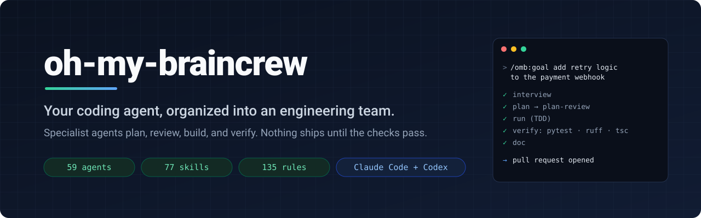
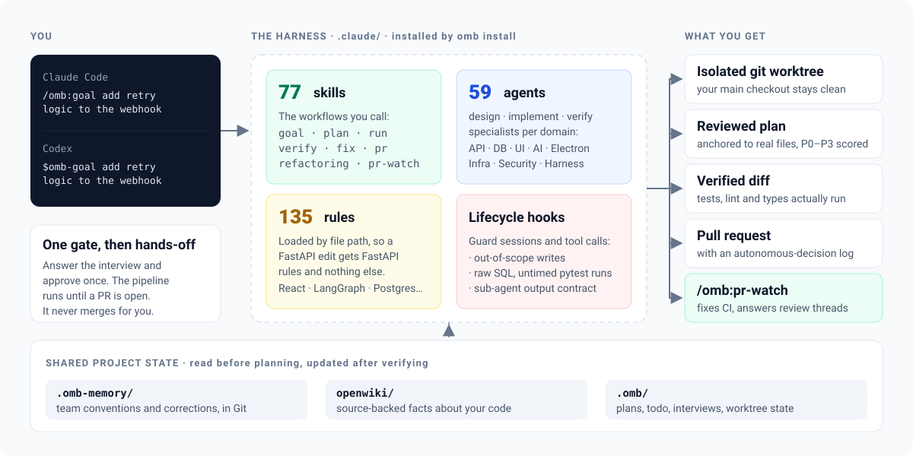
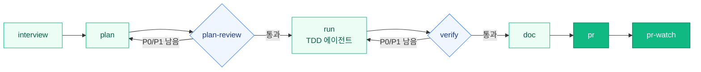

<div align="center">



<br>

**Claude Code나 Codex를 계획·리뷰·구현·검증·PR까지 해내는 엔지니어링 팀으로 바꿉니다.**

[](https://github.com/braincrew-lab/oh-my-braincrew-release/releases/latest)
[](https://github.com/braincrew-lab/oh-my-braincrew-release/releases)
[](#설치)
[](#빠른-시작)
[](#라이선스)

[빠른 시작](#빠른-시작) · [동작 방식](#동작-방식) · [워크플로우](#워크플로우) · [명령어](#명령어) · [운영 메모리](#세션이-끝나도-남는-메모리) · [변경 기록](CHANGELOG.md) · [English](README.md)

</div>

---

하나의 컨텍스트에서 혼자 일하는 코딩 에이전트는 코드를 쓰고, 테스트를 건너뛰고, 다 됐다고 말하기 쉽습니다. **oh-my-braincrew(`omb`)** 는 그 에이전트 주위에 하네스를 설치합니다. 전문 에이전트 59개, 스킬 77개, 컨벤션 규칙 135개와 라이프사이클 훅이 함께 동작해 에이전트가 절차를 갖춘 팀처럼 일하게 만듭니다.

목표를 말하면 하네스가 요구사항을 인터뷰하고, 실제 파일에 근거한 계획을 쓰고, 도메인 리뷰어가 그 계획을 채점합니다. 이어서 격리된 worktree에서 테스트 먼저 구현하고, 실제 타입 체커·린터·테스트를 돌린 뒤 PR을 엽니다. 에이전트의 말만 믿고 완료로 처리하지 않습니다.

```text
> /omb:goal 결제 웹훅에 재시도 로직 추가
```

## omb를 쓰는 이유

| 에이전트 단독 | omb와 함께 |
|---|---|
| 한 컨텍스트가 설계·코드·리뷰를 모두 처리 | API, DB, UI, AI, Electron, Infra, Security 도메인별로 설계·구현·검증 에이전트를 분리 |
| 계획이 산문으로 끝남 | 계획이 파일 경로와 줄 범위를 인용하고, 평가 → 개선 루프를 통과해야 함 |
| "문제없어 보입니다" | 리뷰어 3~12명이 병렬로 계획을 채점하고 결과를 P0~P3 목록 하나로 합침 |
| "테스트는 통과할 겁니다" | `/omb:verify`가 `pytest`, `ruff`, `tsc`, `eslint`를 실행하고 명령 출력으로 보고 |
| 작업 중인 트리에 바로 수정 | 목표마다 별도 git worktree에서 진행하고 SQLite로 상태 추적 |
| 세션마다 처음부터 다시 설명 | 팀 컨벤션은 `.omb-memory/`, 코드 사실은 `openwiki/`에 두고 둘 다 Git으로 공유 |
| 모든 규칙을 한꺼번에 로드 | 파일 경로에 맞는 규칙만 로드. FastAPI를 고칠 때는 FastAPI 규칙만 읽음 |

## 빠른 시작

**1. CLI 설치**

```bash
# macOS (Apple Silicon) / Linux (x86_64)
curl -fsSL https://raw.githubusercontent.com/braincrew-lab/oh-my-braincrew-release/main/install.sh | bash
```

```powershell
# Windows (PowerShell)
irm https://raw.githubusercontent.com/braincrew-lab/oh-my-braincrew-release/main/install.ps1 | iex
```

두 스크립트 모두 최신 릴리스를 내려받아 `checksums-sha256.txt`로 SHA-256을 확인하고 `omb` 단축 명령을 만듭니다. 바이너리 위치는 macOS/Linux가 `~/.local/bin`, Windows가 `%LOCALAPPDATA%\oh-my-braincrew`입니다. Python, `uv`, 소스 체크아웃은 필요하지 않습니다.

**2. 프로젝트에 연결**

```bash
cd /path/to/your/project
omb version
omb install        # `omb init`의 별칭
```

`omb install`은 `.claude/` 하네스와 Codex 호환 파일을 설치합니다. `AGENTS.md`와 `CLAUDE.md`는 없을 때만 만들고, 기존 지침·에이전트·스킬·설정은 그대로 둡니다.

**3. 에이전트에서 작업 시작**

| 호스트 | 프로젝트 지침 정리 | 목표 실행 |
|---|---|---|
| Claude Code | `/omb:deep-setup` | `/omb:goal 결제 웹훅에 재시도 로직 추가` |
| Codex | `$omb-deep-setup` | `$omb-goal 결제 웹훅에 재시도 로직 추가` |

`deep-setup`은 실제 코드, 매니페스트, CI를 읽고 루트와 폴더별 `AGENTS.md` 지침을 작성합니다. 새 스킬이 보이지 않으면 호스트 세션을 다시 시작하세요.

## 동작 방식

<p align="center">
  
</p>

| 계층 | 역할 | 위치 |
|---|---|---|
| **스킬** | 직접 호출하는 워크플로우(`/omb:plan`, `/omb:verify` 등)와 필요할 때 로드되는 루브릭·참고 가이드 | `.claude/skills/omb-*` |
| **에이전트** | 도메인별 설계·구현·검증·탐색 전문가와 비평·계획 평가 에이전트 | `.claude/agents/omb/` |
| **규칙** | FastAPI, React, LangGraph, Postgres/Redis, Docker/K8s/Terraform, 17개 언어, 테스트, git 컨벤션 | `.claude/rules/` |
| **훅** | 세션 시작, 도구 사용 전후, 서브 에이전트 종료 시 실행되는 Python 훅 핸들러. 범위 밖 쓰기, raw SQL, 타임아웃 없는 pytest 실행, 출력 계약을 어긴 서브 에이전트 응답을 차단 | `.claude/hooks/omb/` |
| **상태** | 계획, todo, 인터뷰, worktree 기록 | `.omb/` |

지원 스택은 Python/FastAPI, React/TypeScript/Next.js, LangGraph/LangChain/Deep Agents, Postgres/Redis, Electron, Docker/GitHub Actions/Kubernetes/Terraform입니다.

## 워크플로우

한 번의 호출로 전체를 돌리거나, 필요한 단계만 따로 호출할 수 있습니다.



| 단계 | 명령 | 결과 |
|---|---|---|
| 1 | `/omb:interview` | 저장소를 먼저 찾아본 뒤 코드로 답할 수 없는 것만 묻는 요구사항 인터뷰 → `.omb/interviews/` |
| 2 | `/omb:plan` | 코드 위치 중심 계획과 평가 → 개선 루프 → `.omb/plans/` |
| 3 | `/omb:plan-review` | 도메인 리뷰어 병렬 리뷰와 P0~P3 우선순위의 합의 목록 |
| 4 | `/omb:run` | RED → GREEN → IMPROVE 사이클로 도메인 에이전트에 작업 위임 → `.omb/todo/` |
| 5 | `/omb:verify` | `tsc` / `ruff` / `pytest` / `eslint` 실제 실행, 도메인 리뷰, 단일 판정, P0/P1 자동 수정 |
| 6 | `/omb:doc` | 변경에 맞춰 `docs/` 갱신 |
| 7 | `/omb:pr` | 브랜치 확인 → 린트 게이트 → 커밋 → 푸시 → GitHub PR |
| 8 | `/omb:pr-watch` | 실패한 CI를 새 커밋으로 고치고 모든 리뷰 스레드에 답한 뒤 판정에서 멈춤 |

### `/omb:goal`: 한 번의 호출로 전체 사이클

```text
> /omb:goal LangGraph 에이전트에 웹 검색 도구 추가
```

인터뷰가 끝나면 진행 여부를 한 번만 승인합니다. 이후 파이프라인은 interview → plan → plan-review → run → verify → doc → pr을 추가 질문 없이 이어가고, 단계가 실패하면 그 단계를 재시도합니다.

- 항상 자체 git worktree에서 작업하며 merge하지 않습니다. PR이 열리면 끝납니다.
- 자율 구간에서 내린 결정은 결정 기록에 남기고 PR 본문에 첨부합니다.

모든 변경에 전체 파이프라인이 필요하지는 않습니다. `/omb:plan`은 먼저 필요성을 판단하므로 파일 하나를 고치는 데 리뷰어 열두 명을 부르지 않습니다.

## 명령어

Claude Code에서는 `/omb:<name>`, Codex에서는 같은 스킬을 `$omb-<name>`으로 호출합니다.

<details open>
<summary><strong>계획·구현·검증</strong></summary>

| 명령 | 역할 |
|---|---|
| `/omb:goal` | interview → plan → review → run → verify → doc → pr 자율 실행과 결정 기록 |
| `/omb:interview` | 다차원 요구사항 인터뷰 |
| `/omb:brainstorming` | 설계 전에 한 번에 한 질문씩 의도를 구체화 |
| `/omb:plan` | 평가 → 개선 루프를 거치는 구현 계획(`--worktree`, `--codex`) |
| `/omb:plan-review` | P0~P3 채점을 포함한 멀티 에이전트 계획 리뷰 |
| `/omb:run` | TDD를 강제하며 도메인 에이전트로 계획 실행 |
| `/omb:verify` | 정적 분석, 테스트, 멀티 에이전트 합의, P0/P1 자동 수정 |
| `/omb:fix` | git 이력 분석과 재현 절차에 근거한 최소 패치 계획 |
| `/omb:refactoring` | 아키텍처 분석을 포함한 동작 보존 리팩터링 파이프라인 |
| `/omb:architect` | 여러 주제를 병렬로 분석하고 합의 점수를 매기는 아키텍처 분석 |

</details>

<details>
<summary><strong>리뷰·PR·릴리스</strong></summary>

| 명령 | 역할 |
|---|---|
| `/omb:pr` | 브랜치 검증, 린트 게이트, 구조화된 PR 생성 |
| `/omb:pr-watch` | CI 수정과 모든 리뷰 스레드·코멘트 처리를 백그라운드로 진행하고 판정에서 멈춤 |
| `/omb:review-pr` | 원래 요청에 비추어 PR diff를 리뷰하고 근거 코멘트 게시 |
| `/omb:ultra-review` | PR이나 로컬 작업을 깊이 리뷰하고 수정·스레드 처리까지 진행 |
| `/omb:lint-check` | 변경 파일로 스택을 감지해 맞는 린터 실행 |
| `/omb:release` | 버전 올림, 변경 기록, 태그, GitHub Release. 다른 저장소에서도 사용 가능 |
| `/omb:issue` | 병렬 탐색으로 코드베이스를 스캔하고 투표를 통과한 항목만 이슈로 등록 |
| `/omb:issue-maintainer` | 기존 이슈 한 묶음을 통합·정리하고 중단 시 조건부 복구 |

</details>

<details>
<summary><strong>지식·문서·프로젝트 설정</strong></summary>

| 명령 | 역할 |
|---|---|
| `/omb:setup` | `.omb/` 생성, `AGENTS.md`와 `CLAUDE.md` 브리지 작성, `settings.json` 설정 |
| `/omb:deep-setup` | 기존 프로젝트를 분석해 루트·폴더별 `AGENTS.md` 정리 |
| `/omb:doc` | 카테고리 템플릿에 맞춰 `docs/` 작성·갱신 |
| `/omb:wiki` | 프로젝트 지식 저장소 `openwiki/` 조회·갱신·검사 |
| `/omb:explain` | 방금 진행한 작업이나 지정한 주제·파일을 설명(`--page`로 HTML 출력) |
| `/omb:mermaid` | LangGraph 상태 그래프를 포함한 22종 Mermaid 다이어그램 |
| `/omb:worktree` | 격리된 worktree 생성·조회·재개·정리 |
| `/omb:clean` | 끝난 worktree 제거와 merge 근거가 있는 브랜치 삭제 |
| `/omb:harness` | 에이전트·스킬·훅·규칙 생성·검증·수정(`--verify`, `--fix`) |
| `/omb:prompt-guide` · `/omb:prompt-review` | 프롬프트 작성 가이드와 평가 → 수정 루프 |

</details>

<details>
<summary><strong>두 번째 의견: Codex와 Herdr</strong></summary>

| 명령 | 역할 |
|---|---|
| `/omb:codex-review` | Codex CLI로 로컬 git 상태 리뷰 |
| `/omb:codex-adv-review` | 가정·실패 모드·엣지 케이스를 겨냥한 적대적 리뷰 |
| `/omb:codex-run <작업>` | Codex CLI에 작업 위임 |
| `/omb:herdr --codex <요청>` | 새 [Herdr](https://herdr.dev) 탭에서 요청을 실행하고 결과 회수 후 탭 종료 |
| `/omb:herdr-review` · `/omb:herdr-verify` | 새 Herdr 탭에서 계획·코드 독립 리뷰 또는 요구사항 검증 |
| `/omb:herdr-cronjob` | 전용 Pane과 로그를 가진 Codex·Claude CLI 정기 실행 |

Codex 위임에는 설치·인증된 Codex CLI와 `.claude/settings.local.json`의 `"OMB_USE_CODEX": "1"`(또는 `omb init` 설문에서 활성화)이 필요합니다. Codex가 없거나 실패하면 전환 사실을 알리고 Claude로 계속 진행합니다. Herdr 스킬은 Herdr 프로젝트 탭 안에서 실행합니다.

</details>

## 세션이 끝나도 남는 메모리

다음 세션과 다음 팀원이 이 프로젝트의 작업 방식을 다시 듣지 않아도 알 수 있어야 합니다.

```bash
omb memory init   --root /absolute/project
omb memory status --root /absolute/project --host claude   # 또는 codex
```

활성화한 뒤에는 이렇게 말하면 됩니다.

> 기억해줘. 공개 API를 바꾸면 프론트엔드 소비자와 계약 테스트도 확인해.

메모리 스킬은 같은 차례에서 기존 기억을 읽고, 새 지침을 병합해 저장한 뒤 다시 읽어 확인합니다. 요청의 의미는 에이전트가 판단하고, 형식·크기 한도·revision은 CLI가 검증합니다.

- **핵심은 짧게, 상세는 필요할 때.** `.omb-memory/MEMORY.md`는 우선순위와 교정을 60줄·4,000자 한도 안에 담습니다. 구체적인 절차는 `knowledge/<category>/<topic>.md`에 두고 관련 있을 때만 읽습니다.
- **Git으로 공유.** `.omb-memory/`를 다른 파일처럼 커밋합니다. omb는 자동으로 커밋하거나 푸시하지 않습니다.
- **안전한 수정.** revision 확인, 잠금, 복구 저널로 동시 수정을 보호합니다. 직접 편집하거나 merge한 뒤에는 `omb memory check --root /absolute/project`를 실행하세요.
- **벡터 DB 불필요.** 메모리와 `openwiki/` 지식 저장소를 로컬에서 검색합니다.

```bash
omb context search "authentication" --root /absolute/project
omb context build  "authentication" --root /absolute/project --workflow plan
```

## CLI 레퍼런스

| 명령 | 용도 |
|---|---|
| `omb install [path]` / `omb init [path]` | 프로젝트에 하네스 설치 |
| `omb update [path]` | 바이너리 갱신과 하네스 파일 새로고침 |
| `omb uninstall` | 하네스 파일과 바이너리 제거(`--dry-run`, `--keep-binary`, `--project-dir`) |
| `omb version` | 설치 버전 확인 |
| `omb memory <sub>` | 운영 메모리 초기화·조회·검색·갱신·검증 |
| `omb context search\|build\|status` | wiki·메모리 검색, 워크플로우 컨텍스트 번들 생성과 재사용 확인 |
| `omb spec lint --root [path]` | `docs/specs/` 구조·링크·상태 전이 점검(선택, 작업을 막지 않음) |
| `omb openwiki-install --root [path]` | OpenWiki와 Claude·Codex 호스트 연동 설치 |
| `omb openwiki-read <sub>` | wiki 검색·요약·검사·최신성 확인 |
| `omb update-gitignore` | 하네스 `.gitignore` 블록 다시 적용 |
| `omb hook-stats` | 훅 실행 시간과 실패 통계 |

## 설정

값은 셸 환경 → `.claude/settings.local.json` → `.claude/settings.json` 순서로 적용됩니다.

| 변수 | 용도 |
|---|---|
| `OMB_DOCUMENTATION_LANGUAGE` | 응답과 문서 언어(`en` / `ko`). 코드·프롬프트·커밋은 영어 유지 |
| `OMB_USE_CODEX` | Codex CLI 위임과 리뷰 활성화 |
| `OMB_ORM_BACKEND` | DB 작업 ORM: `tortoise`(기본) 또는 `sqlalchemy` |
| `OMB_INIT_CONFIRM` | 설치 확인 동작: `never`(기본) 또는 `always` |
| `OMB_DEBUG` | `1`이면 `.omb/logs/`에 진단 로그 기록 |

## 설치

### 요구 사항

- 설치·인증된 [Claude Code](https://docs.anthropic.com/en/docs/claude-code) 또는 [Codex](https://github.com/openai/codex)
- `git`, 그리고 PR·이슈·릴리스 워크플로우용으로 인증된 [`gh`](https://cli.github.com)
- OpenWiki 지식 저장소를 쓴다면 Node.js와 npm

### 수동 다운로드

| 플랫폼 | 바이너리 |
|---|---|
| macOS (Apple Silicon) | [`oh-my-braincrew-v1.2.1-darwin-arm64`](https://github.com/braincrew-lab/oh-my-braincrew-release/releases/latest) |
| Linux (x86_64) | [`oh-my-braincrew-v1.2.1-linux-amd64`](https://github.com/braincrew-lab/oh-my-braincrew-release/releases/latest) |
| Windows (x86_64) | [`oh-my-braincrew-v1.2.1-windows-amd64.exe`](https://github.com/braincrew-lab/oh-my-braincrew-release/releases/latest) |

릴리스마다 `harness-vX.Y.Z.tar.gz`(`omb install`이 설치하는 하네스), `.sha256` 파일, `checksums-sha256.txt`가 함께 올라갑니다. 직접 내려받았다면 실행 전에 확인하세요.

```bash
shasum -a 256 -c checksums-sha256.txt --ignore-missing
```

### 설치·업데이트가 건드리는 파일

- **갱신:** omb 소유 경로만 갱신합니다. `.claude/skills/omb*/`, `.claude/agents/omb/`, `.claude/hooks/omb/`, `.claude/commands/omb/`, `.claude/rules/**`, 그리고 `.agents/skills/`·`.Codex/` 아래 생성되는 Codex 파일입니다.
- **보존:** `AGENTS.md`, `CLAUDE.md`, `.claude/settings.json`, 직접 만든 에이전트·스킬, `.claude/rules/custom/`은 그대로 둡니다.
- 설치된 하네스 파일은 `.gitignore`에 추가됩니다. `.omb-memory/`와 프로젝트 지침은 커밋 대상입니다.

### 업데이트와 제거

```bash
omb update                # 새 바이너리와 하네스 갱신
omb uninstall --dry-run   # 제거될 항목 미리 보기
omb uninstall             # 하네스 파일과 바이너리 제거
```

### 문제 해결

- **`omb: command not found`**: `~/.local/bin`을 `PATH`에 추가하세요.
- **macOS에서 실행이 차단됨**: `xattr -d com.apple.quarantine ~/.local/bin/oh-my-braincrew`를 실행하세요.
- **설치·업데이트 후 스킬이 보이지 않음**: Claude Code나 Codex 세션을 다시 시작하세요.

## 변경 기록

버전별 릴리스 노트는 [CHANGELOG.md](CHANGELOG.md)와 [Releases](https://github.com/braincrew-lab/oh-my-braincrew-release/releases) 페이지에 있습니다.

## 라이선스

**Braincrew Internal Use Only.** 이 저장소는 빌드된 바이너리와 하네스 tarball을 배포하며, 소스는 비공개 저장소에 있습니다. 브레인크루 주식회사가 서면으로 승인한 사용자만 쓸 수 있습니다. 전체 조건은 [LICENSE](LICENSE)를 참고하세요.
