# oh-my-braincrew (omb)

[](https://github.com/braincrew-lab/oh-my-braincrew-release/releases/latest)
[](https://github.com/braincrew-lab/oh-my-braincrew-release/releases/latest)
[](https://python.org)
[](https://docs.anthropic.com/en/docs/claude-code)
[](#license)

**[English](README.md)** | **[한국어](README-ko.md)**

Multi-agent orchestration harness for [Claude Code](https://docs.anthropic.com/en/docs/claude-code).

> Delegate, orchestrate, verify — never implement directly.

This repository is the **public distribution channel**: prebuilt binaries, the harness
tarball, and the install scripts. Source lives in the private `braincrew-lab/oh-my-braincrew`
repository.

## What is oh-my-braincrew?

Claude Code on its own is one agent doing everything in one context. `omb` turns it into a
team with a process. You describe what you want; the harness decides which specialists to
involve, makes them work in parallel, has them review each other, and refuses to call the
work done until the type checker, linter, and tests actually pass.

What it installs into a project:

- **59 specialized agents** — design, implement, verify, explore, and review agents across
  API, DB, UI, AI/ML, Electron, Infra, Security, Harness, Docs, and Wiki domains
- **67 skills** — the `/omb:*` workflows below, plus internal rubrics and reference guides
  loaded on demand
- **117 rule files** — conventions loaded progressively, so an agent editing a FastAPI route
  gets FastAPI rules and nothing else
- **Lifecycle hooks** — a Python hook package that runs on session start, before and after
  tool use, and when a sub-agent finishes. It gates secrets, out-of-scope writes, missing
  pytest timeouts, raw SQL, and the sub-agent output contract.
- **Worktree isolation** — parallel feature branches in separate git worktrees with SQLite
  state tracking, so two workstreams never fight over the same tree

## Install

### macOS / Linux

```bash
curl -fsSL https://raw.githubusercontent.com/braincrew-lab/oh-my-braincrew-release/main/install.sh | bash
```

### Windows (PowerShell)

```powershell
irm https://raw.githubusercontent.com/braincrew-lab/oh-my-braincrew-release/main/install.ps1 | iex
```

### Manual Download

| Platform | Architecture | Binary |
|----------|-------------|--------|
| macOS | Apple Silicon (arm64) | [`oh-my-braincrew-vX.Y.Z-darwin-arm64`](https://github.com/braincrew-lab/oh-my-braincrew-release/releases/latest) |
| Linux | x86_64 | [`oh-my-braincrew-vX.Y.Z-linux-amd64`](https://github.com/braincrew-lab/oh-my-braincrew-release/releases/latest) |
| Windows | x86_64 | [`oh-my-braincrew-vX.Y.Z-windows-amd64.exe`](https://github.com/braincrew-lab/oh-my-braincrew-release/releases/latest) |

Every release also ships `harness-vX.Y.Z.tar.gz` (the `.claude/` harness that `omb init`
installs), a matching `.sha256` sidecar, and `checksums-sha256.txt`.

### CLI Commands

| Command | Description |
|---------|-------------|
| `omb init [path]` | Install harness files (`.claude/`, `.omb/`) from the latest release |
| `omb update [path]` | Update the binary and refresh harness files |
| `omb uninstall` | Remove the installed binary and harness files |
| `omb update-gitignore` | Re-apply the harness `.gitignore` block |
| `omb version` | Print the installed version |
| `omb env <sub>` | Read harness environment settings (used by skill preflights) |
| `omb hook-stats` | Hook execution timing and failure statistics |
| `omb wiki-runtime <sub>` | Wiki search / frontmatter / summary runtime queries |

## Setup

```bash
cd /path/to/your/project
omb init
```

Then, inside Claude Code:

```
> /omb:setup
```

`omb init` installs the harness and creates the `.omb/` working directories. It updates only
harness-owned paths — `.claude/skills/omb-*`, `.claude/agents/omb/`, `.claude/hooks/omb/`,
`.claude/commands/omb/`, and `.claude/rules/**` — and never touches your own agents, skills,
commands, `CLAUDE.md`, `.claude/settings.json`, or `.claude/rules/custom/`. Installed harness
files are added to `.gitignore` automatically.

`/omb:setup` then scans the codebase, generates a `CLAUDE.md` tailored to it, and configures
`settings.json` hooks, permissions, and environment variables.

## Recommended Workflow

Run the cycle end to end, or invoke any step on its own.

```mermaid
%%{init: {"theme":"base","themeVariables":{"fontFamily":"ui-sans-serif, -apple-system, Segoe UI, sans-serif","fontSize":"14px","lineColor":"#5a6577","primaryTextColor":"#161d29","edgeLabelBackground":"#ffffff"}}}%%
flowchart LR
  IV["/omb:interview"] --> PL["/omb:plan"] --> PV["/omb:plan-review"]
  PV -->|"P0/P1 remain"| PL
  PV -->|"clear"| RUN["/omb:run"]
  RUN --> VF["/omb:verify"]
  VF -->|"P0/P1 remain"| RUN
  VF -->|"clear"| DOC["/omb:doc"]
  DOC --> PRC["/omb:pr"] --> REL["/omb:release"]

  IV -.-> A1[("`.omb/interviews/`")]
  PL -.-> A2[("`.omb/plans/`")]
  RUN -.-> A3[("`.omb/todo/`")]
  REL -.-> A4["GitHub Release<br/>+ mirrored binaries"]

  classDef step fill:#eef4f0,stroke:#00a363,stroke-width:1.5px,color:#0a7350
  classDef gate fill:#ffffff,stroke:#2768c7,stroke-width:1.5px,color:#1c4f9c
  classDef ship fill:#01dd83,stroke:#00a363,stroke-width:1.5px,color:#0a3d2b
  classDef artifact fill:#ffffff,stroke:#d9e5df,stroke-width:1px,color:#5a6577

  class IV,PL,RUN,DOC step
  class PV,VF gate
  class PRC,REL ship
  class A1,A2,A3,A4 artifact

  linkStyle 2,5 stroke:#d17816,stroke-width:1.5px
  linkStyle 3,6 stroke:#00a363,stroke-width:1.5px
  linkStyle 9,10,11,12 stroke:#8a94a6,stroke-width:1px
```



```
> /omb:interview      # 1. gather requirements
> /omb:plan           # 2. write an implementation plan
> /omb:plan-review    # 3. review and score the plan
> /omb:run            # 4. execute it with TDD agents
> /omb:verify         # 5. verify the implementation
> /omb:doc            # 6. update documentation
> /omb:pr             # 7. open a pull request
> /omb:release        # 8. cut a release
```

| # | Command | What it does |
|---|---------|--------------|
| 1 | `/omb:interview` | Structured requirements interview → `.omb/interviews/` |
| 2 | `/omb:plan` | Code-location-first plan with an evaluate-improve loop → `.omb/plans/` |
| 3 | `/omb:plan-review` | Parallel multi-agent review with P0-P3 scoring |
| 4 | `/omb:run` | Executes the plan through domain agents → `.omb/todo/` |
| 5 | `/omb:verify` | Parallel verifiers + consensus verdict |
| 6 | `/omb:doc` | Generates or updates `docs/` |
| 7 | `/omb:pr` | Lint gate → commit → push → GitHub PR |
| 8 | `/omb:release` | Version bump, changelog, tag, GitHub Release |

Prefer one call over eight? `/omb:goal` runs the whole cycle autonomously — see below.

```
> /omb:goal add a web search tool to the LangGraph agent
```

## Commands

### Planning and execution

#### `/omb:goal` — Autonomous end-to-end pipeline

Chains interview → plan → plan-review → run → verify → doc → pr in one call. After the
interview you answer a single go/no-go gate; from there the pipeline runs without further
prompts until a ready-for-review PR is open.

```
> /omb:goal add a web search tool to the LangGraph agent
> /omb:goal --codex add retry logic to the payment webhook
```

- Always creates its own git worktree; it never merges — the terminal condition is an open PR.
- Decisions made in the autonomous stretch are recorded to a decision log
  (`.omb/goal/{slug}-decisions.md`) and attached to the PR body as an
  `## Autonomous Decisions` section.
- `--codex` delegates the PLAN and PLAN_REVIEW authoring phases to the Codex CLI
  (see [Codex integration](#codex-integration)).

#### `/omb:interview` — Requirements interview

Asks up to 15 questions covering tech stack, implementation choices, and design preferences,
pre-searching your docs first so it does not ask what the repository already answers.

```
> /omb:interview add a web search tool to the LangGraph agent
```

#### `/omb:plan` — Implementation plan

Explores the codebase, writes a plan anchored to real file paths and line ranges, then loops
evaluate → improve until it clears the quality gate. A necessity gate up front decides whether
the request needs the full treatment or a lighter pass, so a one-file edit does not summon
twelve reviewers.

```
> /omb:plan add OAuth login
# Output: .omb/plans/2026-08-08-oauth-login.md

> /omb:plan --worktree add OAuth login    # isolate the work in its own git worktree
> /omb:plan --codex add OAuth login       # delegate plan authoring to Codex CLI
```

#### `/omb:plan-review` — Plan review

Runs 3-12 domain reviewers in parallel, then synthesizes their findings into one consensus
list with P0-P3 priorities. A finding several reviewers raise independently outranks one only
a single reviewer saw.

```
> /omb:plan-review
> /omb:plan-review .omb/plans/2026-08-08-oauth-login.md   # only needed after /clear or a new session
```

#### `/omb:run` — Execute a plan

Reads the plan's task list, delegates each task to the right domain agent, and enforces the
RED-GREEN-IMPROVE cycle. Progress is tracked in `.omb/todo/`.

```
> /omb:run
> /omb:run .omb/plans/2026-08-08-oauth-login.md   # only needed after /clear or a new session
```

#### `/omb:verify` — Post-implementation verification

Runs the real checks (`tsc`, `ruff`, `pytest`, `eslint`), has domain agents review the diff,
and returns one verdict. Claims are backed by command output, not by assertion.

```
> /omb:verify
```

#### `/omb:fix` — Bug-fix plan

Git-history forensics, a reproduction procedure, and the smallest patch that fixes the cause
rather than the symptom — plus whatever rule or wiki entry keeps it from recurring. The
resulting plan goes through the same `/omb:plan-review` → `/omb:run` → `/omb:verify` chain.

```
> /omb:fix LoginForm returns 500 when the password field is empty
> /omb:fix --worktree the SSE stream drops events after a reconnect
```

#### `/omb:refactoring` — Refactoring plan

Goal refinement, then parallel analysis for latent bugs, modularization, design patterns, and
source-of-truth drift, ending in a behavior-preserving TDD plan.

```
> /omb:refactoring split the payment service into domain modules
```

#### `/omb:resolve-issue` — Resolve a GitHub issue

Takes an issue end to end: validity check → plan → implement → verify → PR with an auto-close
link.

```
> /omb:resolve-issue 142
```

#### `/omb:issue` — Issue scanner

Scans the codebase with parallel explorers, votes on what they found, and files GitHub issues
for the survivors.

```
> /omb:issue all --dry-run    # scan every category, report only
> /omb:issue all --bypass     # scan and file issues without confirmation prompts
```

### Documentation and knowledge

#### `/omb:doc` — Service documentation

Creates and updates documents under `docs/` following the project's category structure,
naming conventions, and templates.

```
> /omb:doc
```

#### `/omb:wiki` — Project blueprint wiki

Read, validate, stage, review, and transactionally publish `docs/wiki/` notes — the project's
durable memory for lessons, constraints, and decisions.

```
> /omb:wiki init                                              # scaffold once per project
> /omb:wiki add LangGraph checkpointer state serialization issue
> /omb:wiki read auth                                         # 3-tier lookup, minimal tokens
> /omb:wiki update                                            # sync notes affected by git diff
> /omb:wiki lint
```

#### `/omb:explain` — Explanation contract

Re-explains work for a reader who did not write the code: noun-phrase sections, plain spoken
register, and evidence attached to each claim. `--page` renders the explanation to HTML.

```
> /omb:explain
> /omb:explain --page
```

#### `/omb:mermaid` — Diagrams

Generates Mermaid diagrams across 22 types, including LangGraph state-graph visualizations.

```
> /omb:mermaid draw the web search agent workflow as a state graph
```

### Quality and prompts

#### `/omb:lint-check` — Lint gate

Detects the stack from the changed files and runs the matching linters. Required before a PR.

```
> /omb:lint-check
```

#### `/omb:prompt-guide` — Prompt engineering reference

Loads a 72-rule guide across 15 categories for writing system prompts, agent instructions,
and `CLAUDE.md`.

```
> /omb:prompt-guide role definition
```

#### `/omb:prompt-review` — Prompt review

Scores a prompt against a rubric, fixes the P0/P1 findings, and re-scores until it passes.

```
> /omb:prompt-review .claude/skills/omb-orch-api/SKILL.md
```

#### `/omb:brainstorming` — Idea exploration

One question at a time, to sharpen intent and constraints before any design is committed.

```
> /omb:brainstorming how should the realtime notification system be built?
```

### Project and repo management

#### `/omb:setup` — Project setup

Scaffolds the directory structure, generates `CLAUDE.md`, and configures hooks and
environment variables in `settings.json`.

#### `/omb:harness` — Harness configuration

Create, verify, fix, or design agents, skills, hooks, rules, and `settings.json`.

```
> /omb:harness --verify    # check configuration health
> /omb:harness --fix       # auto-fix what it finds
```

#### `/omb:worktree` — Worktree management

Isolated git worktrees with persistent SQLite state.

```
> /omb:worktree create feat/add-auth
> /omb:worktree status
> /omb:worktree resume feat/add-auth
```

#### `/omb:clean` — Cleanup

Removes finished worktrees, marks them DONE in the database, and deletes merged branches when
there is merge evidence to justify it.

```
> /omb:clean
```

#### `/omb:pr` — Pull request

Validates the branch name, runs the lint gate, commits, pushes, and opens a PR from a
structured template.

```
> /omb:pr
```

#### `/omb:release` — Release

Version bump, changelog and README sync, commit, push, tag, and a GitHub Release with build
assets. Usable in any repository, not just this one.

```
> /omb:release patch
> /omb:release minor
> /omb:release 2.0.0
> /omb:release --dry-run     # preview only; writes nothing
```

#### `/omb:cron` — Scheduled tasks

Schedule, list, and stop recurring Claude Code runs through the system crontab.

```
> /omb:cron --status
```

### Codex integration

Optional integration with the [OpenAI Codex CLI](https://github.com/openai/codex) for a
second opinion from a different model.

| Command | What it does |
|---------|--------------|
| `/omb:codex` | Dispatcher — routes to the subcommands below |
| `/omb:codex-review` | Code review of the local git state |
| `/omb:codex-adv-review` | Adversarial review: assumptions, failure modes, edge cases |
| `/omb:codex-run <task>` | Delegates a task to Codex CLI |

```
> /omb:codex-review
> /omb:codex-adv-review        # strongly recommended once before every PR
> /omb:codex-run refactor the auth middleware from JWT to OAuth2
```

Enable Codex through the `omb init` interactive survey, or add `"OMB_USE_CODEX": "1"` to the
`env` object in `.claude/settings.local.json`. `omb update` only refreshes an already-enabled
Codex CLI — it is not an enablement path.

#### `--codex` flag — delegate planning-workflow authoring

Four planning workflows accept a per-invocation `--codex` flag. With the flag, only each
workflow's **core authoring** is delegated to the Codex CLI; evaluation loops, consensus
synthesis, and orchestration stay with Claude.

| Command | What Codex authors |
|---------|--------------------|
| `/omb:plan --codex <goal>` | The plan draft and the P0/P1 improvement rewrite |
| `/omb:fix --codex <bug>` | The bug-fix plan body — analysis agents and format gates stay with Claude |
| `/omb:plan-review --codex <plan>` | Forces a Codex adversarial reviewer in and delegates P0/P1 fix authoring |
| `/omb:goal --codex <goal>` | Propagates the flag to the PLAN and PLAN_REVIEW phases only |

The flag composes with — never bypasses — the `OMB_USE_CODEX` switch and the preflight gate.
If Codex is missing, disabled, or fails mid-run, the workflow announces
`Codex unavailable ({reason}) — falling back to Claude` and continues on the Claude-only path.

```
> /omb:plan --codex add a web search tool to the LangGraph agent
> /omb:goal --codex add retry logic to the payment webhook
```

## Update / Uninstall

```bash
omb update      # update the binary and refresh harness files
omb init        # reinstall harness files only
omb uninstall   # remove the binary and harness files
```

## Requirements

- [Claude Code](https://docs.anthropic.com/en/docs/claude-code)
- Python 3.12+
- macOS, Linux, or Windows
- `git`, and `gh` for the PR, issue, and release workflows

## Changelog

See [CHANGELOG.md](./CHANGELOG.md) for release history.

## License

Braincrew Internal Use Only.
