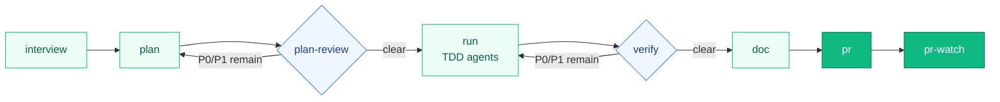

<div align="center">


<br>

**Turn Claude Code or Codex into an engineering team that plans, reviews, builds, verifies, and opens the PR.**

[](https://github.com/braincrew-lab/oh-my-braincrew-release/releases/latest)
[](https://github.com/braincrew-lab/oh-my-braincrew-release/releases)
[](#install)
[](#quick-start)
[](#license)

[Quick start](#quick-start) · [How it works](#how-it-works) · [Workflow](#the-workflow) · [Commands](#commands) · [Memory](#memory-that-survives-the-session) · [Changelog](CHANGELOG.md) · [한국어](README-ko.md)

</div>

---

A single coding agent working in a single context will happily write code, skip the tests, and tell you it's done. **oh-my-braincrew (`omb`)** installs a harness around that agent: 59 specialist agents, 77 skills, 135 convention rules, and lifecycle hooks. Together they make the agent work like a team with a process.

You describe a goal. The harness interviews you, writes a plan anchored to real files, has domain reviewers score it, implements it test-first in an isolated worktree, and runs the real type checker, linter, and tests. Then it opens a pull request. It does not call the work done on the agent's word alone.

```text
> /omb:goal add retry logic to the payment webhook
```

## Why omb

| Agent on its own | Agent with omb |
|---|---|
| One context does design, code, and review | Separate design, implement, and verify agents per domain: API, DB, UI, AI, Electron, Infra, Security |
| Plans are prose | Plans cite file paths and line ranges, then go through an evaluate → improve loop |
| "Looks good to me" | 3–12 reviewers score the plan in parallel and merge their findings into one P0–P3 list |
| "Tests should pass" | `/omb:verify` runs `pytest`, `ruff`, `tsc`, `eslint` and reports what the commands printed |
| Edits land in your working tree | Each goal runs in its own git worktree with SQLite state tracking |
| Every session starts from zero | Team conventions live in `.omb-memory/` and code facts in `openwiki/`, both in Git |
| Every rule loaded at once | Rules load by file path, so a FastAPI edit gets FastAPI rules and nothing else |

## Quick start

**1. Install the CLI**

```bash
# macOS (Apple Silicon) / Linux (x86_64)
curl -fsSL https://raw.githubusercontent.com/braincrew-lab/oh-my-braincrew-release/main/install.sh | bash
```

```powershell
# Windows (PowerShell)
irm https://raw.githubusercontent.com/braincrew-lab/oh-my-braincrew-release/main/install.ps1 | iex
```

Both scripts download the latest release, check its SHA-256 against `checksums-sha256.txt`, and add an `omb` shortcut. The binary goes to `~/.local/bin` on macOS/Linux and `%LOCALAPPDATA%\oh-my-braincrew` on Windows. No Python, `uv`, or source checkout is needed.

**2. Attach it to a project**

```bash
cd /path/to/your/project
omb version
omb install        # alias of `omb init`
```

`omb install` writes the `.claude/` harness plus the Codex compatibility files. It creates `AGENTS.md` and `CLAUDE.md` only if they are missing; your own instructions, agents, skills, and settings are left alone.

**3. Start working** inside your agent:

| Host | Tune the project instructions | Run a goal |
|---|---|---|
| Claude Code | `/omb:deep-setup` | `/omb:goal add retry logic to the payment webhook` |
| Codex | `$omb-deep-setup` | `$omb-goal add retry logic to the payment webhook` |

`deep-setup` reads your real code, manifests, and CI, then writes root and folder-level `AGENTS.md` guidance. If new skills do not show up, restart the host session.

## How it works

<p align="center">
  
</p>

| Layer | What it is | Where it lives |
|---|---|---|
| **Skills** | The workflows you call (`/omb:plan`, `/omb:verify`, …) plus rubrics and reference guides loaded on demand | `.claude/skills/omb-*` |
| **Agents** | Design, implement, verify, and explore specialists per domain, plus critics and plan evaluators | `.claude/agents/omb/` |
| **Rules** | Conventions for FastAPI, React, LangGraph, Postgres/Redis, Docker/K8s/Terraform, 17 languages, testing, and git | `.claude/rules/` |
| **Hooks** | A Python hook handler on session start, before and after tool use, and when a sub-agent stops. It blocks out-of-scope writes, raw SQL, pytest runs without a timeout, and sub-agent replies that break the output contract | `.claude/hooks/omb/` |
| **State** | Plans, todo lists, interviews, and worktree records | `.omb/` |

Covered stacks: Python/FastAPI, React/TypeScript/Next.js, LangGraph/LangChain/Deep Agents, Postgres/Redis, Electron, and Docker/GitHub Actions/Kubernetes/Terraform.

## The workflow

Run the whole cycle with one call, or invoke any step on its own.


```mermaid
flowchart LR
  IV["interview"] --> PL["plan"] --> PV{"plan-review"}
  PV -->|"P0/P1 remain"| PL
  PV -->|"clear"| RUN["run<br/>TDD agents"]
  RUN --> VF{"verify"}
  VF -->|"P0/P1 remain"| RUN
  VF -->|"clear"| DOC["doc"] --> PR["pr"] --> PW["pr-watch"]

  classDef step fill:#ecfdf5,stroke:#10b981,color:#065f46
  classDef gate fill:#eff6ff,stroke:#3b82f6,color:#1e3a8a
  classDef ship fill:#10b981,stroke:#047857,color:#ffffff
  class IV,PL,RUN,DOC step
  class PV,VF gate
  class PR,PW ship
```

| Step | Command | Result |
|---|---|---|
| 1 | `/omb:interview` | Requirements, with your repo searched first so it does not ask what the code already answers → `.omb/interviews/` |
| 2 | `/omb:plan` | Code-location-first plan with an evaluate → improve loop → `.omb/plans/` |
| 3 | `/omb:plan-review` | Parallel domain reviewers and one consensus list with P0–P3 priorities |
| 4 | `/omb:run` | Tasks delegated to domain agents under RED → GREEN → IMPROVE → `.omb/todo/` |
| 5 | `/omb:verify` | Real `tsc` / `ruff` / `pytest` / `eslint` runs, domain review, one verdict, P0/P1 auto-fix |
| 6 | `/omb:doc` | `docs/` updated to match the change |
| 7 | `/omb:pr` | Branch check → lint gate → commit → push → GitHub PR |
| 8 | `/omb:pr-watch` | Fixes failing CI with new commits and replies to every review thread, then stops on a verdict |

### `/omb:goal`: the whole cycle in one call

```text
> /omb:goal add a web search tool to the LangGraph agent
```

After the interview you answer one go/no-go gate. From there the pipeline runs interview → plan → plan-review → run → verify → doc → pr without further prompts, retrying each phase on failure.

- It always works in its own git worktree and never merges. The run ends when a PR is open.
- Decisions it makes on its own are written to a decision log and attached to the PR body.

Not every change needs the full pipeline. `/omb:plan` starts with a necessity gate, so a one-file edit does not summon twelve reviewers.

## Commands

Claude Code uses `/omb:<name>`. Codex calls the same skills as `$omb-<name>`.

<details open>
<summary><strong>Plan, build, verify</strong></summary>

| Command | What it does |
|---|---|
| `/omb:goal` | Autonomous interview → plan → review → run → verify → doc → pr, with a decision log |
| `/omb:interview` | Multi-dimensional requirements interview |
| `/omb:brainstorming` | One question at a time, to sharpen intent before any design |
| `/omb:plan` | Implementation plan with an evaluate → improve loop (`--worktree`, `--codex`) |
| `/omb:plan-review` | Multi-agent plan review with P0–P3 scoring |
| `/omb:run` | Execute a plan through domain agents with TDD enforced |
| `/omb:verify` | Static analysis, tests, multi-agent consensus, P0/P1 auto-fix |
| `/omb:fix` | Bug-fix plan from git forensics, a reproduction, and the minimal patch |
| `/omb:refactoring` | Behavior-preserving refactoring pipeline with an architecture pass |
| `/omb:architect` | Parallel multi-topic architecture analysis with consensus scoring |

</details>

<details>
<summary><strong>Review, PR, release</strong></summary>

| Command | What it does |
|---|---|
| `/omb:pr` | Branch validation, lint gate, structured PR |
| `/omb:pr-watch` | Background watch: fix CI, sweep every review thread and comment, stop on a verdict |
| `/omb:review-pr` | Review a PR diff against the original request and post an evidence comment |
| `/omb:ultra-review` | Deep autonomous review of a PR or local work, with fixes and a thread sweep |
| `/omb:lint-check` | Detect the stack from changed files and run the matching linters |
| `/omb:release` | Version bump, changelog, tag, and GitHub Release, usable in any repo |
| `/omb:issue` | Scan the codebase with parallel explorers and file the issues that survive a vote |
| `/omb:issue-maintainer` | Merge and normalize one group of existing issues, with coordinated recovery |

</details>

<details>
<summary><strong>Knowledge, docs, project setup</strong></summary>

| Command | What it does |
|---|---|
| `/omb:setup` | Scaffold `.omb/`, generate `AGENTS.md` with a `CLAUDE.md` bridge, configure `settings.json` |
| `/omb:deep-setup` | Analyze an existing project and refine root and folder-level `AGENTS.md` |
| `/omb:doc` | Write or update `docs/` from category templates |
| `/omb:wiki` | Read, update, and lint the project's `openwiki/` knowledge store |
| `/omb:explain` | Explain what just happened in the conversation, or a named topic or file (`--page` for HTML) |
| `/omb:mermaid` | Mermaid diagrams across 22 types, including LangGraph state graphs |
| `/omb:worktree` | Create, inspect, resume, and clean isolated worktrees |
| `/omb:clean` | Remove finished worktrees and delete branches that have merge evidence |
| `/omb:harness` | Create, verify, or fix agents, skills, hooks, and rules (`--verify`, `--fix`) |
| `/omb:prompt-guide` · `/omb:prompt-review` | Prompt-writing reference, and an evaluate → fix loop for prompts |

</details>

<details>
<summary><strong>Second opinions: Codex and Herdr</strong></summary>

| Command | What it does |
|---|---|
| `/omb:codex-review` | Codex CLI review of your local git state |
| `/omb:codex-adv-review` | Adversarial review aimed at assumptions, failure modes, and edge cases |
| `/omb:codex-run <task>` | Delegate a task to the Codex CLI |
| `/omb:herdr --codex <request>` | Run a request in a new [Herdr](https://herdr.dev) tab and close the tab once the result is collected |
| `/omb:herdr-review` · `/omb:herdr-verify` | Independent plan/code review, or requirements verification, in a new Herdr tab |
| `/omb:herdr-cronjob` | Schedule detached Codex or Claude CLI runs with owned panes and durable logs |

Codex delegation needs an installed, authenticated Codex CLI and `"OMB_USE_CODEX": "1"` in `.claude/settings.local.json` (or enabling it in the `omb init` survey). If Codex is missing or fails, workflows announce the fallback and continue on Claude. Herdr skills run inside a Herdr project tab.

</details>

## Memory that survives the session

The next session, and the next teammate, should know how this project works without being told again.

```bash
omb memory init   --root /absolute/project
omb memory status --root /absolute/project --host claude   # or: codex
```

Then just say it:

> Remember this: when a public API changes, check the frontend consumers and the contract tests too.

The memory skill reads what is already there, merges the new guidance, saves it, and reads it back in the same turn. The agent decides what the request means; the CLI enforces format, size limits, and revisions.

- **Small core, deep topics.** `.omb-memory/MEMORY.md` holds priorities and corrections within a hard 60-line / 4,000-character budget. Detailed procedures live in `knowledge/<category>/<topic>.md` and are read only when relevant.
- **Shared through Git.** Commit `.omb-memory/` like any other file. omb never auto-commits or pushes.
- **Safe edits.** Revision checks, locking, and a recovery journal protect concurrent writes. Run `omb memory check --root /absolute/project` after a manual edit or merge.
- **No vector database.** Memory and the `openwiki/` knowledge store are searched locally:

```bash
omb context search "authentication" --root /absolute/project
omb context build  "authentication" --root /absolute/project --workflow plan
```

## CLI reference

| Command | Purpose |
|---|---|
| `omb install [path]` / `omb init [path]` | Install harness files into a project |
| `omb update [path]` | Update the binary and refresh harness files |
| `omb uninstall` | Remove harness files and the binary (`--dry-run`, `--keep-binary`, `--project-dir`) |
| `omb version` | Print the installed version |
| `omb memory <sub>` | Initialize, read, search, update, and validate operational memory |
| `omb context search\|build\|status` | Search wiki and memory, then build and reuse workflow context bundles |
| `omb spec lint --root [path]` | Check `docs/specs/` structure, links, and status transitions (optional, never blocks) |
| `omb openwiki-install --root [path]` | Install OpenWiki and the Claude/Codex host integrations |
| `omb openwiki-read <sub>` | Search, summarize, lint, and freshness-check the wiki |
| `omb update-gitignore` | Re-apply the harness `.gitignore` block |
| `omb hook-stats` | Hook timing and failure statistics |

## Configuration

Values resolve in this order: shell environment → `.claude/settings.local.json` → `.claude/settings.json`.

| Variable | Purpose |
|---|---|
| `OMB_DOCUMENTATION_LANGUAGE` | Language for replies and docs (`en` / `ko`). Code, prompts, and commits stay English |
| `OMB_USE_CODEX` | Enable Codex CLI delegation and review |
| `OMB_ORM_BACKEND` | ORM for DB work: `tortoise` (default) or `sqlalchemy` |
| `OMB_INIT_CONFIRM` | Install confirmation: `never` (default) or `always` |
| `OMB_DEBUG` | `1` writes diagnostic logs to `.omb/logs/` |

## Install

### Requirements

- [Claude Code](https://docs.anthropic.com/en/docs/claude-code) or [Codex](https://github.com/openai/codex), installed and authenticated
- `git`, plus an authenticated [`gh`](https://cli.github.com) for PR, issue, and release workflows
- Node.js and npm, if you use the OpenWiki knowledge store

### Manual download

| Platform | Binary |
|---|---|
| macOS (Apple Silicon) | [`oh-my-braincrew-v1.3.1-darwin-arm64`](https://github.com/braincrew-lab/oh-my-braincrew-release/releases/latest) |
| Linux (x86_64) | [`oh-my-braincrew-v1.3.1-linux-amd64`](https://github.com/braincrew-lab/oh-my-braincrew-release/releases/latest) |
| Windows (x86_64) | [`oh-my-braincrew-v1.3.1-windows-amd64.exe`](https://github.com/braincrew-lab/oh-my-braincrew-release/releases/latest) |

Each release also ships `harness-vX.Y.Z.tar.gz` (the harness that `omb install` lays down), its `.sha256` sidecar, and `checksums-sha256.txt`. Verify a manual download before running it:

```bash
shasum -a 256 -c checksums-sha256.txt --ignore-missing
```

### What install and update touch

- **Updated:** omb-owned paths only: `.claude/skills/omb*/`, `.claude/agents/omb/`, `.claude/hooks/omb/`, `.claude/commands/omb/`, `.claude/rules/**`, and the generated Codex files under `.agents/skills/` and `.Codex/`.
- **Preserved:** your `AGENTS.md`, `CLAUDE.md`, `.claude/settings.json`, your own agents and skills, and `.claude/rules/custom/`.
- Installed harness files are added to `.gitignore`. `.omb-memory/` and your instructions are meant to be committed.

### Update and uninstall

```bash
omb update      # new binary + refreshed harness
omb uninstall --dry-run   # preview what will be removed
omb uninstall             # remove harness files and the binary
```

### Troubleshooting

- **`omb: command not found`**: add `~/.local/bin` to your `PATH`.
- **macOS blocks the binary**: run `xattr -d com.apple.quarantine ~/.local/bin/oh-my-braincrew`.
- **Skills missing after install or update**: restart the Claude Code or Codex session.

## Changelog

Release notes for every version are in [CHANGELOG.md](CHANGELOG.md) and on the [Releases](https://github.com/braincrew-lab/oh-my-braincrew-release/releases) page.

## License

**Braincrew Internal Use Only.** This repository distributes prebuilt binaries and the harness tarball; the source lives in a private repository. Only parties authorized in writing by Braincrew Inc. may use it. See [LICENSE](LICENSE) for the full terms.
